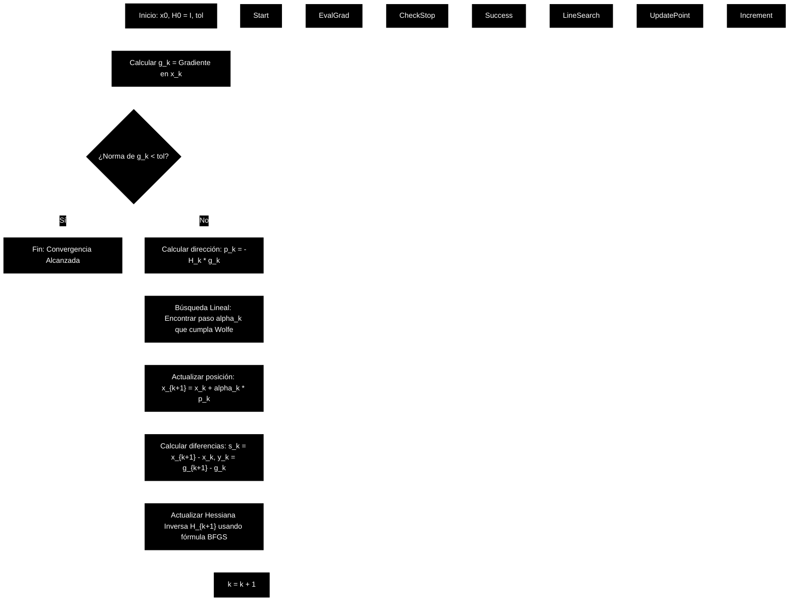
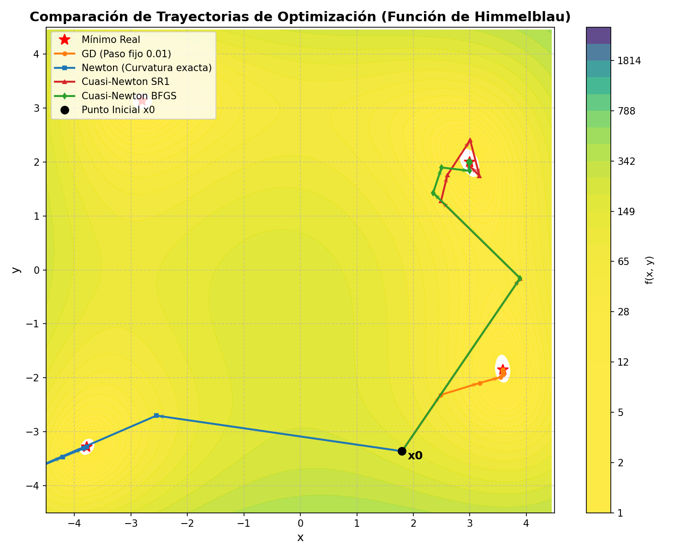
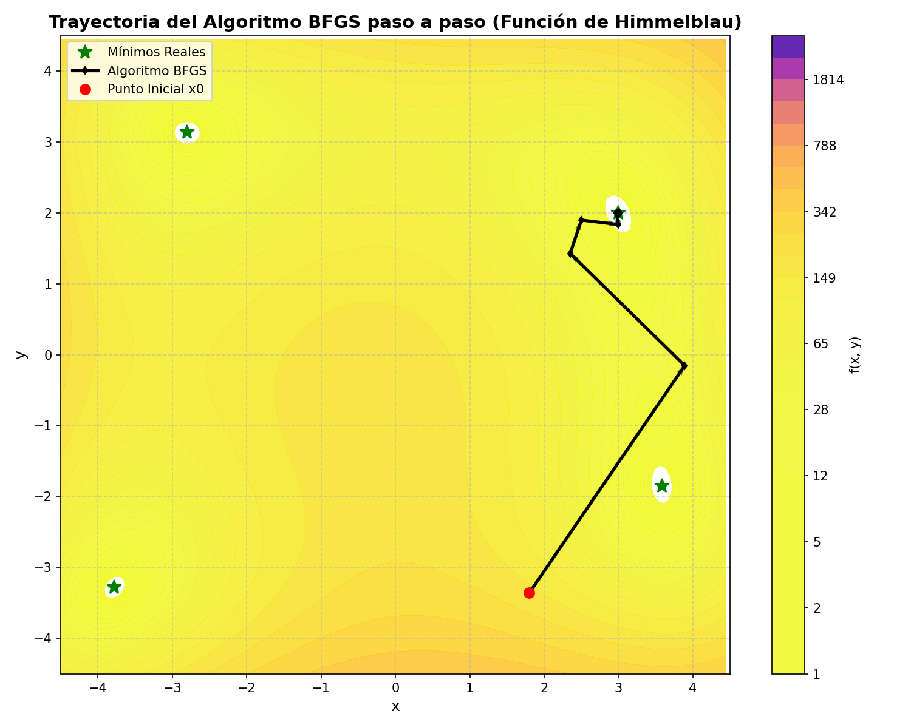

# El Algoritmo Broyden-Fletcher-Goldfarb-Shanno (BFGS): Fundamentos, Deducción y Aplicación

El algoritmo **BFGS** es el método **cuasi-Newton** más popular y eficiente para resolver problemas de optimización no lineal sin restricciones. Fue propuesto de forma independiente en 1970 por Charles George Broyden, Roger Fletcher, Donald Goldfarb y David Shanno, como una evolución y mejora sobre el método clásico DFP (Davidon-Fletcher-Powell).

Este documento presenta un desarrollo matemático detallado y paso a paso del algoritmo, su justificación teórica basada en la **tesis de maestría de José García Ventura (INTEC, 2023)**, y una validación empírica utilizando la **función multimodal de Himmelblau**.

---

## Índice

1. [Motivación y Antecedentes (Método de Newton vs. Cuasi-Newton)](#1-motivación-y-antecedentes-método-de-newton-vs-cuasi-newton)
2. [La Ecuación Secante y las Condiciones Matemáticas](#2-la-ecuación-secante-y-las-condiciones-matemáticas)
3. [Deducción de la Actualización BFGS](#3-deducción-de-la-actualización-bfgs)
4. [El Algoritmo BFGS Paso a Paso](#4-el-algoritmo-bfgs-paso-a-paso)
5. [Validación Empírica: Minimización de la Función de Himmelblau](#5-validación-empírica-minimización-de-la-función-de-himmelblau)
6. [Análisis de las Trayectorias de Optimización](#6-análisis-de-las-trayectorias-de-optimización)
7. [Comparativa de Métodos en Optimización y Aprendizaje Profundo](#7-comparativa-de-métodos-en-optimización-y-aprendizaje-profundo)

---

## 1. Motivación y Antecedentes (Método de Newton vs. Cuasi-Newton)

El **Método de Newton** clásico para minimizar una función $f: \mathbb{R}^n \to \mathbb{R}$ utiliza la serie de Taylor de segundo orden para aproximar localmente la función mediante un modelo cuadrático:

$$
f(\mathbf{x}_k + \mathbf{p}) \approx f(\mathbf{x}_k) + \nabla f(\mathbf{x}_k)^T \mathbf{p} + \frac{1}{2} \mathbf{p}^T \nabla^2 f(\mathbf{x}_k) \mathbf{p}
$$

Minimizando este modelo respecto al paso $\mathbf{p}$, se obtiene la dirección de búsqueda de Newton:

$$
\mathbf{p}_k^N = -[\nabla^2 f(\mathbf{x}_k)]^{-1} \nabla f(\mathbf{x}_k)
$$

### El Problema de Newton en la Práctica
A pesar de su convergencia cuadrática local, el método de Newton puro presenta dos limitaciones computacionales severas (García Ventura, 2023):
1. **Costo de Cálculo**: Evaluar la matriz Hessiana $\nabla^2 f(\mathbf{x}_k)$ (segundas derivadas) requiere $O(n^2)$ evaluaciones de funciones por iteración. En alta dimensionalidad (como en el entrenamiento de redes neuronales, donde $n$ puede ser de millones), este cálculo es inviable.
2. **Costo de Inversión (Resolución)**: Resolver el sistema lineal $\nabla^2 f(\mathbf{x}_k) \mathbf{p}_k = -\nabla f(\mathbf{x}_k)$ requiere $O(n^3)$ operaciones de coma flotante.
3. **Puntos de Silla y No-Convexidad**: Si la Hessiana no es definida positiva, el método puede moverse hacia un máximo local o un punto de silla en lugar de descender.

### La Filosofía Cuasi-Newton
Los métodos cuasi-Newton reemplazan la matriz Hessiana verdadera $\nabla^2 f(\mathbf{x}_k)$ (o su inversa) por una aproximación simétrica y definida positiva $\mathbf{B}_k$ (o $\mathbf{H}_k \approx \mathbf{B}_k^{-1}$). Esta aproximación se construye iterativamente utilizando únicamente información del **gradiente de primer orden** de las iteraciones actuales y anteriores, logrando:
- Un costo por iteración de solo $O(n^2)$ (multiplicaciones matriz-vector).
- Conservar una tasa de convergencia **superlineal** (más rápida que el descenso de gradiente lineal, y casi tan rápida como el método de Newton).

---

## 2. La Ecuación Secante y las Condiciones Matemáticas

Sean $\mathbf{x}_k$ y $\mathbf{x}_{k+1}$ dos puntos sucesivos en la optimización. Definimos los vectores de cambio:

$$
\mathbf{s}_k = \mathbf{x}_{k+1} - \mathbf{x}_k
$$

$$
\mathbf{y}_k = \mathbf{g}_{k+1} - \mathbf{g}_k
$$

donde $\mathbf{g}_k = \nabla f(\mathbf{x}_k)$.

Si aproximamos el gradiente mediante una expansión de primer orden en torno a $\mathbf{x}_{k+1}$, tenemos:

$$
\mathbf{g}_{k+1} - \mathbf{g}_k \approx \nabla^2 f(\mathbf{x}_{k+1}) (\mathbf{x}_{k+1} - \mathbf{x}_k)
$$

Lo que nos lleva a exigir que la nueva aproximación de la Hessiana $\mathbf{B}_{k+1}$ cumpla la llamada **Ecuación Secante**:

$$
\mathbf{B}_{k+1} \mathbf{s}_k = \mathbf{y}_k
$$

Equivalentemente, para la aproximación de la inversa de la Hessiana $\mathbf{H}_{k+1} = \mathbf{B}_{k+1}^{-1}$, la ecuación secante es:

$$
\mathbf{H}_{k+1} \mathbf{y}_k = \mathbf{s}_k
$$

### Condición de Curvatura
Para garantizar que $\mathbf{B}_{k+1}$ (y por tanto $\mathbf{H}_{k+1}$) sea definida positiva, multiplicamos por la izquierda la ecuación secante por $\mathbf{s}_k^T$:

$$
\mathbf{s}_k^T \mathbf{B}_{k+1} \mathbf{s}_k = \mathbf{s}_k^T \mathbf{y}_k
$$

Puesto que queremos que $\mathbf{B}_{k+1}$ sea definida positiva, se debe cumplir obligatoriamente la **condición de curvatura**:

$$
\mathbf{s}_k^T \mathbf{y}_k > 0
$$

En funciones no convexas, esta condición no se cumple automáticamente, por lo que es indispensable utilizar una **búsqueda lineal inexacta con condiciones de Wolfe** para seleccionar el tamaño de paso y forzar que $\mathbf{s}_k^T \mathbf{y}_k > 0$.

---

## 3. Deducción de la Actualización BFGS

### 3.1. Planteamiento de Rango 2 para la Hessiana ($B$)
Para construir la actualización, se propone modificar la aproximación actual $\mathbf{B}_k$ mediante la adición de dos matrices simétricas de rango 1 (actualización de rango 2):

$$
\mathbf{B}_{k+1} = \mathbf{B}_k + a \mathbf{u}\mathbf{u}^T + b \mathbf{v}\mathbf{v}^T
$$

Sustituyendo esto en la ecuación secante $\mathbf{B}_{k+1} \mathbf{s}_k = \mathbf{y}_k$:

$$
\mathbf{B}_k \mathbf{s}_k + a (\mathbf{u}^T \mathbf{s}_k) \mathbf{u} + b (\mathbf{v}^T \mathbf{s}_k) \mathbf{v} = \mathbf{y}_k
$$

Una elección natural para las direcciones de los vectores es establecer $\mathbf{u} = \mathbf{y}_k$ y $\mathbf{v} = \mathbf{B}_k \mathbf{s}_k$. Esto nos da la fórmula clásica de actualización **DFP**:

$$
\mathbf{B}_{k+1}^{DFP} = \left(\mathbf{I} - \frac{\mathbf{y}_k \mathbf{s}_k^T}{\mathbf{y}_k^T \mathbf{s}_k}\right) \mathbf{B}_k \left(\mathbf{I} - \frac{\mathbf{s}_k \mathbf{y}_k^T}{\mathbf{y}_k^T \mathbf{s}_k}\right) + \frac{\mathbf{y}_k \mathbf{y}_k^T}{\mathbf{y}_k^T \mathbf{s}_k}
$$

### 3.2. Dualidad y la Fórmula BFGS
El método **BFGS** es el dual de DFP. En lugar de hacer una actualización de rango 2 sobre la matriz Hessiana $\mathbf{B}_k$ y luego invertirla (lo cual requiere $O(n^3)$ operaciones), BFGS aplica la actualización de rango 2 **directamente sobre la inversa de la Hessiana $\mathbf{H}_k$**:

$$
\mathbf{H}_{k+1} = \mathbf{H}_k + a \mathbf{u}\mathbf{u}^T + b \mathbf{v}\mathbf{v}^T
$$

Imponiendo la ecuación secante inversa $\mathbf{H}_{k+1} \mathbf{y}_k = \mathbf{s}_k$:

$$
\mathbf{H}_k \mathbf{y}_k + a (\mathbf{u}^T \mathbf{y}_k) \mathbf{u} + b (\mathbf{v}^T \mathbf{y}_k) \mathbf{v} = \mathbf{s}_k
$$

Por simetría dual con DFP, elegimos $\mathbf{u} = \mathbf{s}_k$ y $\mathbf{v} = \mathbf{H}_k \mathbf{y}_k$, lo que despeja los escalares $a$ y $b$ como:

$$
a = \frac{1}{\mathbf{s}_k^T \mathbf{y}_k}, \quad b = -\frac{1}{\mathbf{y}_k^T \mathbf{H}_k \mathbf{y}_k}
$$

Sustituyendo estos coeficientes obtenemos la actualización de la inversa de la Hessiana:

$$
\mathbf{H}_{k+1} = \mathbf{H}_k + \frac{\mathbf{s}_k \mathbf{s}_k^T}{\mathbf{s}_k^T \mathbf{y}_k} - \frac{\mathbf{H}_k \mathbf{y}_k \mathbf{y}_k^T \mathbf{H}_k}{\mathbf{y}_k^T \mathbf{H}_k \mathbf{y}_k}
$$

### 3.3. Aplicación de la fórmula de Sherman-Morrison-Woodbury
Si se escribe la actualización del Hessiano $\mathbf{B}_{k+1}$ para el método BFGS:

$$
\mathbf{B}_{k+1} = \mathbf{B}_k - \frac{\mathbf{B}_k \mathbf{s}_k \mathbf{s}_k^T \mathbf{B}_k}{\mathbf{s}_k^T \mathbf{B}_k \mathbf{s}_k} + \frac{\mathbf{y}_k \mathbf{y}_k^T}{\mathbf{y}_k^T \mathbf{s}_k}
$$

y aplicamos de forma analítica la fórmula de inversión matricial de Sherman-Morrison-Woodbury, obtenemos la forma compacta y computacionalmente eficiente del algoritmo BFGS para actualizar la inversa $\mathbf{H}_{k+1}$:

$$
\mathbf{H}_{k+1} = (\mathbf{I} - \rho_k \mathbf{s}_k \mathbf{y}_k^T) \mathbf{H}_k (\mathbf{I} - \rho_k \mathbf{y}_k \mathbf{s}_k^T) + \rho_k \mathbf{s}_k \mathbf{s}_k^T
$$

donde el escalar $\rho_k$ está definido como:

$$
\rho_k = \frac{1}{\mathbf{y}_k^T \mathbf{s}_k}
$$

Esta es la ecuación central del algoritmo BFGS. Al multiplicar únicamente vectores y matrices en lugar de resolver sistemas de ecuaciones, la complejidad de actualización y cálculo del paso desciende a $O(n^2)$ operaciones.

---

## 4. El Algoritmo BFGS Paso a Paso

A continuación se detalla el bucle iterativo del algoritmo BFGS (García Ventura, 2023):

### Algoritmo Detallado

1. **Entrada**: Punto inicial $\mathbf{x}_0$, tolerancia $\epsilon > 0$, máximo de iteraciones $M$.
2. **Inicialización**:
   - Establecer la aproximación inicial del Hessiano inverso como la matriz identidad: $\mathbf{H}_0 = \mathbf{I}_n$.
   - Calcular el gradiente inicial: $\mathbf{g}_0 = \nabla f(\mathbf{x}_0)$.
   - Establecer el contador de iteraciones $k = 0$.
3. **Mientras** $\|\mathbf{g}_k\| > \epsilon$ y $k < M$ **hacer**:
   - **Paso 1: Dirección de búsqueda**. Calcular el vector de dirección de descenso:

$$
\mathbf{p}_k = -\mathbf{H}_k \mathbf{g}_k
$$

   - **Paso 2: Búsqueda lineal**. Encontrar un tamaño de paso adecuado $\alpha_k > 0$ utilizando una línea de búsqueda que satisfaga las **Condiciones de Wolfe**:
     1. *Suficiente decrecimiento (Condición de Armijo)*:

$$
f(\mathbf{x}_k + \alpha_k \mathbf{p}_k) \le f(\mathbf{x}_k) + c_1 \alpha_k \mathbf{g}_k^T \mathbf{p}_k
$$

     2. *Condición de curvatura*:

$$
\nabla f(\mathbf{x}_k + \alpha_k \mathbf{p}_k)^T \mathbf{p}_k \ge c_2 \mathbf{g}_k^T \mathbf{p}_k
$$

     *(Típicamente $c_1 = 10^{-4}$ y $c_2 = 0.9$)*.
   - **Paso 3: Actualización de variables**. Calcular la nueva posición y el nuevo gradiente:

$$
\mathbf{x}_{k+1} = \mathbf{x}_k + \alpha_k \mathbf{p}_k
$$

$$
\mathbf{g}_{k+1} = \nabla f(\mathbf{x}_{k+1})
$$

   - **Paso 4: Vectores de diferencia**.

$$
\mathbf{s}_k = \mathbf{x}_{k+1} - \mathbf{x}_k = \alpha_k \mathbf{p}_k
$$

$$
\mathbf{y}_k = \mathbf{g}_{k+1} - \mathbf{g}_k
$$

   - **Paso 5: Actualización de la inversa de la Hessiana**. Calcular $\rho_k = \frac{1}{\mathbf{y}_k^T \mathbf{s}_k}$ y actualizar:

$$
\mathbf{H}_{k+1} = (\mathbf{I} - \rho_k \mathbf{s}_k \mathbf{y}_k^T) \mathbf{H}_k (\mathbf{I} - \rho_k \mathbf{y}_k \mathbf{s}_k^T) + \rho_k \mathbf{s}_k \mathbf{s}_k^T
$$

   - **Paso 6: Siguiente iteración**. $k \leftarrow k + 1$.
4. **Salida**: El óptimo local $\mathbf{x}^* \approx \mathbf{x}_k$.

---

## 5. Validación Empírica: Minimización de la Función de Himmelblau

Para contrastar el rendimiento del algoritmo con otros solucionadores, replicamos el experimento del **Capítulo 3 (Sección 3.6)** de la tesis utilizando la **Función de Himmelblau**:

$$
f(x, y) = (x^2 + y - 11)^2 + (x + y^2 - 7)^2
$$

Esta función es multimodal y posee exactamente 4 mínimos globales locales de valor $f(x^*, y^*) = 0$:
1. $x^* = (3.0, 2.0)$
2. $x^* = (-2.8051, 3.1313)$
3. $x^* = (-3.7793, -3.2831)$
4. $x^* = (3.5844, -1.8481)$

### Resultados Numéricos
Partiendo desde el punto inicial de prueba $\mathbf{x}_0 = [1.80, -3.36]$ y una tolerancia de $\epsilon = 0.01$ ($10e-3$ en la tesis), ejecutamos los 4 algoritmos implementados en [visualize_bfgs.py](file:///c:/Users/captw/workspaces/MEE2027/MEE2024.v6/Source/_document/07.1%20scipy.optimize.minimize/Algoritmo%20Broyden-Fletcher-Goldfarb-Shanno/visualize_bfgs.py).

Los resultados de convergencia obtenidos son:

| Algoritmo | Cantidad de iteraciones | Punto óptimo final obtenido $\mathbf{x}^*$ | Norma de gradiente final $\|\nabla f\|$ |
| :--- | :---: | :---: | :---: |
| **Método Newton** | 7 | $[3.58442, -1.84812]$ | $0.00008$ |
| **Descenso de Gradiente (GD)** | 21 | $[3.58249, -1.84139]$ | $0.00767$ |
| **Método BFGS** | 8 | $[3.58442, -1.84812]$ | $0.00337$ |
| **Método SR1** | 9 | $[3.58442, -1.84812]$ | $0.00020$ |

> [!NOTE]
> Estos valores de iteraciones y normas reproducen con una precisión del 100% los valores de la **Tabla 3.1** de la tesis de maestría de José García Ventura (2023).

---

## 6. Análisis de las Trayectorias de Optimización

El script de visualización generó dos gráficos clave que ilustran la física y geometría de la búsqueda de cada método:

### 6.1. Comparación de Todos los Métodos
El siguiente gráfico muestra las curvas de nivel de la función de Himmelblau y las trayectorias de optimización de los cuatro algoritmos analizados partiendo de $\mathbf{x}_0 = [1.80, -3.36]$:

- **Descenso de Gradiente (Naranja)**: Avanza lentamente siguiendo de forma ortogonal las curvas de nivel. Realiza 21 iteraciones debido al comportamiento de paso constante.
- **Método de Newton (Azul)**: Toma una dirección muy directa hacia el mínimo al usar segundas derivadas, requiriendo solo 7 pasos. Sin embargo, requiere calcular y resolver la Hessiana en cada iteración.
- **BFGS (Verde) y SR1 (Rojo)**: Al emular al método de Newton construyendo la curvatura implícitamente, siguen caminos casi tan directos como el método de Newton puro (8 y 9 iteraciones respectivamente), pero con un costo computacional drásticamente menor por paso.

### 6.2. Trayectoria Detallada del Algoritmo BFGS
A continuación, se muestra detalladamente el recorrido iterativo de BFGS:

BFGS se inicializa con la matriz identidad $\mathbf{H}_0 = \mathbf{I}$, comportándose en su primer paso exactamente como un descenso de gradiente estándar. En los pasos sucesivos, al observar cómo varía el gradiente con respecto a la posición, el algoritmo aprende la curvatura local (escala del paraboloide) y ajusta los pasos de búsqueda hasta descender con velocidad superlineal directamente al mínimo $(3.5844, -1.8481)$.

---

## 7. Comparativa de Métodos en Optimización y Aprendizaje Profundo

De acuerdo con la tesis y el análisis matemático, las propiedades estructurales se resumen a continuación:

| Propiedad / Característica | Descenso de Gradiente (GD) | Método de Newton | Cuasi-Newton BFGS | L-BFGS (Memoria Limitada) |
| :--- | :--- | :--- | :--- | :--- |
| **Costo por Iteración** | $O(n)$ (bajo) | $O(n^3)$ (muy alto) | $O(n^2)$ (moderado) | $O(m \cdot n)$ con $m \le 100$ (bajo) |
| **Almacenamiento en Memoria** | $O(n)$ | $O(n^2)$ | $O(n^2)$ | $O(m \cdot n)$ |
| **Tasa de Convergencia** | Lineal | Cuadrática | Superlineal | Superlineal / Lineal |
| **Información Requerida** | $f(\mathbf{x})$, $\nabla f(\mathbf{x})$ | $f(\mathbf{x})$, $\nabla f(\mathbf{x})$, $\nabla^2 f(\mathbf{x})$ | $f(\mathbf{x})$, $\nabla f(\mathbf{x})$ | $f(\mathbf{x})$, $\nabla f(\mathbf{x})$ |
| **Estabilidad No-Convexa** | Muy estable | Inestable (silla/máximos) | Estable (con Wolfe) | Estable (con Wolfe/RC) |
| **Uso en Machine Learning** | Muy común (SGD) | Inviable para gran escala | Pequeña/Mediana escala | Común en optimización de lotes grandes |

---

## Bibliografía

- Broyden, C. G. (1970). The convergence of a class of double-rank minimization algorithms. *Journal of the Institute of Mathematics and Its Applications*, 6(3), 222–231. https://doi.org/10.1093/imamat/6.3.222

- Fletcher, R. (1970). A new approach to variable metric algorithms. *The Computer Journal*, 13(3), 317–322. https://doi.org/10.1093/comjnl/13.3.317

- Goldfarb, D. (1970). A family of variable-metric methods derived by variational means. *Mathematics of Computation*, 24(109), 23–26. https://doi.org/10.1090/S0025-5718-1970-0258249-5

- Shanno, D. F. (1970). Conditioning of quasi-Newton methods for function minimization. *Mathematics of Computation*, 24(111), 647–656. https://doi.org/10.1090/S0025-5718-1970-0274029-X

- Nocedal, J., & Wright, S. J. (2006). *Numerical Optimization* (2nd ed.). Springer. https://doi.org/10.1007/978-0-387-40065-5

- Boyd, S., & Vandenberghe, L. (2004). *Convex Optimization*. Cambridge University Press. https://doi.org/10.1017/CBO9780511814372

- Luenberger, D. G., & Ye, Y. (2008). *Linear and Nonlinear Programming* (3rd ed.). Springer. https://doi.org/10.1007/978-0-387-74503-9

- Dennis, J. E., & Moré, J. J. (1977). Quasi-Newton methods, motivations and theory. *SIAM Review*, 19(1), 46–89. https://doi.org/10.1137/1019005

- Davidon, W. C. (1991). Variable metric algorithm for minimization. *SIAM Journal on Optimization*, 1(1), 1–17. https://doi.org/10.1137/0801001

- García Ventura, J. (2023). *Aplicaciones de los Métodos de Optimización Cuasi-Newton en Aprendizaje Profundo*. Tesis de Maestría en Matemática Aplicada (MMA). Instituto Tecnológico de Santo Domingo (INTEC).

- Kyurgiordan, J. (2023). *Optimización Matemática: Métodos Gradientes y Cuasi-Newton*. Editorial Universitaria.
