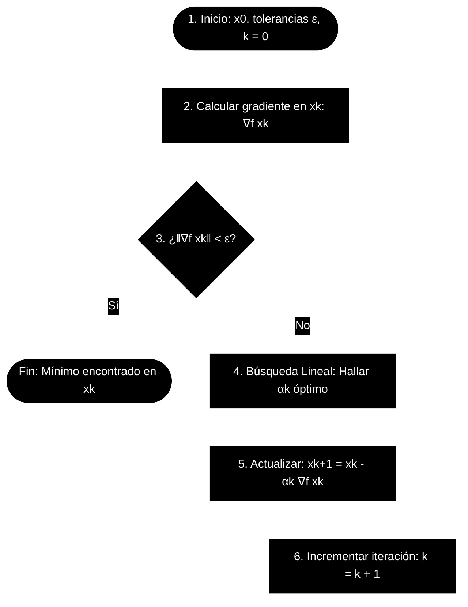

# El Algoritmo de Máximo Descenso (Gradient Descent)

El método de **Máximo Descenso** (o *Steepest Descent* en inglés) es uno de los algoritmos de optimización iterativos más fundamentales para encontrar mínimos locales de una función diferenciable $f: \mathbb{R}^n \to \mathbb{R}$.

Este documento presenta una guía paso a paso del algoritmo, su fundamentación matemática, la optimización del tamaño de paso ($\alpha$), sus propiedades geométricas y su comportamiento de convergencia.

---

## 1. Fundamento Matemático: ¿Por qué $-\nabla f(x)$ es la dirección de máximo descenso?

Para comprender por qué nos movemos en la dirección del gradiente negativo, analicemos cómo cambia el valor de la función $f(x)$ cuando nos desplazamos una distancia infinitesimal en una dirección dada por un vector unitario $u \in \mathbb{R}^n$ (con $\|u\|_2 = 1$).

### La Derivada Direccional
La tasa de cambio instantánea de $f$ en el punto $x$ a lo largo de la dirección $u$ viene dada por la **derivada direccional** $D_u f(x)$:

$$
D_u f(x) = \lim_{h \to 0} \frac{f(x + hu) - f(x)}{h}
$$

Si la función $f$ es diferenciable, la derivada direccional se calcula como el producto escalar entre el gradiente de la función y el vector de dirección $u$:

$$
D_u f(x) = \nabla f(x) \cdot u = \nabla f(x)^T u
$$

### Aplicando el Producto Escalar
De la geometría clásica, sabemos que el producto escalar de dos vectores $A$ y $B$ con ángulo $\theta$ entre ellos es:

$$
A \cdot B = \|A\| \|B\| \cos\theta
$$

Aplicando esto a nuestra derivada direccional:

$$
D_u f(x) = \|\nabla f(x)\|_2 \|u\|_2 \cos\theta
$$

Como definimos $u$ como un vector unitario ($\|u\|_2 = 1$):

$$
D_u f(x) = \|\nabla f(x)\|_2 \cos\theta
$$

### Minimizando la Derivada Direccional
Queremos encontrar la dirección $u$ que produzca la **disminución más rápida** de $f(x)$. Esto equivale a minimizar la derivada direccional $D_u f(x)$:

$$
\min_{u, \|u\|_2 = 1} D_u f(x) = \min_{\theta} \left( \|\nabla f(x)\|_2 \cos\theta \right)
$$

Dado que $\|\nabla f(x)\|_2 \ge 0$, el valor mínimo posible de la expresión se alcanza cuando $\cos\theta$ toma su valor mínimo absoluto, el cual es **$-1$**.

El coseno de un ángulo es $-1$ si y solo si los vectores son colineales y opuestos en dirección ($\theta = \pi$ radianes o $180^\circ$):

$$
\cos\theta = -1 \iff u \text{ apunta en dirección opuesta a } \nabla f(x)
$$

Por lo tanto, la dirección unitaria de descenso más pronunciado es:

$$
u^* = -\frac{\nabla f(x)}{\|\nabla f(x)\|_2}
$$

Cualquier paso a lo largo de la dirección del vector **$-\nabla f(x)$** garantiza la tasa local más rápida de reducción del valor de la función.

---

## 2. La Fórmula Iterativa del Descenso

El algoritmo de máximo descenso genera una secuencia de puntos $x^{(0)}, x^{(1)}, x^{(2)}, \dots \in \mathbb{R}^n$ mediante la siguiente regla de actualización:

$$
x^{(k+1)} = x^{(k)} + \alpha_k d^{(k)}
$$

Donde:
*   **$x^{(k)}$**: El punto actual en la iteración $k$.
*   **$d^{(k)}$**: La dirección de búsqueda en la iteración $k$. En el método de máximo descenso, esta dirección se define directamente como el gradiente negativo en el punto actual:

$$
d^{(k)} = -\nabla f(x^{(k)})
$$

*   **$\alpha_k > 0$**: El **tamaño del paso** (o *learning rate* / tasa de aprendizaje en aprendizaje automático), que determina cuánto nos desplazamos a lo largo de la dirección de búsqueda.
*   **$x^{(k+1)}$**: El nuevo punto calculado para la siguiente iteración.

Sustituyendo la dirección, la fórmula iterativa clásica es:

$$
x^{(k+1)} = x^{(k)} - \alpha_k \nabla f(x^{(k)})
$$

---

## 3. Algoritmo Paso a Paso

El proceso algorítmico completo para encontrar un mínimo local es el siguiente:

### Descripción detallada de las fases:

1.  **Inicialización**: Elegir una aproximación inicial $x^{(0)} \in \mathbb{R}^n$, una tolerancia de convergencia $\epsilon > 0$ (normalmente un valor pequeño como $10^{-6}$), y establecer el contador de iteraciones $k = 0$.
2.  **Cálculo del Gradiente**: Evaluar el vector gradiente de la función en el punto actual, $\nabla f(x^{(k)})$.
3.  **Criterio de Parada**: Evaluar si el gradiente es lo suficientemente cercano a cero. Típicamente se utiliza la norma euclídea:

$$
\|\nabla f(x^{(k)})\|_2 < \epsilon
$$

    *   Si se cumple, el algoritmo se detiene y $x^{(k)}$ se acepta como la solución óptima.
    *   Si no se cumple, se continúa al paso 4.
4.  **Búsqueda del tamaño de paso ($\alpha_k$)**: Determinar un tamaño de paso adecuado $\alpha_k$ (ver sección 4).
5.  **Actualización**: Calcular el nuevo punto $x^{(k+1)} = x^{(k)} - \alpha_k \nabla f(x^{(k)})$.
6.  **Ciclo**: Incrementar el contador $k \leftarrow k + 1$ y volver al paso 2.

---

## 4. Cómo hallar los valores de $\alpha$ óptimos (Búsqueda Lineal / Line Search)

El valor del tamaño de paso $\alpha_k$ es crucial:
*   Si $\alpha_k$ es **muy pequeño**, la convergencia será extremadamente lenta.
*   Si $\alpha_k$ es **muy grande**, el algoritmo puede oscilar e incluso divergir.

Para optimizar el algoritmo, definimos el problema de encontrar el **$\alpha_k$ óptimo** en cada paso. Esto se conoce como **búsqueda lineal exacta** (*exact line search*).

### Búsqueda Lineal Exacta
En cada iteración $k$, queremos encontrar el paso $\alpha > 0$ que minimice la función $f$ a lo largo del rayo que parte de $x^{(k)}$ en la dirección del gradiente negativo. Definimos una función unidimensional auxiliar $\phi(\alpha)$:

$$
\phi(\alpha) = f(x^{(k)} - \alpha \nabla f(x^{(k)}))
$$

El $\alpha_k$ óptimo es el valor que minimiza esta función unidimensional:

$$
\alpha_k = \arg\min_{\alpha > 0} \phi(\alpha)
$$

Para encontrar este mínimo, aplicamos el cálculo elemental igualando la derivada de $\phi(\alpha)$ con respecto a $\alpha$ a cero (condición necesaria de óptimo de primer orden):

$$
\phi'(\alpha_k) = 0
$$

Aplicando la **regla de la cadena** multivariable a $\phi(\alpha)$:

$$
\phi'(\alpha) = \nabla f(x^{(k)} - \alpha \nabla f(x^{(k)}))^T \frac{d}{d\alpha} \left( x^{(k)} - \alpha \nabla f(x^{(k)}) \right)
$$

Dado que $\frac{d}{d\alpha}(x^{(k)} - \alpha \nabla f(x^{(k)})) = -\nabla f(x^{(k)})$, la derivada queda:

$$
\phi'(\alpha) = \nabla f(x^{(k)} - \alpha \nabla f(x^{(k)}))^T \left( -\nabla f(x^{(k)}) \right) = 0
$$

Lo que se traduce en:

$$
\nabla f(x^{(k+1)})^T \nabla f(x^{(k)}) = 0
$$

> [!IMPORTANT]
> **Propiedad Geométrica de Ortogonalidad:**
> Esta ecuación matemática nos dice algo fundamental: **en la búsqueda lineal exacta, el gradiente en el nuevo punto $x^{(k+1)}$ es ortogonal al gradiente en el punto anterior $x^{(k)}$**.
> Debido a esto, la trayectoria del algoritmo de máximo descenso avanza realizando giros ortogonales de $90^\circ$ en cada paso, dando lugar al clásico patrón en **zig-zag**.

---

### Caso Particular: Funciones Cuadráticas Convexas

Para una función cuadrática de la forma:

$$
f(x) = \frac{1}{2} x^T A x - b^T x
$$

Donde $A \in \mathbb{R}^{n \times n}$ es una matriz simétrica y definida positiva (lo que asegura que la función es estrictamente convexa y tiene un único mínimo global), podemos calcular $\alpha_k$ analíticamente.

El gradiente de esta función en cualquier punto $x$ es:

$$
\nabla f(x) = A x - b
$$

Denotemos al gradiente en la iteración $k$ como $g^{(k)} = \nabla f(x^{(k)}) = A x^{(k)} - b$. Queremos minimizar:

$$
\phi(\alpha) = f(x^{(k)} - \alpha g^{(k)})
$$

Sustituyendo en la expresión de la función cuadrática:

$$
\phi(\alpha) = \frac{1}{2} (x^{(k)} - \alpha g^{(k)})^T A (x^{(k)} - \alpha g^{(k)}) - b^T (x^{(k)} - \alpha g^{(k)})
$$

Desarrollando los términos algebraicos utilizando la simetría de $A$ ($u^T A v = v^T A u$):

$$
\phi(\alpha) = \frac{1}{2} \left[ x^{(k)T} A x^{(k)} - 2\alpha g^{(k)T} A x^{(k)} + \alpha^2 g^{(k)T} A g^{(k)} \right] - b^T x^{(k)} + \alpha b^T g^{(k)}
$$

$$
\phi(\alpha) = f(x^{(k)}) - \alpha g^{(k)T} \left( A x^{(k)} - b \right) + \frac{1}{2} \alpha^2 g^{(k)T} A g^{(k)}
$$

Recordando que $A x^{(k)} - b = g^{(k)}$, simplificamos la expresión:

$$
\phi(\alpha) = f(x^{(k)}) - \alpha g^{(k)T} g^{(k)} + \frac{1}{2} \alpha^2 g^{(k)T} A g^{(k)}
$$

Derivamos ahora con respecto a $\alpha$ e igualamos a cero:

$$
\phi'(\alpha) = -g^{(k)T} g^{(k)} + \alpha g^{(k)T} A g^{(k)} = 0
$$

Resolviendo para $\alpha$, obtenemos la **fórmula cerrada para el $\alpha_k$ óptimo**:

$$
\alpha_k = \frac{g^{(k)T} g^{(k)}}{g^{(k)T} A g^{(k)}} = \frac{\|\nabla f(x^{(k)})\|_2^2}{\nabla f(x^{(k)})^T A \nabla f(x^{(k)})}
$$

---

### Búsqueda Lineal Inexacta (Funciones Generales No Lineales)

Para funciones no lineales generales, resolver el problema de minimización unidimensional exacta $\min \phi(\alpha)$ en cada iteración es computacionalmente prohibitivo. En la práctica, se utilizan técnicas de **búsqueda lineal inexacta**, donde buscamos un paso $\alpha_k$ que provea un descenso "suficiente" sin gastar demasiados recursos.

Las dos condiciones estándar de aceptación para $\alpha_k$ son las **Condiciones de Wolfe**:

1.  **Condición de Armijo (Descenso Suficiente)**:

$$
f(x^{(k)} - \alpha_k \nabla f(x^{(k)})) \le f(x^{(k)}) - c_1 \alpha_k \|\nabla f(x^{(k)})\|_2^2
$$

    Donde $c_1 \in (0, 1)$, típicamente $c_1 = 10^{-4}$. Asegura que la reducción en $f$ es proporcional al tamaño del paso y a la pendiente inicial.

2.  **Condición de Curvatura**:

$$
-\nabla f(x^{(k)} - \alpha_k \nabla f(x^{(k)}))^T \nabla f(x^{(k)}) \ge c_2 \left( -\|\nabla f(x^{(k)})\|_2^2 \right)
$$

    Donde $c_2 \in (c_1, 1)$, típicamente $c_2 = 0.9$. Asegura que la pendiente en el nuevo punto sea mayor que la pendiente inicial multiplicada por $c_2$, evitando pasos excesivamente pequeños.

Un algoritmo común para hallar este $\alpha_k$ es el **Backtracking Line Search**:
*   Comenzar con un paso inicial grande, por ejemplo, $\alpha = 1$.
*   Mientras no se cumpla la condición de Armijo, reducir $\alpha$ multiplicándolo por un factor de contracción $\beta \in (0, 1)$ (ej. $\beta = 0.5$ o $0.8$):

$$
\alpha \leftarrow \beta \alpha
$$

*   El primer $\alpha$ que satisface la condición de Armijo es aceptado como $\alpha_k$.

---

## 5. Tasa de Convergencia del Máximo Descenso

La tasa de convergencia mide la velocidad con la que la secuencia de puntos $x^{(k)}$ se aproxima al mínimo óptimo $x^*$.

### Convergencia Lineal
Para funciones fuertemente convexas, el método de máximo descenso tiene una **tasa de convergencia lineal** (también llamada geométrica). Esto significa que el error disminuye a lo menos por un factor constante en cada iteración:

$$
\|x^{(k+1)} - x^*\|_2 \le r \|x^{(k)} - x^*\|_2
$$

Donde $r \in (0, 1)$ es la tasa de convergencia.

### El Impacto del Número de Condición
Para una función cuadrática convexa con matriz Hessiana $A$ (donde los autovalores de $A$ cumplen $0 < \lambda_{min} \le \lambda_{max}$), se puede demostrar rigurosamente la siguiente cota superior para la reducción del error en términos del valor de la función:

$$
f(x^{(k+1)}) - f(x^*) \le \left( \frac{\kappa - 1}{\kappa + 1} \right)^2 \left( f(x^{(k)}) - f(x^*) \right)
$$

Donde **$\kappa$** (kappa) es el **número de condición** de la Hessiana $A$:

$$
\kappa = \frac{\lambda_{max}}{\lambda_{min}}
$$

#### Análisis de la Tasa:

1.  **Caso Ideal ($\kappa = 1$)**:
    *   Ocurre cuando todos los autovalores de $A$ son iguales ($\lambda_{max} = \lambda_{min}$), lo que significa que las curvas de nivel de $f(x)$ son esferas perfectas en $\mathbb{R}^n$.
    *   La cota del error se vuelve:

$$
\left( \frac{1-1}{1+1} \right)^2 = 0 \implies f(x^{(1)}) - f(x^*) \le 0 \implies f(x^{(1)}) = f(x^*)
$$

    *   **El algoritmo converge al mínimo global exacto en una sola iteración ($k=1$)**, sin importar el punto de partida $x^{(0)}$.

2.  **Caso Mal Condicionado ($\kappa \gg 1$)**:
    *   Ocurre cuando hay una gran disparidad entre los autovalores (por ejemplo, $\lambda_{max} = 100$ y $\lambda_{min} = 1$, dando $\kappa = 100$). Las curvas de nivel se vuelven elipses sumamente alargadas ("valles estrechos").
    *   La tasa de convergencia se aproxima a:

$$
\left( \frac{100 - 1}{100 + 1} \right)^2 = \left( \frac{99}{101} \right)^2 \approx 0.96
$$

    *   Esto significa que en cada iteración el error solo se reduce en aproximadamente un $4\%$. El algoritmo requerirá cientos de iteraciones para converger debido a que oscilará en zig-zag de una pared del valle a la otra, avanzando muy lentamente a lo largo del fondo del valle hacia el mínimo.

Por esta razón, a pesar de su simplicidad, el método de máximo descenso clásico es notoriamente lento para problemas mal condicionados. Esto motivó el desarrollo de métodos más avanzados como el **Método de Gradiente Conjugado** o los métodos cuasi-Newton (como **BFGS**).
