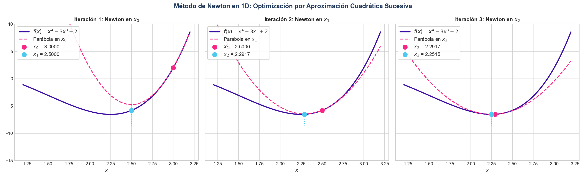
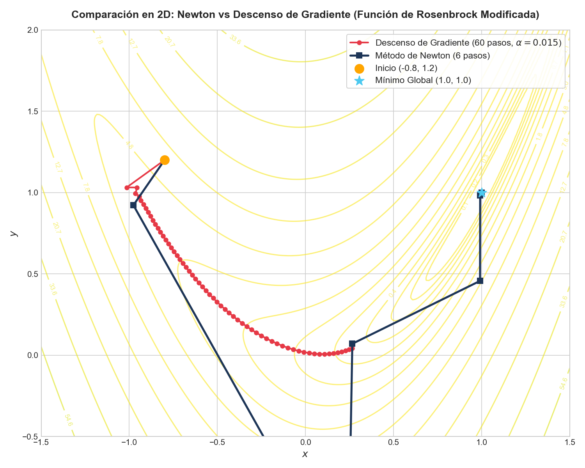

# El Método de Optimización de Newton: Fundamentos, Derivación y Geometría

El método de Newton (también conocido como Newton-Raphson para optimización) es uno de los algoritmos fundamentales en optimización matemática no lineal. A diferencia de los métodos de primer orden (como el descenso de gradiente), el método de Newton es un algoritmo de **segundo orden** que aprovecha la información de la curvatura local de la función para encontrar mínimos locales de manera extremadamente eficiente.

A continuación, se presenta un desarrollo detallado, paso a paso, de su formulación teórica, su interpretación geométrica y sus ventajas.

---

## 1. La Aproximación Cuadrática y la Serie de Taylor

Para comprender por qué el método de Newton es una generalización de la serie de Taylor, debemos analizar cómo modela localmente la función objetivo.

Sea $f: \mathbb{R}^n \to \mathbb{R}$ una función continuo-diferenciable al menos dos veces ($f \in \mathcal{C}^2$). Queremos resolver el problema de optimización sin restricciones:

$$
\min_{\mathbf{x} \in \mathbb{R}^n} f(\mathbf{x})
$$

Si estamos en un punto actual $\mathbf{x}_k$ y queremos encontrar un paso $\Delta \mathbf{x}$ tal que el nuevo punto $\mathbf{x}_{k+1} = \mathbf{x}_k + \Delta \mathbf{x}$ reduzca el valor de la función, podemos aproximar $f(\mathbf{x}_k + \Delta \mathbf{x})$ utilizando su **expansión en serie de Taylor de segundo orden** alrededor de $\mathbf{x}_k$:

$$
f(\mathbf{x}_k + \Delta \mathbf{x}) \approx q_k(\Delta \mathbf{x}) = f(\mathbf{x}_k) + \nabla f(\mathbf{x}_k)^T \Delta \mathbf{x} + \frac{1}{2} \Delta \mathbf{x}^T \nabla^2 f(\mathbf{x}_k) \Delta \mathbf{x}
$$

Donde:
* $\nabla f(\mathbf{x}_k) \in \mathbb{R}^n$ es el **gradiente** de $f$ en el punto $\mathbf{x}_k$ (vector de primeras derivadas).
* $\nabla^2 f(\mathbf{x}_k) \in \mathbb{R}^{n \times n}$ es la **matriz Hessiana** $\mathbf{H}(\mathbf{x}_k)$ (matriz de segundas derivadas parciales).
* $q_k(\Delta \mathbf{x})$ es un **modelo cuadrático local** (un paraboloide) que aproxima a la función original $f$.

El método de Newton consiste en hacer una **aproximación cuadrática** de la función en cada iteración y saltar directamente al punto mínimo de dicha aproximación.

---

## 2. Demostración Matemática Paso a Paso

### Caso A: Función de Una Variable ($n = 1$)

Supongamos que $f: \mathbb{R} \to \mathbb{R}$. Queremos minimizar $f(x)$.

1. **Aproximación cuadrática (Parábola):**
   La serie de Taylor de segundo orden alrededor del punto $x_k$ para un incremento $h = x - x_k$ es:
   

$$
f(x) \approx q(x) = f(x_k) + f'(x_k)(x - x_k) + \frac{1}{2}f''(x_k)(x - x_k)^2
$$

2. **Búsqueda del mínimo de la aproximación:**
   Dado que $q(x)$ es una función cuadrática (una parábola), si $f''(x_k) > 0$ (curvatura positiva), esta parábola se abre hacia arriba y tiene un único mínimo global. Para hallar este mínimo, derivamos $q(x)$ respecto a $x$ e igualamos a cero:
   

$$
\frac{d}{dx} q(x) = f'(x_k) + f''(x_k)(x - x_k) = 0
$$

3. **Despejar el siguiente punto ($x_{k+1}$):**
   Llamamos al punto que minimiza esta parábola $x_{k+1}$. Resolviendo la ecuación lineal resultante:
   

$$
f''(x_k)(x_{k+1} - x_k) = -f'(x_k)
$$

   

$$
x_{k+1} - x_k = -\frac{f'(x_k)}{f''(x_k)}
$$

   

$$
x_{k+1} = x_k - \frac{f'(x_k)}{f''(x_k)}
$$

Esta es la **fórmula iterativa del método de Newton** en una dimensión para optimización. 

> *Nota: Observa que esto es idéntico a aplicar el método clásico de Newton-Raphson para encontrar las raíces de la ecuación $f'(x) = 0$.*

---

### Caso B: Generalización para $n$ Dimensiones ($n > 1$)

Ahora generalizamos el proceso para un vector de variables $\mathbf{x} \in \mathbb{R}^n$.

1. **Aproximación cuadrática (Paraboloide):**
   El modelo cuadrático local $q(\mathbf{x})$ alrededor del punto $\mathbf{x}_k$ se escribe como:
   

$$
q(\mathbf{x}) = f(\mathbf{x}_k) + \nabla f(\mathbf{x}_k)^T (\mathbf{x} - \mathbf{x}_k) + \frac{1}{2} (\mathbf{x} - \mathbf{x}_k)^T \mathbf{H}(\mathbf{x}_k) (\mathbf{x} - \mathbf{x}_k)
$$

   
   donde $\mathbf{H}(\mathbf{x}_k) = \nabla^2 f(\mathbf{x}_k)$ es la matriz Hessiana simétrica de tamaño $n \times n$.

2. **Búsqueda del mínimo del paraboloide:**
   Para encontrar el vector $\mathbf{x}$ que minimiza la forma cuadrática $q(\mathbf{x})$, calculamos su gradiente con respecto a $\mathbf{x}$ y lo igualamos al vector cero $\mathbf{0}$:
   

$$
\nabla_{\mathbf{x}} q(\mathbf{x}) = \nabla f(\mathbf{x}_k) + \mathbf{H}(\mathbf{x}_k) (\mathbf{x} - \mathbf{x}_k) = \mathbf{0}
$$

   
   *Derivación de este paso:*
   * El gradiente de $\nabla f(\mathbf{x}_k)^T (\mathbf{x} - \mathbf{x}_k)$ con respecto a $\mathbf{x}$ es $\nabla f(\mathbf{x}_k)$.
   * El gradiente de la forma cuadrática $\frac{1}{2} (\mathbf{x} - \mathbf{x}_k)^T \mathbf{H}(\mathbf{x}_k) (\mathbf{x} - \mathbf{x}_k)$ con respecto a $\mathbf{x}$ es $\mathbf{H}(\mathbf{x}_k) (\mathbf{x} - \mathbf{x}_k)$, dado que $\mathbf{H}$ es una matriz simétrica.

3. **Despejar el siguiente punto ($\mathbf{x}_{k+1}$):**
   Llamamos $\mathbf{x}_{k+1}$ a la solución de este sistema de ecuaciones. Si la matriz Hessiana $\mathbf{H}(\mathbf{x}_k)$ es **definida positiva** (lo que garantiza que el paraboloide tiene un único mínimo y no un máximo o un punto de silla), entonces $\mathbf{H}(\mathbf{x}_k)$ es invertible.
   

$$
\mathbf{H}(\mathbf{x}_k) (\mathbf{x}_{k+1} - \mathbf{x}_k) = -\nabla f(\mathbf{x}_k)
$$

   

$$
\mathbf{x}_{k+1} - \mathbf{x}_k = -\mathbf{H}(\mathbf{x}_k)^{-1} \nabla f(\mathbf{x}_k)
$$

   

$$
\mathbf{x}_{k+1} = \mathbf{x}_k - \mathbf{H}(\mathbf{x}_k)^{-1} \nabla f(\mathbf{x}_k)
$$

Esta es la **fórmula iterativa generalizada del método de Newton** en dimensiones arbitrarias.

---

## 3. Interpretación Geométrica: La Minimización del Paraboloide

En cada iteración $k$, el método de Newton realiza una aproximación geométrica muy intuitiva:

1. **Construcción del paraboloide de ajuste:** 
   El algoritmo toma el punto actual $\mathbf{x}_k$, calcula el valor de la función $f(\mathbf{x}_k)$, la pendiente local (gradiente $\nabla f(\mathbf{x}_k)$) y la curvatura local (Hessiano $\mathbf{H}(\mathbf{x}_k)$). Con estos tres elementos, "dibuja" una parábola (en 1D) o un paraboloide (en $n$-D) que coincide exactamente en posición, pendiente y curvatura con la función real en el punto $\mathbf{x}_k$.
2. **El Salto al Vértice:**
   En lugar de dar un paso ciego guiado solo por la pendiente local, el método calcula analíticamente las coordenadas del **vértice (mínimo)** de este paraboloide ajustado y coloca la nueva iteración $\mathbf{x}_{k+1}$ exactamente en ese vértice.
3. **Iteración:**
   Al llegar a $\mathbf{x}_{k+1}$, el paraboloide anterior ya no es exacto (porque la función real no es perfectamente cuadrática). Por lo tanto, el algoritmo calcula un nuevo gradiente y un nuevo Hessiano en $\mathbf{x}_{k+1}$, construye un nuevo paraboloide y vuelve a saltar a su mínimo.

La siguiente imagen muestra este proceso en una función de una variable ($f(x) = x^4 - 3x^3 + 2$). Observa cómo en cada iteración la parábola punteada rosa se ajusta a la curva morada en $x_k$ y el algoritmo salta directamente al mínimo de dicha parábola:

---

## 4. Diferencias con el Descenso de Gradiente y la Tasa de Aprendizaje ($\alpha$)

En el **Descenso de Gradiente estándar**, la regla de actualización es:

$$
\mathbf{x}_{k+1} = \mathbf{x}_k - \alpha \nabla f(\mathbf{x}_k)
$$

Donde el gradiente $\nabla f(\mathbf{x}_k)$ da únicamente la **dirección** de máximo crecimiento, pero no contiene información de la escala física del problema ni de la curvatura. Por lo tanto:
* Es estrictamente necesario introducir una **tasa de aprendizaje $\alpha$** (learning rate).
* Si $\alpha$ es muy grande, el algoritmo oscila y diverge.
* Si $\alpha$ es muy pequeña, la convergencia es extremadamente lenta.
* Encontrar el $\alpha$ óptimo requiere un costoso proceso de prueba y error (hiperparametrización).

En el **Método de Newton**, la actualización es:

$$
\mathbf{x}_{k+1} = \mathbf{x}_k - \mathbf{H}(\mathbf{x}_k)^{-1} \nabla f(\mathbf{x}_k)
$$

Aquí, el tamaño y la dirección del paso están determinados de forma adaptativa y automática por la inversa de la matriz Hessiana. 

### ¿Por qué ya no se necesita la tasa de aprendizaje $\alpha$?
Matemáticamente, la inversa del Hessiano $\mathbf{H}^{-1}$ actúa como una "tasa de aprendizaje matricial autorregulada". 
* Si analizamos el caso en 1D, el paso es $\Delta x = -\frac{f'(x_k)}{f''(x_k)}$. El término $\frac{1}{f''(x_k)}$ escala el gradiente.
* **Curvatura alta ($f''(x_k)$ grande):** La función cambia muy rápido (un valle estrecho). El término $\frac{1}{f''(x_k)}$ se vuelve pequeño, lo que resulta en un paso corto y seguro para no saltarse el mínimo.
* **Curvatura baja ($f''(x_k)$ pequeño):** La función es muy plana. El término $\frac{1}{f''(x_k)}$ se vuelve grande, lo que produce un paso largo para cruzar rápidamente la zona plana.
* **Convergencia en un paso:** Si la función objetivo $f$ es de por sí una función cuadrática (paraboloide perfecto), el método de Newton converge al mínimo global exacto en **exactamente una iteración** partiendo desde cualquier punto inicial. En ese caso, el paso teórico calculado coincide al 100% con la distancia al mínimo.

---

## 5. Ventajas de Calcular y Utilizar el Hessiano

Calcular la matriz Hessiana ($\nabla^2 f$) en cada paso de optimización aporta ventajas matemáticas y computacionales críticas:

1. **Precondicionamiento y Eliminación del Zigzagueo:**
   Cuando una función tiene "valles estrechos" u "óvalos alargados" (problemas mal condicionados, comunes en funciones de pérdida de Machine Learning), el descenso de gradiente estándar sufre de oscilaciones severas (zigzagueo) porque el gradiente es casi perpendicular a la dirección del mínimo.
   La multiplicación por la inversa del Hessiano $\mathbf{H}^{-1}$ realiza un **cambio de coordenadas lineal (precondicionamiento)** que deforma la geometría local del problema, transformando las curvas de nivel elípticas en circulares (esféricas). La dirección de búsqueda apunta así directamente al mínimo.
2. **Convergencia Cuadrática:**
   Cerca de un mínimo local donde la función se comporta de manera aproximadamente cuadrática, la convergencia del método de Newton es **cuadrática**. Esto significa que el error en la iteración $k+1$ es proporcional al cuadrado del error en la iteración $k$:
   

$$
\|\mathbf{x}_{k+1} - \mathbf{x}^*\| \leq C \|\mathbf{x}_k - \mathbf{x}^*\|^2
$$

   
   En términos prácticos, esto significa que **el número de dígitos decimales de precisión se duplica en cada iteración**. Usualmente, Newton converge en menos de 5 o 10 pasos, mientras que el descenso de gradiente puede requerir miles de iteraciones.
3. **Invarianza de Escala:**
   El método de Newton es invariante ante transformaciones lineales de escala de las variables. Si reescalamos nuestras variables (por ejemplo, cambiando unidades de metros a milímetros), el descenso de gradiente cambiará completamente su trayectoria y requerirá un nuevo $\alpha$, mientras que el método de Newton recorrerá exactamente la misma trayectoria óptima debido a que el Hessiano absorbe el cambio de escala.

La siguiente gráfica ilustra esta diferencia en 2D al minimizar la función de Rosenbrock (un valle curvo y estrecho, altamente no lineal). Nota cómo el descenso de gradiente (línea roja, 60 pasos con una tasa de aprendizaje ajustada manualmente) avanza muy lento a lo largo del canal, mientras que el método de Newton (línea azul oscuro, solo 6 pasos) corta directamente a través de la curvatura del valle hacia el mínimo global:

---

## 6. Desventajas y Alternativas en la Práctica

A pesar de sus extraordinarias ventajas matemáticas, el método de Newton puro presenta algunos desafíos prácticos en la computación moderna:

1. **Costo Computacional:**
   Para un problema con $n$ variables, el Hessiano tiene tamaño $n \times n$.
   * Calcular el Hessiano requiere evaluar $O(n^2)$ segundas derivadas.
   * Resolver el sistema lineal $\mathbf{H}\Delta \mathbf{x} = -\nabla f$ (o invertir la matriz) requiere $O(n^3)$ operaciones de punto flotante.
   * *Solución en SciPy:* Algoritmos como **BFGS** y **L-BFGS** son métodos "cuasi-Newton" que aproximan iterativamente el Hessiano a partir de los cambios en el gradiente sin calcular las segundas derivadas explícitamente, logrando una convergencia superlineal con un costo computacional por iteración mucho menor.
2. **Sensibilidad a Puntos de Silla y Máximos:**
   Si el Hessiano no es definido positivo (por ejemplo, en regiones no convexas o cerca de puntos de silla), el método de Newton puede dirigirse hacia un máximo local o un punto de silla, o dar pasos en direcciones de ascenso de la función.
   * *Solución en SciPy:* Se combinan con métodos de **Búsqueda de Línea (Line Search)** o **Regiones de Confianza (Trust-Region)** para acotar el tamaño del paso y garantizar que siempre se descienda la función.
