# Generación del árbol de triángulos a partir de la BBDD de Tycho.
Para crear tu propia base de datos, se empieza por descargar un catálogo de estrellas. Tetra3 admite tres opciones, donde el 'hip_main' es la base de datos predeterminada y recomendada para usar:

El catálogo Yale Bright Star de 285KB 'BSC5' contiene 9.110 estrellas. Esto es completo para hasta aproximadamente magnitud siete y es suficiente para configuraciones de campo de visión de >10 grados.

El catálogo Hipparcos de 51MB 'hip_main' contiene 118.218 estrellas. Esto contiene aproximadamente tres estrellas por grado cuadrado y es suficiente hasta aproximadamente >3 grados de campo de visión.

El catálogo Tycho de 355MB 'tyc_main' (también de la misión satelital Hipparcos) que contiene 1.058.332 estrellas. Esto es completo hasta magnitud 10 y es suficiente para todas las bases de datos tetra3.

Los datos 'BSC5' están disponibles desde <http://tdc-www.harvard.edu/catalogs/bsc5.html> (uso byte format) y 'hip_main' y 'tyc_main' están disponibles en <https://cdsarc.u-strasbg.fr/ftp/cats/I/239/> (guarda el archivo .dat correspondiente). El El catálogo descargado debe colocarse en el directorio de Tetra3. 

---

## Índice

- [Diagrama del proceso de creación del KDtree triángulos](#diagrama-del-proceso-de-creación-del-kdtree-triángulos)
- [Secuencia de ficheros a crear después de la instalación](#secuencia-de-ficheros-a-crear-después-de-la-instalación)
- [Cambios en la última versión](#cambios-en-la-última-versión)
  - [Sintaxis](#sintaxis)
  - [Explicación](#explicación)
- [Bibliografía y referencias](#bibliografía-y-referencias)
 
---
## Diagrama del proceso de creación del KDtree triángulos

```mermaid
%%{init: {"theme":"base","themeVariables":{
    "background":"#000000",
    "primaryColor":"#000000",
    "primaryTextColor":"#ffffff",
    "textColor":"#ffffff",
    "lineColor":"#8a8a88",
    "edgeColor":"#ffffff"
}}}%%
flowchart TB
 subgraph ftp["Acceso a datos FTP"]
        B["Localizar fichero<br>tyc_main.dat"]
        A["Acceder al servidor FTP<br>cdsarc.cds.unistra.fr/cats/I/239"]
        C["Guardar en<br>c:/users/captw/downloads/tyc_main.dat.txt"]
        D["Procesar datos con<br>my_database_lookup2.py<br>Clase: database_searcher (constructor)"]
        E["Método save_npz"]
        F["Guardar en<br>compressed_tycho2026epoch.npz"]
  end
    A --> B
    B --> C
    C --> D
    D --> E
    E --> F
    INPUT["Módulo: stacker_implementation.py<br>Entrada de datos:<br>- Ficheros light<br>- Ficheros dark<br>- Ficheros dark<br>- Directorio de salida<br>- Opciones de trabajo"] --> G
    G["Módulo: database_cache.py<br>Iniciar desde recursos existentes<br>(compressed_tycho2026epoch.npz)"] --> H{"¿Existe TripleTriangle_pattern_data.npz?"}
    H -- Sí --> K["Módulo: database_cache.py<br>Class: TriangleData<br>Obtener np.arrays:<br>- anchors (n x T x2)<br>- pattern_datta (n x N x 5)<br>- pattern_ind (n x N)<br>- kdtree(triangles)"]
    H -- No --> I["Módulo: platesolve.new.py<br>Método: generate<br>Calcula:<br>anchors: Vectores cartesianos de estrellas<br>pattern_ind: Índices de las estrellas<br>pattern_data: Datos de distancia y ángulo<br>triangles:El hash final (r, \phi) para cada combinación"]
    I --> J
    F --> I
    J["Guardar en<br>TripleTriangle_pattern_data.npz"]
    J --> K
    K --> L["Módulo: stacker_implementation.py<br>Obtener los centroides de la imagen apilada de de todas las imágens "]
    L --> M["Módulo: stacker_implementation.py<br>Grabar fichero 'STACKED_CENTROIDS_DATA.csv' con:<br>- px<br>- py<br>- area (pixels)<br>- flux (noise-normed)"] 
    M --> N["Módulo: platesolve_triangle.py<br>Método: platesolve<br>Asocia las coordenadas de los centroides con coordenadas de estrellas conocidas en catálogos astronómicos<br>Obtiene:<br>- Triángulos matched<br>- Platescale/arcsec<br>- Ascensión recta<br>- Declinación<br>- Roll "]
    N --> O["Módulo: stacker_implementation.py<br>Grabar fichero 'STACKED_CENTROIDS_MATCHED_ID.csv' con:<br>- px<br>- py<br>- RA<br>- DEC<br> -magV "]
    O --> P["Módulo: stacker_implementation.py<br>Grabar fichero 'centroid_data.zip' con:<br>STACKED_CENTROIDS_DATA.csv<br>STACKED_CENTROIDS_MATCHED_ID.csv"]
    
     B:::ftpStep
     A:::ftpStep
     C:::ftpStep
     D:::ftpStep
     E:::ftpStep
     F:::ftpStep
     INPUT:::stacked
     G:::ftpStep
     H:::ftpStep
     J:::ftpStep
     I:::ftpStep
     J:::ftpStep
     K:::ftpStep
     L:::stacked
     M:::stacked
     N:::ftpStep
     O:::ftpStep
     P:::stacked


style ftp fill:#000,stroke:#fff,stroke-width:2px,color:#fff

classDef ftpStep fill:#000,stroke:#fff,stroke-width:2px,color:#fff
classDef stacked fill:#77f,stroke:#77f,stroke-width:2px,color:#fff
```

## Secuencia de ficheros a crear después de la instalación

1. Acceder a la base de datos de VizieR por medio del enlace:  (https://cdsarc.cds.unistra.fr/ftp/cats/I/239/) y descargar el fichero correspondiente a la base de datos Tyco 'tyc_main.dat'

2. Ejecutar el programa  'mee2024/_working/04_tycho2024epoch.py' indicando donde se ubica la base de datos descargada y el destino de la base de datos tratada con extensión npz: 'mee2024/resources/compressed_tycho2024epoch.npz'

3.   Cuando se ejecuta por primera vez, se llama al módulo 'mee2024/_working/platesolve.py' que crea un fichero npz llamado: 'C:/Users/captw/AppData/Local/MEE2024/MEE2024/TripleTrianglePlatesolveDatabase/_TripleTriangle_pattern_data.npz' que será la base del grafo Kdtree utilizado para mapear los centroides con la base de datos Tyco.
   

-------------------------------------

## Cambios en la última versión
La versión 6 del proyecto MEE2024 ha modificado el módulo 'mee2024/platesolve.py' respecto a la versión 4.

En la anterior versión se importaba la librería tetra3 de https://github.com/esa/tetra3/tree/master y se llaba al método 'generate_database(max_fov=9, min_fov=1, star_max_magnitude=9, save_as='tyc_dbase4', star_catalog='tyc_main').  En la versión actual se desarrolla en el módulo la creación del fichero npz.

----------------------------------------------

Según la documentación de tetra3, https://tetra3.readthedocs.io/en/latest/:

### Sintaxis
generate_database(max_fov, min_fov=Ninguno, save_as=Ninguno, star_catalog='hip_main', pattern_stars_per_fov=10, verification_stars_per_fov=30, star_max_magnitude=7, pattern_max_error=0,005, simplify_pattern=Falso, range_ra=Ninguno, range_dec=Ninguno, presort_patterns=Verdadero, save_largest_edge=Falso, multiscale_step=1.5)
Crea una base de datos y, opcionalmente, guárdala en un archivo.

### Explicación
Tarda unos minutos en una base de datos pequeña (con gran FOV), puede llevar muchas horas en una base de datos grande (con campo de visión pequeña). El conocimiento principal necesario es el FOV para el que quieres que funcione la base de datos y la magnitud más alta de estrellas que quieras incluir. Para una sola aplicación, se define max_fov igual a tu campo de visión conocido. Alternativamente, configura max_fov y min_fov al rango de FOV que quieres para construir una base de datos. Para una gran diferencia en max_fov y min_fov, se construirá una base de datos multiescala donde se incluirán patrones de varios tamaños diferentes en el cielo.

---

## Bibliografía y referencias
- **VizieR Hipparcos/Tycho Catalog (I/239)**: [Acceso FTP CDS](https://cdsarc.cds.unistra.fr/ftp/cats/I/239/) - Repositorio de descarga del catálogo Tycho (`tyc_main.dat`).
- **Harvard BSC5 Catalog**: [Harvard TDC BSC5](http://tdc-www.harvard.edu/catalogs/bsc5.html) - Catálogo Yale Bright Star (BSC5).
- **Repositorio Tetra3**: [GitHub ESA Tetra3](https://github.com/esa/tetra3/tree/master) - Código fuente original y algoritmos del sistema de resolución de placas.
- **Documentación de Tetra3**: [Read the Docs Tetra3](https://tetra3.readthedocs.io/en/latest/) - Manual de uso y detalles de funciones como `generate_database`.