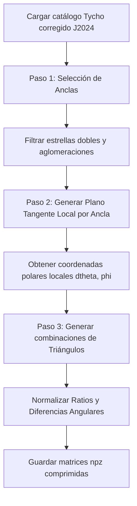
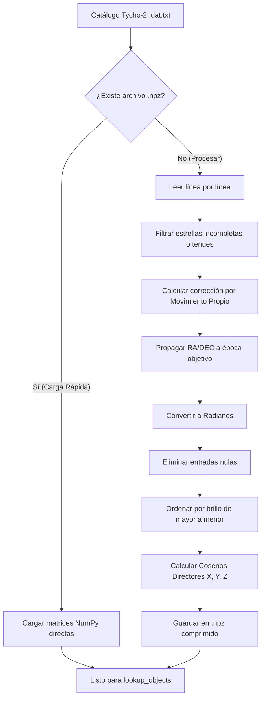
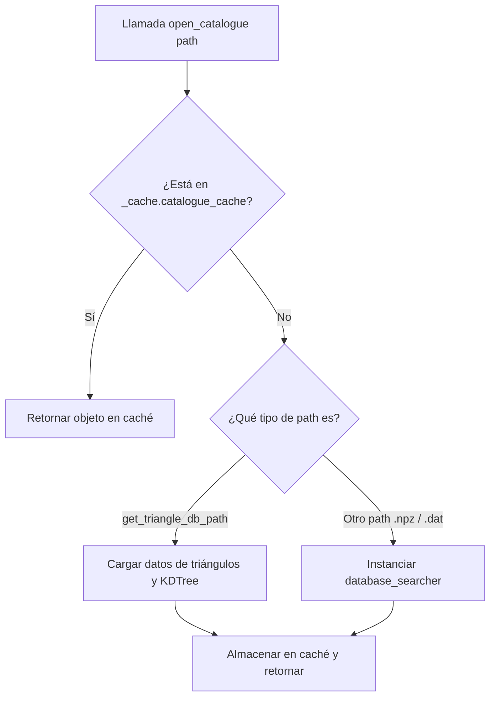
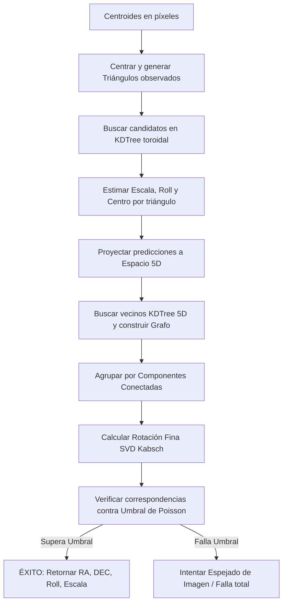
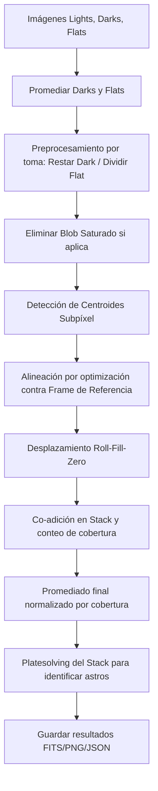

# Generación de catálogos, centroides, apilado y Platesolving

Este documento reúne de manera estructurada los fundamentos astronómicos, modelados matemáticos, detalles de diseño algorítmico y descripciones de software (API) de los seis módulos del sistema de calibración de imágenes, alineación por centroides, resolución de placas (*platesolving*) y gestión de catálogos estelares de la aplicación:
1. `my_platesolve_new.py`
2. `my_database_lookup2.py`
3. `my_database_cache.py`
4. `my_database_searcher.py`
5. `my_platesolve_triangle.py`
6. `my_stacker_implementation.py`

---

## Índice General

- [Generación de catálogos, centroides, apilado y Platesolving](#generación-de-catálogos-centroides-apilado-y-platesolving)
  - [Índice General](#índice-general)
  - [Capítulo 1: Generación del Catálogo de Triángulos Invariantes (`my_platesolve_new.py`)](#capítulo-1-generación-del-catálogo-de-triángulos-invariantes-my_platesolve_newpy)
    - [1.1. Introducción y Arquitectura del Programa](#11-introducción-y-arquitectura-del-programa)
    - [1.2. Modelado Matemático Detallado](#12-modelado-matemático-detallado)
      - [1.2.1. Selección de Estrellas "Ancla" y Región de Exclusión](#121-selección-de-estrellas-ancla-y-región-de-exclusión)
        - [Reglas de Selección:](#reglas-de-selección)
      - [1.2.2. Base Ortonormal en el Plano Tangente Local](#122-base-ortonormal-en-el-plano-tangente-local)
      - [1.2.3. Coordenadas Polares del Patrón](#123-coordenadas-polares-del-patrón)
      - [1.2.4. Características Invariantes de los Triángulos](#124-características-invariantes-de-los-triángulos)
        - [Normalización para Invariancia de Escala y Orientación:](#normalización-para-invariancia-de-escala-y-orientación)
    - [1.3. Lógica y Estructura de Datos de Mapeo Interno](#13-lógica-y-estructura-de-datos-de-mapeo-interno)
    - [1.4. Descripción Informática del Módulo (API)](#14-descripción-informática-del-módulo-api)
      - [1.4.1. Función: `generate`](#141-función-generate)
        - [**Constantes de Operación del Generador**](#constantes-de-operación-del-generador)
      - [1.4.2. Estructura del Archivo NPZ Guardado](#142-estructura-del-archivo-npz-guardado)
    - [1.5. Observaciones sobre el Código (Robustez y Casos Límite)](#15-observaciones-sobre-el-código-robustez-y-casos-límite)
  - [Capítulo 2: Búsqueda y Reducción del Catálogo Estelar (`my_database_lookup2.py`)](#capítulo-2-búsqueda-y-reducción-del-catálogo-estelar-my_database_lookup2py)
    - [2.1. Introducción y Arquitectura del Programa](#21-introducción-y-arquitectura-del-programa)
    - [2.2. Fundamentos Astronómicos](#22-fundamentos-astronómicos)
      - [2.2.1. Sistema de Coordenadas Ecuatoriales Celestes](#221-sistema-de-coordenadas-ecuatoriales-celestes)
      - [2.2.2. Movimiento Propio (Proper Motion)](#222-movimiento-propio-proper-motion)
    - [2.3. Formulación Matemática](#23-formulación-matemática)
      - [2.3.1. Conversión de Unidades de Movimiento Propio](#231-conversión-de-unidades-de-movimiento-propio)
      - [2.3.2. Corrección Geométrica por Declinación y Regularización Polar](#232-corrección-geométrica-por-declinación-y-regularización-polar)
        - [El problema de la singularidad polar:](#el-problema-de-la-singularidad-polar)
      - [2.3.3. Propagación Temporal a la Época Objetivo](#233-propagación-temporal-a-la-época-objetivo)
      - [2.3.4. Proyección a Coordenadas Cartesianas (Cosenos Directores)](#234-proyección-a-coordenadas-cartesianas-cosenos-directores)
    - [2.4. Algoritmos de Búsqueda y Filtrado (`lookup_objects`)](#24-algoritmos-de-búsqueda-y-filtrado-lookup_objects)
      - [2.4.1. Filtrado por Magnitud](#241-filtrado-por-magnitud)
      - [2.4.2. Filtrado por Ascensión Recta con Discontinuidad de 360°](#242-filtrado-por-ascensión-recta-con-discontinuidad-de-360)
      - [2.4.3. Filtrado por Declinación](#243-filtrado-por-declinación)
    - [2.5. Estructura de Datos y Eficiencia Numérica](#25-estructura-de-datos-y-eficiencia-numérica)
      - [2.5.1. Organización de Matrices](#251-organización-de-matrices)
      - [2.5.2. Clasificación por Brillo (Sorting)](#252-clasificación-por-brillo-sorting)
    - [2.6. Descripción Informática del Módulo (API)](#26-descripción-informática-del-módulo-api)
      - [2.6.1. Clase `database_searcher`](#261-clase-database_searcher)
        - [**Atributos de la Clase**](#atributos-de-la-clase)
        - [**Constructor: `__init__`**](#constructor-__init__)
        - [**Método: `lookup_objects`**](#método-lookup_objects)
        - [**Método: `save_npz`**](#método-save_npz)
  - [Capítulo 3: Mecanismo de Caché y Estructuras del Patrón (`my_database_cache.py`)](#capítulo-3-mecanismo-de-caché-y-estructuras-del-patrón-my_database_cachepy)
    - [3.1. Introducción y Propósito del Módulo](#31-introducción-y-propósito-del-módulo)
    - [3.2. Fundamentos Algorítmicos y Matemáticos](#32-fundamentos-algorítmicos-y-matemáticos)
      - [3.2.1. Representación Geométrica de Patrones (Triángulos)](#321-representación-geométrica-de-patrones-triángulos)
      - [3.2.2. KD-Tree Bidimensional con Topología Toroidal](#322-kd-tree-bidimensional-con-topología-toroidal)
        - [Explicación matemática del parámetro `boxsize`:](#explicación-matemática-del-parámetro-boxsize)
    - [3.3. Arquitectura del Mecanismo de Caché](#33-arquitectura-del-mecanismo-de-caché)
      - [3.3.1. Carga Dinámica y Fallo de Caché (*Cache Miss*)](#331-carga-dinámica-y-fallo-de-caché-cache-miss)
    - [3.4. Descripción Informática del Módulo (API)](#34-descripción-informática-del-módulo-api)
      - [3.4.1. Clase Interna `_cache`](#341-clase-interna-_cache)
        - [**Atributos de Clase**](#atributos-de-clase)
      - [3.4.2. Clase `TriangleData`](#342-clase-triangledata)
        - [**Constructor: `__init__`**](#constructor-__init__-1)
      - [3.4.3. Funciones del Módulo](#343-funciones-del-módulo)
        - [**Función: `work`**](#función-work)
        - [**Función: `prepare_triangles`**](#función-prepare_triangles)
        - [**Función: `open_database`**](#función-open_database)
        - [**Función: `open_catalogue`**](#función-open_catalogue)
  - [Capítulo 4: Análisis por Reingeniería Inversa: `database_searcher` (`my_database_searcher.py`)](#capítulo-4-análisis-por-reingeniería-inversa-database_searcher-my_database_searcherpy)
    - [4.1. Funcionamiento del Motor de Búsqueda](#41-funcionamiento-del-motor-de-búsqueda)
    - [4.2. Desarrollo Matemático: Gestión de la Esfera Celeste](#42-desarrollo-matemático-gestión-de-la-esfera-celeste)
      - [4.2.1. Lógica de Rango RA (Ascensión Recta)](#421-lógica-de-rango-ra-ascensión-recta)
      - [4.2.2. Transformación a Versores (Direction Vectors)](#422-transformación-a-versores-direction-vectors)
    - [4.3. Optimización de Memoria y Tipos de Datos](#43-optimización-de-memoria-y-tipos-de-datos)
    - [4.4. Capacidades de Consulta (`lookup_objects`)](#44-capacidades-de-consulta-lookup_objects)
  - [Capítulo 5: Solucionador Astrométrico de Campo Estelar (`my_platesolve_triangle.py`)](#capítulo-5-solucionador-astrométrico-de-campo-estelar-my_platesolve_trianglepy)
    - [5.1. Introducción y Arquitectura del Solucionador](#51-introducción-y-arquitectura-del-solucionador)
    - [5.2. Modelado Matemático Detallado](#52-modelado-matemático-detallado)
      - [5.2.1. Estimación del Umbral de Aceptación Estocástico](#521-estimación-del-umbral-de-aceptación-estocástico)
        - [Probabilidad de Coincidencia Aleatoria ($p$):](#probabilidad-de-coincidencia-aleatoria-p)
        - [Número de Ensayos Combinatorios ($N$):](#número-de-ensayos-combinatorios-n)
        - [Límite del Máximo de Variables de Poisson:](#límite-del-máximo-de-variables-de-poisson)
      - [5.2.2. Estimación Analítica de Escala, Roll y Centro](#522-estimación-analítica-de-escala-roll-y-centro)
      - [5.2.3. Agrupación y Consenso en Espacio 5D](#523-agrupación-y-consenso-en-espacio-5d)
      - [5.2.4. Refinamiento de la Rotación mediante el Algoritmo de Kabsch (SVD)](#524-refinamiento-de-la-rotación-mediante-el-algoritmo-de-kabsch-svd)
    - [5.3. Descripción Informática del Módulo (API)](#53-descripción-informática-del-módulo-api)
      - [5.3.1. Funciones del Módulo](#531-funciones-del-módulo)
        - [**`estimate_acceptance_threshold`**](#estimate_acceptance_threshold)
        - [**`match_centroids`**](#match_centroids)
        - [**`_find_rotation_matrix`**](#_find_rotation_matrix)
        - [**`compute_platescale`**](#compute_platescale)
        - [**`match_triangles_inner`**](#match_triangles_inner)
        - [**`platesolve`**](#platesolve)
    - [5.4. Bibliografía y Referencias de Soporte](#54-bibliografía-y-referencias-de-soporte)
  - [Capítulo 6: Guiado, Calibración y Apilado de Imágenes (`my_stacker_implementation.py`)](#capítulo-6-guiado-calibración-y-apilado-de-imágenes-my_stacker_implementationpy)
    - [6.1. Introducción y Propósito del Módulo](#61-introducción-y-propósito-del-módulo)
    - [6.2. Modelado Matemático y Algorítmico](#62-modelado-matemático-y-algorítmico)
      - [6.2.1. Reducción Astronómica (Calibración de la Imagen)](#621-reducción-astronómica-calibración-de-la-imagen)
      - [6.2.2. Detección y Enmascaramiento de Blobs Saturados](#622-detección-y-enmascaramiento-de-blobs-saturados)
      - [6.2.3. Extracción de Centroides Subpíxel (Centro de Masas)](#623-extracción-de-centroides-subpíxel-centro-de-masas)
        - [Método de Centro de Masa Simplificado](#método-de-centro-de-masa-simplificado)
        - [Método Avanzado de Normalización por Varianza Local](#método-avanzado-de-normalización-por-varianza-local)
      - [6.2.4. Alineación Geométrica Inter-frame (Optimización en Dos Pasos)](#624-alineación-geométrica-inter-frame-optimización-en-dos-pasos)
        - [Paso 1: Búsqueda Global y Ajuste Robusto](#paso-1-búsqueda-global-y-ajuste-robusto)
        - [Paso 2: Ajuste Fino de Mínimos Cuadrados](#paso-2-ajuste-fino-de-mínimos-cuadrados)
      - [6.2.5. Apilado por Desplazamiento y Adición (Shift-and-Add)](#625-apilado-por-desplazamiento-y-adición-shift-and-add)
    - [6.3. Descripción Informática del Módulo (API)](#63-descripción-informática-del-módulo-api)
      - [6.3.1. Funciones del Módulo](#631-funciones-del-módulo)
        - [**`open_image`**](#open_image)
        - [**`roll_fillzero`**](#roll_fillzero)
        - [**`expand_mask`**](#expand_mask)
        - [**`remove_saturated_blob`**](#remove_saturated_blob)
        - [**`attempt_align`**](#attempt_align)
        - [**`simple_get_centroids`**](#simple_get_centroids)
        - [**`get_centroids_blur`**](#get_centroids_blur)
        - [**`filter_edgy_centroids`**](#filter_edgy_centroids)
        - [**`do_stack`**](#do_stack)
    - [6.4. Bibliografía de Soporte (Procesamiento de Imágenes Astronómicas y Alineación)](#64-bibliografía-de-soporte-procesamiento-de-imágenes-astronómicas-y-alineación)

---

## Capítulo 1: Generación del Catálogo de Triángulos Invariantes (`my_platesolve_new.py`)

### 1.1. Introducción y Arquitectura del Programa
El proceso de *platesolving* requiere de una base de datos indexada con descriptores geométricos que sean **invariantes ante escala, rotación y traslación**. El módulo `my_platesolve_new.py` realiza este procesamiento precalculando las relaciones geométricas para todo el cielo en tres etapas consecutivas:
1. **Selección y distribución de anclas:** Identifica estrellas brillantes distribuidas uniformemente en la esfera celeste y descarta estrellas dobles que puedan corromper las lecturas.
2. **Construcción de bases tangentes locales:** Para cada estrella ancla, se define un plano tangente y se determinan las coordenadas polares de sus vecinas más brillantes.
3. **Generación de tripletas (Triángulos):** Se combinan las estrellas de la vecindad de cada ancla para construir descriptores triangulares invariantes de escala y orientación, los cuales son finalmente almacenados en disco.

<div style="display: flex; justify-content: center; width: 100%;">



</div>

### 1.2. Modelado Matemático Detallado
#### 1.2.1. Selección de Estrellas "Ancla" y Región de Exclusión
Para lograr una indexación eficiente del cielo sin redundancias locales excesivas, las estrellas se categorizan en estrellas "ancla" (vértices centrales del patrón) y "piernas" (estrellas secundarias que completan el patrón).
Dada una estrella candidato $i$ con vector cartesiano $\mathbf{v}_i$, se definen dos zonas angulares:
* **Zona de exclusión de densidad ($\theta_{\text{sep}} = 0.65^\circ$):** Ángulo mínimo para asegurar la dispersión homogénea de las anclas.
* **Zona de exclusión de estrella doble ($\theta_{\text{dob}} = 0.01^\circ$ o $36''$):** Evita errores de resolución causados por estrellas binarias o muy próximas en el sensor de imagen.

##### Reglas de Selección:
Para una estrella $i$ con vecinos más brillantes dentro del catálogo:
1. Si **ninguna estrella ya seleccionada como ancla** se encuentra a una distancia menor a $\theta_{\text{sep}}$:
   * Si la estrella pertenece al subconjunto de las más brillantes de primer nivel ($i < a+b$), se selecciona como ancla (`kept[i] = True`).
   * Se añade a la lista de piernas/vecinos válidos (`kept2[i] = True`).
2. Si existe un ancla dentro del radio $\theta_{\text{sep}}$ pero **ninguna dentro de** $\theta_{\text{dob}}$:
   * Si pertenece al subconjunto de estrellas hiper-brillantes ($i < a$), se selecciona igualmente como ancla (`kept[i] = True`) para mantener la cobertura.
   * Se añade a la lista de piernas (`kept2[i] = True`).

#### 1.2.2. Base Ortonormal en el Plano Tangente Local
Para representar la posición relativa de una estrella vecina $\mathbf{v}_{\text{vec}}$ respecto a su estrella ancla $\mathbf{v}_{\text{anc}}$ sin distorsiones geométricas en la esfera celeste, se proyecta el vector diferencia $\mathbf{\delta} = \mathbf{v}_{\text{vec}} - \mathbf{v}_{\text{anc}}$ sobre la base ortonormal del plano tangente a la esfera en $\mathbf{v}_{\text{anc}}$.

La base ortonormal local se define usando el eje del polo celeste norte $\mathbf{z} = (0, 0, 1)^T$:
1. **Vector tangente de Ascensión Recta ($\hat{\phi}$):** Dirección este-oeste tangente al paralelo local:

$$
\mathbf{t}_{\phi} = \mathbf{z} \times \mathbf{v}_{\text{anc}}
$$

$$
\hat{\phi} = \frac{\mathbf{t}_{\phi}}{\|\mathbf{t}_{\phi}\|}
$$


2. **Vector tangente de Declinación ($\hat{\theta}$):** Dirección norte-sur tangente al meridiano local:

$$
\mathbf{t}_{\theta} = \hat{\phi} \times \mathbf{v}_{\text{anc}}
$$

$$
\hat{\theta} = \frac{\mathbf{t}_{\theta}}{\|\mathbf{t}_{\theta}\|}
$$

Proyectando el vector diferencia $\mathbf{\delta}$ en este plano tangente, obtenemos sus coordenadas 2D cartesianas locales $(x, y)$:

$$
x = \hat{\theta} \cdot \mathbf{\delta}
$$

$$
y = \hat{\phi} \cdot \mathbf{\delta}
$$

#### 1.2.3. Coordenadas Polares del Patrón
A partir de las coordenadas del plano tangente local, se calculan las coordenadas polares del vecino $(\Delta\theta, \phi)$:
1. **Separación Angular Celeste ($\Delta\theta$):**
   Dado que los vectores son unitarios sobre la esfera celeste, la distancia angular real a través del círculo máximo se calcula de manera exacta a partir de la longitud del vector cuerda $\|\mathbf{\delta}\|$:

$$
\Delta\theta = 2 \arcsin\left(\frac{1}{2} \|\mathbf{\delta}\|\right)
$$

2. **Ángulo Polar Local ($\phi$):**

$$
\phi = \text{arctan2}(y, x)
$$

   Donde $\phi \in (-\pi, \pi]$.

#### 1.2.4. Características Invariantes de los Triángulos
Para cada ancla $i$, se toman sus $N = c+e = 18$ vecinos más brillantes de su entorno local y se construyen descriptores triangulares. Cada triángulo está constituido por el ancla y dos vecinas $j$ y $k$ (con $j < k$ en orden de iteración).

Las propiedades del triángulo se definen a partir de las distancias angulares de los vecinos al ancla ($d_j = \Delta\theta_j$ y $d_k = \Delta\theta_k$) y de sus ángulos polares ($\phi_j$ y $\phi_k$):
1. **Razón de Radios Inicial:**

$$
r_{\text{ini}} = \frac{d_k}{d_j}
$$

2. **Diferencia Angular Inicial:**

$$
\Delta\phi_{\text{ini}} = \phi_k - \phi_j
$$


##### Normalización para Invariancia de Escala y Orientación:
Para que el descriptor sea idéntico independientemente del orden de los vértices secundarios y la rotación del sensor, se realiza la siguiente normalización:
* **Si $r_{\text{ini}} > 1$:**

$$
r = \frac{1}{r_{\text{ini}}}
$$

$$
\Delta\phi = -\Delta\phi_{\text{ini}}
$$
* **Si $r_{\text{ini}} \le 1$:**

$$
r = r_{\text{ini}}
$$

$$
\Delta\phi = \Delta\phi_{\text{ini}}
$$

Finalmente, se normaliza la diferencia angular al dominio $[0, 2\pi)$ para evitar saltos de fase:


$$
\Delta\phi = \Delta\phi \pmod{2\pi}
$$


Cada triángulo queda parametrizado de manera robusta por el par ordenado $(r, \Delta\phi)$.

### 1.3. Lógica y Estructura de Datos de Mapeo Interno
Una de las secciones algorítmicas más complejas del código es la remoción de la propia estrella ancla dentro del listado de vecinos devuelto por el KD-Tree de piernas (`kd_tree2`).

Dado que:
* `vectors` representa el catálogo original de tamaño $d$.
* `vectors2` de tamaño $M$ es el subconjunto donde `kept2 == True`.
* El ancla tiene un índice $i$ dentro de la lista de anclajes `vectors_kept`.
* El índice original del ancla en `vectors` es $\text{ind} = \text{kept\_vectors\_ind}[i]$.

Para eliminar al ancla de la lista de índices vecinos devueltos por `kd_tree2.query_ball_point` (los cuales están referenciados a los índices de `vectors2`), se calcula su índice equivalente en `vectors2` restando el número de elementos descartados en `kept2` hasta esa posición:


$$
\text{Índice en vectors2} = \text{ind} - \text{cumsum}[\text{ind}]
$$


Donde $\text{cumsum}$ es la suma acumulada de las estrellas no seleccionadas en `kept2`:

$$
\text{cumsum} = \sum_{k=0}^{\text{ind}} \neg \text{kept2}[k]
$$


### 1.4. Descripción Informática del Módulo (API)
El módulo exporta una única función principal encargada de construir y escribir la base de datos de triángulos.

#### 1.4.1. Función: `generate`
```python
def generate()
```
* **Descripción:** Carga el catálogo comprimido por defecto del proyecto, calcula la distribución del cielo para anclas y piernas, extrae las relaciones geométricas polares locales de vecinos y exporta los descriptores de triángulos resultantes en un archivo `.npz` comprimido.
* **Parámetros de Entrada:** Ninguno.
* **Parámetros de Salida / Retorno:** `None`.

##### **Constantes de Operación del Generador**
| Constante | Tipo | Valor | Descripción |
| :--- | :--- | :--- | :--- |
| `a` | `int` | `80000` | Cantidad de estrellas brillantes para anclajes principales. |
| `b` | `int` | `120000` | Cantidad de estrellas adicionales para anclajes secundarios. |
| `theta_sep` | `float` | `0.01134` rad ($0.65^\circ$) | Radio mínimo de separación espacial de las anclas. |
| `theta_double_star`| `float` | `0.000174` rad ($0.01^\circ$) | Radio de tolerancia de estrellas dobles. |
| `c` | `int` | `0` | Número de vecinos cercanos por distancia. |
| `d` | `int` | `700000` | Número total de estrellas consideradas para piernas. |
| `e` | `int` | `18` | Número de vecinos seleccionados por brillo. |
| `theta_pat` | `float` | `0.02967` rad ($1.7^\circ$) | Radio angular para la búsqueda de estrellas del patrón. |

#### 1.4.2. Estructura del Archivo NPZ Guardado
El archivo comprimido en `get_triangle_db_path()` contiene cuatro arreglos NumPy principales:
1. **`anchors` (numpy.ndarray):** Matriz de tamaño $N_{\text{anclas}} \times 3$ con los vectores directores cartesianos $(x,y,z)$ de las estrellas ancla seleccionadas.
2. **`pattern_ind` (numpy.ndarray):** Matriz de tamaño $N_{\text{anclas}} \times 18$ que almacena los índices correspondientes a las estrellas vecinas que forman el patrón de cada ancla.
3. **`pattern_data` (numpy.ndarray):** Matriz de dimensiones $N_{\text{anclas}} \times 18 \times 5$. Guarda la información polar e instrumental de los vecinos:
   * `[:, :, 0]`: Distancia angular $\Delta\theta$.
   * `[:, :, 1]`: Ángulo polar $\phi$.
   * `[:, :, 2:5]`: Vector unitario cartesiano $(x,y,z)$ de la estrella vecina.
4. **`triangles` (numpy.ndarray):** Matriz de dimensiones $N_{\text{anclas}} \times 153 \times 2$. Contiene los descriptores de las parejas de estrellas vecinas para cada ancla:
   * `[:, :, 0]`: Razón de radios normalizada ($r \le 1$).
   * `[:, :, 1]`: Diferencia angular normalizada ($\Delta\phi \in [0, 2\pi)$).

### 1.5. Observaciones sobre el Código (Robustez y Casos Límite)


---

## Capítulo 2: Búsqueda y Reducción del Catálogo Estelar (`my_database_lookup2.py`)

### 2.1. Introducción y Arquitectura del Programa
El script `my_database_lookup2.py` está diseñado para resolver eficientemente la indexación espacial y la consulta rápida de estrellas para aplicaciones como la resolución de placas (*platesolving*) u orientación astronómica. 

El flujo lógico consta de dos fases principales:
1. **Carga y Reducción Astronómica:** Lee el catálogo en formato de texto plano (`.dat.txt`), aplica correcciones por movimiento propio para una época objetivo (por ejemplo, el año 2026), filtra estrellas por su brillo (magnitud límite) y proyecta las coordenadas celestes en un espacio cartesiano tridimensional (vectores directores).
2. **Persistencia y Búsqueda:** Almacena los datos procesados en un archivo binario comprimido de NumPy (`.npz`) para permitir cargas instantáneas en ejecuciones futuras, y proporciona una función de búsqueda por rangos de Ascensión Recta ($\alpha$) y Declinación ($\delta$) con manejo de discontinuidades geométricas.

<div>



</div>

### 2.2. Fundamentos Astronómicos
#### 2.2.1. Sistema de Coordenadas Ecuatoriales Celestes
El cielo se modela como una esfera unitaria (Esfera Celeste). La posición de cualquier astro se define mediante dos coordenadas angulares en el sistema de coordenadas ecuatoriales:
* **Ascensión Recta ($\alpha$ o RA):** Ángulo medido sobre el ecuador celeste desde el punto Aries (equinoccio vernal) hacia el Este. Varía habitualmente en el rango $[0, 360^\circ)$ o $[0, 24\text{h})$.
* **Declinación ($\delta$ o DEC):** Distancia angular medida perpendicularmente al ecuador celeste hacia el Norte (positiva) o hacia el Sur (negativa). Su rango es $[-90^\circ, +90^\circ]$.

#### 2.2.2. Movimiento Propio (Proper Motion)
Las estrellas no están fijas en el espacio; poseen un movimiento intrínseco relativo al Sol denominado **movimiento propio**. Este movimiento se proyecta en la esfera celeste como dos velocidades angulares:
* $\mu_\alpha^* = \mu_\alpha \cos\delta$: Movimiento propio en la dirección de la Ascensión Recta (corregido por el efecto de convergencia de los meridianos en los polos).
* $\mu_\delta$: Movimiento propio en la dirección de la Declinación.

En el catálogo Tycho-2, estas componentes se expresan en **miliarcosegundos por año** ($\text{mas/año}$) y están referenciadas a la época media de observación del catálogo:

$$
t_0 = 1991.25
$$


El equinoccio y ecuador de referencia utilizados para el catálogo Tycho-2 corresponden al estándar internacional J2000.0 (época J2000).

### 2.3. Formulación Matemática
El procesamiento matemático del script se divide en tres etapas secuenciales: conversión de unidades, propagación temporal y proyección cartesiana.

#### 2.3.1. Conversión de Unidades de Movimiento Propio
Las variables correspondientes a los movimientos propios en el catálogo Tycho-2 se encuentran en la columna 12 ($\text{pmRA} = \mu_\alpha^*$) y en la columna 13 ($\text{pmDEC} = \mu_\delta$) en $\text{mas/año}$. El script convierte estas velocidades angulares a **grados por año** ($^\circ\text{/año}$):


$$
\mu_\alpha^* \, [^\circ\text{/año}] = \frac{\text{pmRA}}{1000 \cdot 3600}
$$


$$
\mu_\delta \, [^\circ\text{/año}] = \frac{\text{pmDEC}}{1000 \cdot 3600}
$$


*Justificación:* Hay $1000\text{ mas}$ en 1 arcosegundo ($''$), y $3600''$ en 1 grado ($^\circ$). Por tanto, $1^\circ = 3.6 \times 10^6\text{ mas}$.

#### 2.3.2. Corrección Geométrica por Declinación y Regularización Polar
Dado que $\text{pmRA}$ es la componente tangencial sobre el paralelo local ($\mu_\alpha^* = \mu_\alpha \cos\delta$), para obtener la velocidad real de cambio en la coordenada de Ascensión Recta ($\mu_\alpha$) debemos dividir por el coseno de la declinación:


$$
\mu_\alpha = \frac{\mu_\alpha^*}{\cos\delta}
$$


##### El problema de la singularidad polar:
Cuando la declinación de una estrella se aproxima a los polos celestes ($\delta \to \pm 90^\circ$), el término $\cos\delta \to 0$. Esto causa que $\mu_\alpha \to \infty$, introduciendo inestabilidad numérica extrema en la división.

Para mitigar esto, el código implementa un umbral de regularización:
* Si $\cos\delta > 0.1$ (lo cual equivale a un límite en declinación de $|\delta| < \arccos(0.1) \approx 84.26^\circ$):
  Se calcula $\mu_\alpha$ de manera ordinaria.
* Si $\cos\delta \le 0.1$ (zona polar con $|\delta| \ge 84.26^\circ$):
  Se descarta el movimiento propio asignando valores nulos a ambos componentes:

$$
\mu_\alpha = 0, \quad \mu_\delta = 0
$$


#### 2.3.3. Propagación Temporal a la Época Objetivo
Dada una época de destino $t$ (por ejemplo, el año actual $t = 2026$), el diferencial de tiempo transcurrido desde la época de observación es:


$$
\Delta t = t - t_0 = t - 1991.25
$$


Las nuevas coordenadas celestes en grados se calculan aplicando una aproximación lineal de primer orden:


$$
\alpha(t) = \alpha(t_0) + \mu_\alpha \cdot \Delta t
$$


$$
\delta(t) = \delta(t_0) + \mu_\delta \cdot \Delta t
$$


Posteriormente, se realiza la conversión a radianes:


$$
\alpha_{\text{rad}} = \alpha(t) \cdot \frac{\pi}{180^\circ}
$$


$$
\delta_{\text{rad}} = \delta(t) \cdot \frac{\pi}{180^\circ}
$$


#### 2.3.4. Proyección a Coordenadas Cartesianas (Cosenos Directores)
Para optimizar los cálculos geométricos tridimensionales posteriores, la posición esférica $(\alpha_{\text{rad}}, \delta_{\text{rad}})$ en la esfera celeste unitaria se proyecta a un vector director cartesiano tridimensional $\mathbf{v} = (x, y, z)^T$:


$$
x = \cos(\alpha_{\text{rad}}) \cos(\delta_{\text{rad}})
$$


$$
y = \sin(\alpha_{\text{rad}}) \cos(\delta_{\text{rad}})
$$


$$
z = \sin(\delta_{\text{rad}})
$$


Donde:
* $\mathbf{v}$ representa un vector unitario, verificándose que:

$$
\|\mathbf{v}\| = \sqrt{x^2 + y^2 + z^2} = \sqrt{\cos^2\delta(\cos^2\alpha + \sin^2\alpha) + \sin^2\delta} = \sqrt{\cos^2\delta (1) + \sin^2\delta} = 1
$$


### 2.4. Algoritmos de Búsqueda y Filtrado (`lookup_objects`)
El método `lookup_objects` implementa un filtro rápido sobre el catálogo precargado utilizando tres criterios: rango de Ascensión Recta, rango de Declinación y Magnitud Máxima.

#### 2.4.1. Filtrado por Magnitud
Dado un límite de magnitud aparente $m_{\text{máx}}$, se seleccionan únicamente las estrellas cuyo brillo cumpla con:


$$
m_{\text{estrella}} < m_{\text{máx}}
$$


> [!NOTE]
> Recuerde que en la escala de magnitudes astronómicas, a menor valor numérico, mayor es el brillo intrínseco del objeto.

#### 2.4.2. Filtrado por Ascensión Recta con Discontinuidad de 360°
Dado un intervalo de consulta en Ascensión Recta $[\alpha_{\text{mín}}, \alpha_{\text{máx}}]$, el algoritmo maneja la naturaleza periódica del ángulo (donde $360^\circ \equiv 0^\circ$):
1. **Caso Estándar ($\alpha_{\text{mín}} < \alpha_{\text{máx}}$):**
   El intervalo no cruza el origen. La condición de filtrado es lógica de conjunción:

$$
\alpha_{\text{mín}} < \alpha < \alpha_{\text{máx}}
$$

2. **Caso de Discontinuidad ($\alpha_{\text{mín}} \ge \alpha_{\text{máx}}$):**
   El intervalo cruza el límite de la discontinuidad (por ejemplo, una búsqueda de $350^\circ$ a $10^\circ$). La condición de filtrado se convierte en una disyunción lógica:

$$
\alpha > \alpha_{\text{mín}} \quad \lor \quad \alpha < \alpha_{\text{máx}}
$$


#### 2.4.3. Filtrado por Declinación
El filtrado en declinación opera de forma similar al de ascensión recta en el intervalo $[\delta_{\text{mín}}, \delta_{\text{máx}}]$. Aunque la declinación físicamente está acotada entre $[-90^\circ, 90^\circ]$ y no presenta periodicidad natural del mismo tipo, el código incluye una estructura análoga:
* **Caso Estándar ($\delta_{\text{mín}} < \delta_{\text{máx}}$):**

$$
\delta_{\text{mín}} < \delta < \delta_{\text{máx}}
$$

* **Caso de Discontinuidad teórica ($\delta_{\text{mín}} \ge \delta_{\text{máx}}$):**

$$
\delta > \delta_{\text{mín}} \quad \lor \quad \delta < \delta_{\text{máx}}
$$


### 2.5. Estructura de Datos y Eficiencia Numérica
#### 2.5.1. Organización de Matrices
Para cada estrella cargada en memoria, se asignan valores en dos matrices NumPy altamente eficientes:
1. **`star_table` (tipo `float32`, dimensiones $N \times 6$):**
   Almacena las propiedades físicas y geométricas.

$$
\text{Fila } i = \begin{bmatrix} \alpha_{\text{rad}} & \delta_{\text{rad}} & x & y & z & \text{mag} \end{bmatrix}
$$

2. **`star_catID` (tipo `uint16`, dimensiones $N \times 3$):**
   Almacena el identificador único del catálogo Tycho-2, compuesto por tres números enteros:
   * **TYC1:** Número de región astronómica.
   * **TYC2:** Número de estrella dentro de la región.
   * **TYC3:** Número de componente (generalmente 1 para estrellas individuales, o más en sistemas múltiples).

#### 2.5.2. Clasificación por Brillo (Sorting)
Durante la inicialización, se calcula un arreglo de índices ordenados `brightness_ii` a partir del vector de magnitudes (columna 5 de `star_table`):


$$
\text{brightness\_ii} = \text{argsort}(\text{star\_table}[:, 5])
$$


Ambas matrices (`star_table` y `star_catID`) son reordenadas utilizando estos índices. Esto asegura que:


$$
\text{star\_table}[i, 5] \le \text{star\_table}[i+1, 5] \quad \forall i \in [0, N-2]
$$


*Ventaja:* Al buscar estrellas brillantes, se garantiza que los primeros elementos recuperados corresponden siempre a las estrellas de mayor brillo aparente en el cielo, permitiendo truncar las búsquedas eficientemente si se requiere.

### 2.6. Descripción Informática del Módulo (API)
#### 2.6.1. Clase `database_searcher`
Clase principal encargada de la ingestión de catálogos estelares (crudos o comprimidos), la corrección espacial de las posiciones estelares y el procesamiento de consultas de región celeste.

##### **Atributos de la Clase**
* **`self.num_entries` (int):** Número total de registros de estrellas cargados válidamente en memoria.
* **`self.star_table` (numpy.ndarray):** Matriz de tipo `float32` y dimensiones $N \times 6$. Cada fila representa una estrella con las siguientes columnas indexadas:
  * `[0]`: Ascensión Recta ($\alpha$) en radianes.
  * `[1]`: Declinación ($\delta$) en radianes.
  * `[2]`: Componente cartesiano $x$ del vector director unitario.
  * `[3]`: Componente cartesiano $y$ del vector director unitario.
  * `[4]`: Componente cartesiano $z$ del vector director unitario.
  * `[5]`: Magnitud aparente ($mag$).
* **`self.star_catID` (numpy.ndarray):** Matriz de tipo `uint16` y dimensiones $N \times 3$. Guarda el identificador jerárquico Tycho-2 `[TYC1, TYC2, TYC3]`. Si la carga se realiza desde un archivo `.npz`, esta matriz se inicializa con ceros.
* **`self.brightness_ii` (numpy.ndarray):** Arreglo unidimensional de enteros (`int`) con los índices resultantes de la ordenación de menor a mayor magnitud (mayor a menor brillo).
* **`self.epoch_equinox` (float):** Constante estática `2000` que define la época del equinoccio del catálogo de referencia (J2000.0).
* **`self.pm_origin` (float):** Constante estática `1991.25` que define la época astronómica base de las mediciones de posición del catálogo Tycho-2.

##### **Constructor: `__init__`**
```python
def __init__(self, catalogue_path, star_max_magnitude=12, epoch_proper_motion='now', debug_folder=None):
```
* **Descripción:** Inicializa la base de datos de búsqueda. Si la ruta provista termina con la extensión `.npz`, realiza una carga binaria directa y ultrarrápida. En caso contrario (catálogo `.dat.txt` en texto plano), realiza el análisis de parseo línea por línea mediante CSV, aplica la física de movimiento propio y las transformaciones geométricas.
* **Parámetros de Entrada:**
  * `catalogue_path` (str o pathlib.Path): Ruta del catálogo estelar.
  * `star_max_magnitude` (float o int): Magnitud aparente máxima permitida. Por defecto `12`.
  * `epoch_proper_motion` (int, float, str o None): Año de destino para el movimiento propio. Por defecto `'now'`.
  * `debug_folder` (str o pathlib.Path): Directorio para depuración. Por defecto `None`.
* **Retorno:** `None`.

##### **Método: `lookup_objects`**
```python
def lookup_objects(self, range_ra, range_dec, star_max_magnitude=12):
```
* **Descripción:** Filtra y devuelve las estrellas que se encuentren dentro del sector celeste delimitado por los rangos espaciales y de magnitud.
* **Parámetros de Entrada:**
  * `range_ra` (tuple o None): Rango de Ascensión Recta `(ra_min, ra_max)` en grados.
  * `range_dec` (tuple o None): Rango de Declinación `(dec_min, dec_max)` en grados.
  * `star_max_magnitude` (float o int): Magnitud máxima permitida. Por defecto `12`.
* **Retorno:** Tupla de matrices `(star_table, star_catID)`.

##### **Método: `save_npz`**
```python
def save_npz(self, file):
```
* **Descripción:** Guarda y exporta el catálogo estelar preprocesado en un formato de compresión binario `.npz` optimizado para NumPy.
* **Parámetros de Entrada:**
  * `file` (str o pathlib.Path): Ruta de salida del archivo `.npz`.
* **Retorno:** `None`.

---

## Capítulo 3: Mecanismo de Caché y Estructuras del Patrón (`my_database_cache.py`)

### 3.1. Introducción y Propósito del Módulo
El módulo `my_database_cache.py` actúa como una capa de persistencia intermedia en memoria (Caché Singleton) que gestiona dos tipos de datos:
1. **Catálogos estelares tradicionales:** Representados por instancias de la clase `database_searcher` de `my_database_lookup2`.
2. **Bases de datos de patrones de estrellas (Triángulos):** Utilizadas para la identificación instantánea del campo de estrellas mediante algoritmos basados en KD-Trees multidimensionales.

El principal objetivo del módulo es evitar el reanálisis y la recarga computacionalmente costosa de archivos en disco durante consultas repetitivas de placas.

<div style="display: flex; justify-content: center; width: 100%;">



</div>

### 3.2. Fundamentos Algorítmicos y Matemáticos
El corazón matemático de este módulo reside en la clase `TriangleData` y su indexación mediante un **Árbol K-Dimensional (KD-Tree)** con restricciones de periodicidad.

#### 3.2.1. Representación Geométrica de Patrones (Triángulos)
En el algoritmo de platesolving, un patrón estelar se descompone en combinaciones de triángulos formados por una estrella central ("ancla") y sus vecinas. Para cada triángulo, se calculan características invariantes ante traslaciones, rotaciones y escalas de la imagen:
1. **Relación de radios (Ratio):** Razón entre las longitudes de los lados del triángulo.
2. **Separación angular ($\phi$):** El ángulo formado entre las estrellas del triángulo en la esfera celeste.

La matriz `self.triangles` posee dimensiones $(n \times T \times 2)$, donde $n$ es el número de patrones estelares (estrellas de anclaje) y $T$ es el número de combinaciones de triángulos:


$$
T = \frac{N(N - 1)}{2}
$$


#### 3.2.2. KD-Tree Bidimensional con Topología Toroidal
Para realizar búsquedas ultrarrápidas de correspondencias en tiempo $O(\log M)$ (donde $M = n \times T$), las propiedades del triángulo se aplanan en una matriz bidimensional de forma $(M \times 2)$ mediante un redimensionamiento:


$$
\text{Puntos} = \text{reshape}(\text{self.triangles}, (-1, 2))
$$


Se construye un KD-Tree de SciPy (`scipy.spatial.KDTree`) configurando condiciones de contorno periódicas:


$$
\text{kd\_tree} = \text{KDTree}(\text{Puntos}, \text{boxsize}=[9999999, 2\pi])
$$


##### Explicación matemática del parámetro `boxsize`:
La métrica ordinaria de distancia euclidiana en 2D entre dos puntos de características $p_1 = (r_1, \theta_1)$ y $p_2 = (r_2, \theta_2)$ es:


$$
d(p_1, p_2) = \sqrt{(r_1 - r_2)^2 + (\theta_1 - \theta_2)^2}
$$


Sin embargo, el ángulo polar celeste $\theta$ es periódico con periodo $2\pi$ radianes. Para corregir esto, el parámetro `boxsize` implementa una topología toroidal:
* **Dimensión 1 (Ratio $r$):** Se establece un límite de periodicidad de $9\,999\,999$, un valor infinitamente superior al rango real de ratios de lados. Esto hace que el eje geométrico del ratio actúe como un espacio euclidiano plano estándar.
* **Dimensión 2 (Ángulo $\theta$):** Se establece un límite de periodicidad de $2\pi$ ($360^\circ$). La distancia periódica en este eje se redefine internamente como:


$$
d_{\text{periódica}}(\theta_1, \theta_2) = \min\left(|\theta_1 - \theta_2|, 2\pi - |\theta_1 - \theta_2|\right)
$$


La distancia total sobre el toro de búsqueda es, por tanto:


$$
D_{\text{toro}}(p_1, p_2) = \sqrt{(r_1 - r_2)^2 + d_{\text{periódica}}(\theta_1, \theta_2)^2}
$$


### 3.3. Arquitectura del Mecanismo de Caché
El módulo encapsula el almacenamiento de datos en la clase estática `_cache`, y define métodos auxiliares para poblar de forma síncrona el almacenamiento.

#### 3.3.1. Carga Dinámica y Fallo de Caché (*Cache Miss*)
Cuando se invoca la función de carga para el catálogo de triángulos y no se localizan los datos físicos en la ruta predeterminada de la aplicación (`TripleTrianglePlatesolveDatabase`), se produce un fallo crítico de datos. Para resolverlo sin interrumpir el flujo, el módulo se acopla dinámicamente con `my_platesolve_new`:
1. Captura la excepción de carga faltante (`Exception`).
2. Invoca el generador de base de datos astronómica: `my_platesolve_new.generate()`.
3. Una vez creado el catálogo geométrico en disco, vuelve a intentar la lectura y carga definitiva de las estructuras.

### 3.4. Descripción Informática del Módulo (API)
#### 3.4.1. Clase Interna `_cache`
Contenedor estático para las referencias a las estructuras cacheadas en memoria.

##### **Atributos de Clase**
* **`database_cache` (dict):** Diccionario destinado a almacenar objetos de bases de datos generales (actualmente en desuso).
* **`catalogue_cache` (dict):** Diccionario asociativo `ruta -> instancia` (`database_searcher` o `TriangleData`).

#### 3.4.2. Clase `TriangleData`
Clase envolvente que estructura las matrices de patrones de astros y genera el árbol espacial indexado.

##### **Constructor: `__init__`**
```python
def __init__(self, cata_data):
```
* **Parámetros de Entrada:**
  * `cata_data` (dict o `numpy.lib.npyio.NpzFile`): Archivo comprimido con las llaves `'triangles'`, `'anchors'`, `'pattern_data'`, y `'pattern_ind'`.
* **Atributos Creados:**
  * `self.triangles` (numpy.ndarray)
  * `self.anchors` (numpy.ndarray)
  * `self.pattern_data` (numpy.ndarray)
  * `self.pattern_ind` (numpy.ndarray)
  * `self.kd_tree` (scipy.spatial.KDTree) - Inicializado con topología toroidal.

#### 3.4.3. Funciones del Módulo
##### **Función: `work`**
```python
def work()
```
* **Descripción:** Realiza la carga de datos del catálogo de patrones de triángulos. Si falla por ausencia de archivo, delega en `my_platesolve_new.generate()`.
* **Entradas:** Ninguna.
* **Salida:** `None`.

##### **Función: `prepare_triangles`**
```python
def prepare_triangles()
```
* **Descripción:** Función de inicialización pública de la base de datos de triángulos. Invoca de manera síncrona a `work()`.
* **Entradas:** Ninguna.
* **Salida:** `None`.

##### **Función: `open_database`**
```python
def open_database(path)
```
* **Descripción:** Función deprecada.
* **Salida:** Lanza un error explícito: `Exception("Function has been removed")`.

##### **Función: `open_catalogue`**
```python
def open_catalogue(path, debug_folder=None, **kwaargs)
```
* **Descripción:** Abre un catálogo estelar y devuelve su instancia en caché. Si el elemento no existe en `_cache.catalogue_cache`, lo crea.
* **Parámetros de Entrada:**
  * `path` (str): Ruta del catálogo.
  * `debug_folder` (str o Path, opcional): Ruta para depuración.
  * `**kwaargs`: Argumentos variables adicionales.
* **Retorno:** Instancia de `database_searcher` o `TriangleData`.


---

## Capítulo 4: Análisis por Reingeniería Inversa: `database_searcher` (`my_database_searcher.py`)

### 4.1. Funcionamiento del Motor de Búsqueda

El sistema no utiliza una base de datos SQL tradicional; en su lugar, emplea una búsqueda lineal sobre un array de NumPy altamente optimizado. Esto es posible gracias a que los datos están cargados en memoria y se aprovecha la vectorización de CPU.

**Flujo de Trabajo:**
1. **Carga y Normalización:** Al iniciar, el buscador precarga las coordenadas (RA, Dec) y las convierte a radianes.
2. **Filtrado por Rango:** Se aplican máscaras booleanas sucesivas para reducir el conjunto de estrellas.
3. **Ordenación por Brillo:** El catálogo se pre-ordena por magnitud, permitiendo que las primeras $N$ estrellas encontradas sean siempre las más brillantes.

---

### 4.2. Desarrollo Matemático: Gestión de la Esfera Celeste

La búsqueda de objetos astronómicos presenta un reto matemático: la **discontinuidad del origen de coordenadas** (meridiano 0/360).

#### 4.2.1. Lógica de Rango RA (Ascensión Recta)
La RA se mide de 0 a 360 grados. Si un usuario busca una región que cruza el meridiano cero (ej. de 350° a 10°), una comparación simple `RA > min AND RA < max` fallaría. El buscador implementa la siguiente lógica:

Sea $RA_{min}$ y $RA_{max}$ los límites de búsqueda:

1. **Caso Normal ($RA_{min} < RA_{max}$):**
   $$S = \{star \mid RA_{min} < RA_{star} < RA_{max}\}$$
2. **Caso de Cruce ($RA_{min} > RA_{max}$):**
   $$S = \{star \mid RA_{star} > RA_{min} \lor RA_{star} < RA_{max}\}$$

Esta lógica asegura que el "corte" de la esfera no deje huecos en la base de datos.

#### 4.2.2. Transformación a Versores (Direction Vectors)
Para evitar el uso constante de funciones trigonométricas costosas (`cos`, `sin`) durante búsquedas espaciales complejas, el módulo pre-calcula la representación de cada estrella como un vector unitario $\mathbf{V}$ en $\mathbb{R}^3$:

$$
\mathbf{V} = \begin{bmatrix} 
\cos \alpha \cdot \cos \delta \\ 
\sin \alpha \cdot \cos \delta \\ 
\sin \delta 
\end{bmatrix}
$$

Esto permite que cálculos posteriores, como la distancia angular $\theta$ entre dos estrellas $\mathbf{V_1}$ y $\mathbf{V_2}$, se realicen mediante un simple producto escalar:
$$\theta = \arccos(\mathbf{V_1} \cdot \mathbf{V_2})$$

---

### 4.3. Optimización de Memoria y Tipos de Datos

El buscador utiliza tipos de datos específicos para balancear precisión y rendimiento:
* **`float32`:** Para coordenadas y vectores. Ofrece precisión suficiente para astrometría de campo amplio (FOV > 0.5°) mientras reduce el uso de memoria a la mitad comparado con `float64`.
* **`uint16`:** Para los identificadores de catálogo (TYC), permitiendo representar números hasta 65,535 en un espacio mínimo.

---

### 4.4. Capacidades de Consulta (`lookup_objects`)

El método principal de búsqueda permite filtrar simultáneamente por:
1. **Ventana Espacial:** Rango de RA y Dec.
2. **Corte de Magnitud:** Excluye estrellas más débiles que un valor `star_max_magnitude`.
3. **Memoria Dinámica:** El método devuelve una vista (`view`) o copia filtrada del array original, manteniendo la integridad de la base de datos principal.

---

## Capítulo 5: Solucionador Astrométrico de Campo Estelar (`my_platesolve_triangle.py`)

### 5.1. Introducción y Arquitectura del Solucionador
El módulo `my_platesolve_triangle.py` resuelve el problema conocido en astronavegación como **"Perdido en el Espacio" (Lost-in-Space)**. A partir de una lista de centroides de estrellas detectadas en una imagen en coordenadas de píxeles, el solucionador determina la escala de la placa (arcosegundos por píxel), las coordenadas de apuntamiento del centro de la imagen (Ascensión Recta $\alpha$, Declinación $\delta$) y el ángulo de rotación de la cámara (Roll).

El flujo lógico del algoritmo consta de cinco fases principales:
1. **Generación de tripletas observadas:** Centra los centroides y construye combinaciones de triángulos utilizando las estrellas más brillantes de la imagen.
2. **Búsqueda geométrica en base de datos:** Consulta las características de los triángulos observados $(\text{ratio}, \Delta\phi)$ en el KD-Tree toroidal del catálogo precalculado.
3. **Voto y Consenso en Espacio 5D:** Agrupa los triángulos que coinciden en sus predicciones de escala de placa, roll y centro geométrico mediante componentes conectadas de grafos dispersos.
4. **Alineación Fina por SVD:** Refina la matriz de rotación tridimensional entre los vectores de la imagen y el catálogo usando la descomposición en valores singulares (Algoritmo de Kabsch).
5. **Validación Estadística:** Compara el número de correspondencias reales contra un umbral de Poisson riguroso calculado mediante la función Lambert W.

<div style="display: flex; justify-content: center; width: 100%;">



</div>

### 5.2. Modelado Matemático Detallado
#### 5.2.1. Estimación del Umbral de Aceptación Estocástico
Para evitar falsos positivos, el programa implementa un análisis estadístico riguroso basado en procesos de Poisson y la función de Lambert W.

##### Probabilidad de Coincidencia Aleatoria ($p$):
Asumiendo que las estrellas están distribuidas de forma homogénea (isotrópica) en la esfera celeste, la probabilidad de que una coordenada aleatoria en la imagen caiga dentro de un radio de tolerancia angular $r$ (en radianes) de una estrella del catálogo de tamaño $N_{\text{cat}}$ es la relación de áreas sobre la esfera:


$$
p = N_{\text{cat}} \cdot \frac{\pi r^2}{4\pi} = \frac{N_{\text{cat}} \cdot r^2}{4}
$$


Para un triángulo observado que coincide con uno del catálogo, las $n_{\text{obs}} - 3$ estrellas restantes de la imagen se modelan como ensayos de Bernouilli independientes, aproximándose por una distribución de Poisson con parámetro $\lambda$:


$$
\lambda = p \cdot (n_{\text{obs}} - 3)
$$


##### Número de Ensayos Combinatorios ($N$):
El número de formas en que se pueden combinar las estrellas observadas y las del catálogo para generar coincidencias geométricas se estima mediante:


$$
N = \binom{N_{\text{cat}}}{3} \cdot \binom{g}{3} \cdot \text{TOLERANCE}^2
$$


##### Límite del Máximo de Variables de Poisson:
El umbral de aceptación se calcula determinando el valor esperado del máximo de $N$ variables de Poisson independientes con media $\lambda$. Se resuelve analíticamente empleando la **función de Lambert W** ($W$):


$$
x_0 = \frac{\ln(N)}{W\left(\frac{\ln(N)}{e \lambda}\right)}
$$


$$
x_1 = x_0 + \frac{\ln(\lambda) - \lambda - \frac{1}{2}\ln(2\pi) - \frac{3}{2}\ln(x_0)}{\ln(x_0) - \ln(\lambda)}
$$


El umbral de estrellas requeridas para validar la resolución es:


$$
\text{Umbral} = \text{round}(x_1) + 3 + \text{addon}
$$


Donde el $+3$ representa los vértices del triángulo de coincidencia inicial, y `addon` (por defecto 3) es un margen empírico de seguridad.

#### 5.2.2. Estimación Analítica de Escala, Roll y Centro
Para cada triángulo observado que coincide con uno del catálogo, el programa estima analíticamente los parámetros de proyección de la cámara.

Sean los vectores cartesianos del triángulo en el catálogo $\mathbf{T} = [\mathbf{a}_1, \mathbf{a}_2, \mathbf{a}_3] \in \mathbb{R}^{3 \times 3}$ y las coordenadas correspondientes en la imagen escalada en radianes $\mathbf{S} = [\mathbf{s}_1, \mathbf{s}_2, \mathbf{s}_3] \in \mathbb{R}^{3 \times 3}$. La matriz de rotación $\mathbf{R}$ que mapea la cámara al cielo satisface:


$$
\mathbf{T} = \mathbf{R} \cdot \mathbf{S} \implies \mathbf{R} = \mathbf{T} \cdot \mathbf{S}^{-1}
$$


Para optimizar el rendimiento y evitar llamadas repetidas a solucionadores numéricos, la inversa $\mathbf{S}^{-1}$ se calcula analíticamente por cofactores en formato vectorizado sobre NumPy:


$$
\mathbf{S}^{-1} = \frac{1}{\det(\mathbf{S})} \text{Adj}(\mathbf{S})
$$


A partir de la matriz de rotación estimada $\mathbf{R}$:
1. **Centro Óptico Celeste ($\mathbf{v}_{\text{centro}}$):**
   El eje óptico de la cámara apunta en la dirección z del sensor, $\mathbf{z}_{\text{cam}} = (0, 0, 1)^T$. Al proyectarlo al cielo, obtenemos el vector director del centro de la placa:

$$
\mathbf{v}_{\text{centro}} = \mathbf{R} \cdot \begin{pmatrix} 0 \\ 0 \\ 1 \end{pmatrix} = \mathbf{R}_{:, 0}
$$

   A partir del vector unitario se extrae la Ascensión Recta ($\alpha$) y la Declinación ($\delta$):

$$
\alpha = \text{arctan2}(v_y, v_x), \quad \delta = \arcsin(v_z)
$$

2. **Ángulo de Roll ($\psi$):**
   Representa la orientación de la cámara alrededor de su eje óptico:

$$
\psi = \text{arctan2}(R_{1, 2}, R_{2, 2}) \pmod{2\pi}
$$


#### 5.2.3. Agrupación y Consenso en Espacio 5D
Un triángulo individual puede emparejarse erróneamente debido al ruido. Sin embargo, los triángulos verdaderos coincidirán en la estimación global de escala de placa, roll y centro. El programa proyecta cada coincidencia a un espacio métrico de dimensión 5:


$$
\mathbf{u} = \begin{pmatrix} \frac{\ln(\text{escala})}{\text{log\_TOL\_SCALE}} \\ \frac{\text{roll}}{\text{TOL\_ROLL}} \\ \frac{\mathbf{v}_{\text{centro}}}{\text{TOL\_CENT}} \end{pmatrix} \in \mathbb{R}^5
$$


Se construye un `KDTree` con los vectores $\mathbf{u}$ de todas las coincidencias y se agrupan aquellas que se encuentran a una distancia máxima de 1 unidad. Este problema de agrupación se resuelve eficientemente mediante la búsqueda de componentes conectadas en un grafo disperso:
1. Las aristas del grafo se definen por pares de coincidencias consistentes espaciados a distancia $\le 1$ en $\mathbb{R}^5$.
2. Se extraen las componentes conexas utilizando el algoritmo de componentes conectadas en grafos no dirigidos.
3. Se selecciona la componente más grande que posea al menos 4 coincidencias no redundantes para realizar el ajuste fino.

#### 5.2.4. Refinamiento de la Rotación mediante el Algoritmo de Kabsch (SVD)
Una vez agrupadas las estrellas que coinciden en el patrón, se calcula la matriz de rotación óptima de mínimos cuadrados que mapea el conjunto de vectores de la imagen $\mathbf{P} = [\mathbf{p}_1, \mathbf{p}_2, \dots, \mathbf{p}_k]$ a los vectores del catálogo $\mathbf{Q} = [\mathbf{q}_1, \mathbf{q}_2, \dots, \mathbf{q}_k]$ mediante descomposición en valores singulares:
1. **Matriz de Covarianza ($\mathbf{H}$):**

$$
\mathbf{H} = \mathbf{P}^T \cdot \mathbf{Q}
$$

2. **Descomposición SVD:**

$$
\mathbf{H} = \mathbf{U} \cdot \mathbf{\Sigma} \cdot \mathbf{V}^T
$$

3. **Matriz de Rotación Óptima ($\mathbf{R}$):**

$$
\mathbf{R} = \mathbf{U} \cdot \mathbf{V}^T
$$


### 5.3. Descripción Informática del Módulo (API)
#### 5.3.1. Funciones del Módulo

##### **`estimate_acceptance_threshold`**
```python
def estimate_acceptance_threshold(n_obs, N_stars_catalog, threshold_match, g, addon=3):
```
* **Descripción:** Calcula el umbral estadístico mínimo de estrellas coincidentes necesarias para aceptar la resolución de placas.
* **Entradas:**
  * `n_obs` (int): Estrellas detectadas en la imagen.
  * `N_stars_catalog` (int): Estrellas en el catálogo de referencia.
  * `threshold_match` (float): Radio de coincidencia en radianes.
  * `g` (int): Vecinos estelares considerados en la vecindad del ancla.
  * `addon` (int, por defecto 3): Margen de seguridad estocástica.
* **Retorno:** `int`.

##### **`match_centroids`**
```python
def match_centroids(centroids, platescale_fit, image_size, options):
```
* **Descripción:** Compara los centroides de la imagen con el catálogo dentro del campo visual proyectado, eliminando coincidencias ambiguas mediante correspondencias reflexivas de vecinos más cercanos.
* **Entradas:**
  * `centroids` (numpy.ndarray): Matriz $K \times 2$ de coordenadas.
  * `platescale_fit` (numpy.ndarray): Escala y orientación de placa en radianes.
  * `image_size` (tuple): Dimensiones de la imagen `(alto, ancho)`.
  * `options` (dict): Parámetros de configuración.
* **Retorno:** Tupla `(stardata, plate2, max_error)`.

##### **`_find_rotation_matrix`**
```python
def _find_rotation_matrix(image_vectors, catalog_vectors):
```
* **Descripción:** Implementa el algoritmo de mínimos cuadrados de Kabsch para encontrar la rotación óptima.
* **Entradas:**
  * `image_vectors` (numpy.ndarray): Matriz $K \times 3$ de vectores de la imagen.
  * `catalog_vectors` (numpy.ndarray): Matriz $K \times 3$ de vectores del catálogo.
* **Retorno:** `numpy.ndarray` (Matriz de rotación $3 \times 3$).

##### **`compute_platescale`**
```python
def compute_platescale(triangles, pattern_data, anchors, match_cand, match_data, match_vect):
```
* **Descripción:** Estima analíticamente y de forma vectorizada la escala de placa, roll, matriz de rotación y centro del campo visual.
* **Entradas:** Estructuras de datos del catálogo y de las coincidencias de triángulos.
* **Retorno:** Tupla `(scale, roll, center_vect, rmatrix, target)`.

##### **`match_triangles_inner`**
```python
def match_triangles_inner(centroids, image_shape, options, kd_tree, anchors, pattern_ind, pattern_data, triangles):
```
* **Descripción:** Centra las coordenadas de píxeles, calcula los descriptores de triángulos observados y realiza la consulta en el KD-Tree para retornar las estimaciones primarias.
* **Retorno:** Tupla `(scale, roll, center_vect, match_info, triangle_info, vectors, target)`.

##### **`platesolve`**
```python
def platesolve(centroids, image_shape, options, output_dir=None, try_mirror_also=True):
```
* **Descripción:** Función principal de resolución de placa accesible por el usuario. Administra los intentos normales, y si fallan, realiza una transformación especular de la imagen.
* **Entradas:**
  * `centroids` (list o ndarray): Centroides detectados.
  * `image_shape` (tuple): Tamaño de la imagen.
  * `options` (dict): Parámetros y banderas.
  * `try_mirror_also` (bool, por defecto `True`): Si es `True`, reintenta el cálculo invirtiendo los ejes ante fallos.
* **Retorno:** Diccionario con claves (`"success"`, `"platescale"`, `"ra"`, `"dec"`, `"roll"`, `"matched_centroids"`, `"matched_stars"`).

---

### 5.4. Bibliografía y Referencias de Soporte

El diseño, la física astronómica, y las implementaciones matemáticas de este conjunto de módulos se apoyan en los siguientes trabajos académicos y literatura de referencia:

1. **Valdes, F. G., Campusano, L. E., Velasquez, J. D., & Stetson, P. B. (1995).** *FOCAS Automatic Catalog Matching Algorithms.* Publications of the Astronomical Society of the Pacific, 107, 1119-1128.
   * *Relevancia:* Trabajo clásico sobre emparejamiento de catálogos mediante descriptores basados en triángulos. Introduce la clasificación y ordenamiento de estrellas por magnitud para mitigar la complejidad combinatoria.

2. **Lang, D., Hogg, D. W., Mierle, K., Blanton, M., & Roweis, S. (2010).** *Astrometry.net: Blind Astrometric Calibration of Arbitrary Astronomical Images.* The Astronomical Journal, 139(5), 1782-1800.
   * *Relevancia:* Documenta el blind solving mediante descriptores geométricos locales invariantes (quads de estrellas) y su indexación espacial ultrarrápida usando árboles K-dimensionales (KD-Trees).

3. **Liebe, C. C. (1997).** *Star trackers for attitude determination.* IEEE Aerospace and Electronic Systems Magazine, 12(6), 10-16.
   * *Relevancia:* Presenta la teoría operativa de los seguidores de estrellas (*star trackers*) mediante catalogación de tripletas de estrellas para estimación de actitud en tiempo real.

4. **Groth, E. J. (1986).** *A Pattern-Matching Algorithm for Two-Dimensional Coordinate Lists.* Astronomical Journal, 91, 1244-1248.
   * *Relevancia:* Desarrolla el uso de razones entre distancias en agrupaciones estelares para lograr la invariancia de escala y orientación en algoritmos de emparejamiento de coordenadas 2D.

5. **Mortari, D. (1997).** *Search-Less Algorithm for Star Pattern Recognition.* Journal of the Astronautical Sciences, 45(2), 179-194.
   * *Relevancia:* Algoritmos eficientes de indexación y búsqueda directa para bases de datos de patrones de estrellas sin requerir búsquedas iterativas complejas.

6. **Kabsch, W. (1976).** *A discussion of the solution for the best rotation to relate two sets of vectors.* Acta Crystallographica Section A, 32(5), 922-923.
   * *Relevancia:* Formula el método cerrado basado en SVD para hallar la rotación rígida óptima de mínimos cuadrados entre dos nubes de puntos correlacionadas tridimensionales.

7. **Keith Briggs, Linlin Song & Thomas Prellberg. (2009).** *A note on the distribution of the maximum of a set of Poisson random variables.* BT Research & Mathematics QMUL.
   * *Relevancia:* Proporciona la aproximación estadística para el máximo de variables aleatorias de Poisson independientes que se utiliza en la estimación de umbrales en escenarios de coincidencia espacial estelar.

---

## Capítulo 6: Guiado, Calibración y Apilado de Imágenes (`my_stacker_implementation.py`)

### 6.1. Introducción y Propósito del Módulo
El apilado de imágenes astronómicas es una técnica fundamental utilizada para **incrementar la Relación Señal/Ruido (SNR)** de objetos celestes tenues. Dado que el ruido térmico y de lectura del sensor es de naturaleza estocástica e independiente entre tomas, al promediar $N$ imágenes, la señal coherente de las estrellas se acumula linealmente, mientras que la desviación estándar del ruido crece únicamente con la raíz cuadrada $\sqrt{N}$. Por tanto, la SNR global mejora en un factor de $\sqrt{N}$.

El pipeline de procesamiento de `my_stacker_implementation.py` consta de las siguientes fases:
1. **Ingestión e Inicialización:** Carga y conversión de imágenes multiformato (FITS, JPG, PNG) a matrices bidimensionales en escala de grises de punto flotante.
2. **Calibración de Campo:** Promediado de imágenes de calibración y aplicación de la corrección por corriente de oscuridad (*dark frame subtraction*) y corrección por iluminación del campo y viñeteo (*flat-field correction*).
3. **Eliminación de Saturación:** Detección de estrellas sobreexpuestas o planetas brillantes ("blobs") y su posterior enmascaramiento y supresión para evitar errores de guiado.
4. **Extracción de Centroides:** Identificación de estrellas y estimación ultraprecisa de sus coordenadas submétricas (subpíxel) mediante métodos de centro de masa filtrados.
5. **Alineación Inter-frame:** Optimización geométrica robusta en dos fases para encontrar el vector de desplazamiento relativo $(dy, dx)$ entre tomas.
6. **Apilado y Registro:** Desplazamiento y co-adición de las imágenes ajustadas por bordes, seguido de la calibración astrométrica final del stack resultante mediante *platesolving*.

<div style="display: flex; justify-content: center; width: 100%;">



</div>

---

### 6.2. Modelado Matemático y Algorítmico

#### 6.2.1. Reducción Astronómica (Calibración de la Imagen)
Para eliminar los patrones sistemáticos de ruido instrumental del sensor, cada imagen científica $I_{\text{raw}}$ se calibra usando un cuadro maestro de oscuridad $D$ (promedio de tomas con obturador cerrado) y un cuadro maestro de plano plano $F$ (promedio de tomas de iluminación uniforme):


$$
I_{\text{calibrada}}(y, x) = \frac{I_{\text{raw}}(y, x) - D(y, x)}{F(y, x)}
$$


Donde:
* La sustracción del *dark* $D$ elimina la señal térmica acumulada de forma desigual en el sensor (píxeles calientes).
* La división por el *flat* $F$ (normalizado a la unidad) corrige las variaciones de sensibilidad pixel a pixel y el viñeteo óptico.

---

#### 6.2.2. Detección y Enmascaramiento de Blobs Saturados
Las fuentes extremadamente brillantes en el campo visual pueden saturar los píxeles del sensor (llegando al límite digital, ej. 65535 en sensores de 16 bits), provocando desbordamientos de carga y halos que corrompen el cálculo de centroides.

El módulo detecta y elimina estas áreas mediante:
1. **Reducción Espacial:** Aplica un submuestreo espacial promediado local (`downscale_local_mean`) de factor $S$ (generalmente 8) para suavizar ruido de alta frecuencia y acelerar la identificación de estructuras contiguas de saturación.
2. **Segmentación y Convex Hull:** Se binarizan las zonas sobre el umbral de saturación $I_{\text{sat}}$ y se etiquetan las regiones conectadas. Para la región de mayor área, se calcula su Envolvente Convexa (*Convex Hull*) para rellenar vacíos.
3. **Expansión de Máscaras y Mezcla con Fondo:** Se expande la envolvente convexa mediante convoluciones morfológicas de radios $r_1$ y $r_2$. Para evitar discontinuidades abruptas en los bordes de la máscara de exclusión ($r_1$), los valores de píxel se reemplazan por el **percentil 5** de la intensidad de la propia imagen:

$$
I(y, x) \leftarrow P_5(I) \quad \forall (y,x) \in \text{Máscara}_1
$$

   Esto simula de manera natural el ruido y la luminosidad de fondo del cielo. La $\text{Máscara}_2$ ($r_2 > r_1$) se utiliza como zona de exclusión de seguridad para prohibir la detección de estrellas espurias en el halo circundante.

---

#### 6.2.3. Extracción de Centroides Subpíxel (Centro de Masas)
Para estimar las coordenadas submétricas de las estrellas, el código implementa dos alternativas:

##### Método de Centro de Masa Simplificado
1. Aplica un filtro de caja uniforme de $25 \times 25$ píxeles para estimar y restar el fondo local de baja frecuencia:

$$
I_{\text{sub}}(y, x) = I(y, x) - \text{UniformFilter}(I, 25)
$$

2. Estima el ruido RMS global $\sigma = \sqrt{\text{mean}(I_{\text{sub}}^2)}$ y binariza a un umbral de $2\sigma$.
3. Aplica una apertura binaria para eliminar ruido de un solo píxel y etiqueta regiones.
4. Calcula las coordenadas del centroide ponderado por intensidad (centro de masas):

$$
cy = \frac{\sum_i w_i y_i}{\sum_i w_i}, \quad cx = \frac{\sum_i w_i x_i}{\sum_i w_i}
$$

   Donde $w_i$ representa los pesos (intensidades del píxel) y $(y_i, x_i)$ son los centros del píxel con corrección de sesgo de $+0.5$.

##### Método Avanzado de Normalización por Varianza Local
1. **Sustracción de Fondo por Doble Caja Blur:**
   Estima la variación del fondo usando la diferencia entre un desenfoque de caja grande de tamaño $k$ (ej. 17) y un desenfoque interno de tamaño pequeño $d_{\text{int}}$ (ej. 3) corregido por escalas de área:

$$
\text{Blur}(y, x) = \left(\text{BoxFilter}(I, k) - \text{BoxFilter}(I, d_{\text{int}}) \cdot \frac{d_{\text{int}}^2}{k^2}\right) \cdot \frac{k^2}{k^2 - d_{\text{int}}^2}
$$

   $$I_{\text{sub}}(y, x) = I(y, x) - \text{Blur}(y, x)$$
2. **Normalización por Varianza Local:**
   Calcula el cuadrado de la señal $I_{\text{sub}}^2$, recorta los extremos (percentil 95) para evitar que estrellas hiper-brillantes distorsionen la estadística local, y obtiene la varianza local con un filtro de caja de $50 \times 50$:

$$
\sigma^2_{\text{local}}(y, x) = \text{UniformFilter}\left(\text{Clip}(I_{\text{sub}}^2), 50\right)
$$

   Normaliza la señal por la desviación estándar local para mapear la significancia estadística (SNR local) de cada píxel:

$$
\text{SNR}_{\text{local}}(y, x) = \max\left(\frac{I_{\text{sub}}(y, x)}{\sqrt{\sigma^2_{\text{local}}(y, x)}} - \sigma_{\text{resta}}, 0\right)
$$

3. **Filtrado Morfológico y Sanity Check de Perfil Estelar:**
   Tras segmentar y etiquetar las regiones sobre un umbral SNR, el módulo verifica que el perfil de luminosidad decrezca de forma estrictamente monótona a medida que nos alejamos del centro del candidato:

$$
\bar{I}_{r=1} > \bar{I}_{r=2} > \bar{I}_{r=3} > \bar{I}_{r=4}
$$

   Donde $\bar{I}_r$ es la intensidad promedio en un contorno cuadrado de radio $r$. Esto elimina instantáneamente falsas detecciones por píxeles calientes o ruido impulsivo de alta frecuencia.

---

#### 6.2.4. Alineación Geométrica Inter-frame (Optimización en Dos Pasos)
Para encontrar el vector de traslación relativo $\mathbf{b} = (dy, dx)^T$ entre el frame de referencia y una toma científica, se realiza un proceso de mínimos cuadrados no lineal robusto.

##### Paso 1: Búsqueda Global y Ajuste Robusto
Sean los centroides de referencia $\mathbf{C}_1 = [\mathbf{c}_{1,1}, \dots, \mathbf{c}_{1,m}]$ y los centroides del frame objetivo $\mathbf{C}_2 = [\mathbf{c}_{2,1}, \dots, \mathbf{c}_{2,m}]$. Se minimiza la función de pérdida:


$$
\min_{\mathbf{b}} L(\mathbf{b}) = \frac{1}{|\mathbf{C}_1|} \sum_{i} \min_{j} \left( \|\mathbf{c}_{1, i} - \mathbf{c}_{2, j} - \mathbf{b}\|^{1.5} \land \text{cutoff} \right)
$$


*Justificación:* El uso de la norma elevada a la potencia de $1.5$ pondera óptimamente las coincidencias cercanas. La operación de mínimo $\min_j$ resuelve automáticamente la asociación de identidad de las estrellas sin conocer la correspondencia de antemano. El umbral $\text{cutoff}$ actúa como estimador robusto (M-estimador), anulando la influencia de estrellas que no tienen contraparte en la otra imagen (outliers).

##### Paso 2: Ajuste Fino de Mínimos Cuadrados
Una vez estimada la traslación aproximada $\mathbf{b}_0$, se asocian las estrellas coincidentes dentro de un radio de tolerancia $\epsilon$. Con el subconjunto de parejas validadas $(\mathbf{c}_{1,k}, \mathbf{c}_{2,k})$, se refina la solución minimizando la distancia euclidiana cuadrática (L2 ordinaria):


$$
\min_{\mathbf{b}} L_2(\mathbf{b}) = \sum_k \|\mathbf{c}_{1, k} - \mathbf{c}_{2, k} - \mathbf{b}\|^2
$$


El error residual RMS final de la alineación se calcula como:

$$
\text{RMS} = \sqrt{\frac{L_2(\mathbf{b}_{\text{óptimo}})}{K}}
$$


---

#### 6.2.5. Apilado por Desplazamiento y Adición (Shift-and-Add)
Al desplazar digitalmente las imágenes científicas para alinearlas con la de referencia, los bordes de la toma desplazada quedan vacíos. El módulo compensa esto implementando un operador de desplazamiento con relleno de ceros (`roll_fillzero`) y manteniendo una matriz de conteo de cobertura $C(y, x)$.

Para cada imagen $t$ con vector de alineación óptimo $\mathbf{b}_t = (dy_t, dx_t)^T$:
1. Se desplaza y acumula la imagen calibrada:

$$
S_{\text{acumulada}}(y, x) \leftarrow S_{\text{acumulada}}(y, x) + \text{RollFillZero}\left(I_{\text{calibrada}, t}, \mathbf{b}_t\right)
$$

2. Se desplaza y acumula la matriz de cobertura (máscara unitaria $\mathbf{1}$):

$$
C(y, x) \leftarrow C(y, x) + \text{RollFillZero}\left(\mathbf{1}, \mathbf{b}_t\right)
$$


La imagen apilada final normalizada por la cobertura real de píxeles es:


$$
\text{Stack}(y, x) = \frac{S_{\text{acumulada}}(y, x)}{C(y, x)}
$$


Esto asegura que las regiones periféricas de la imagen apilada no presenten artefactos de atenuación artificial debido a los desplazamientos.

---

### 6.3. Descripción Informática del Módulo (API)

#### 6.3.1. Funciones del Módulo

##### **`open_image`**
```python
def open_image(file):
```
* **Descripción:** Carga archivos de imagen. Soporta lectura FITS científica y formatos estándar de imagen (a través de OpenCV). Convierte el resultado a un arreglo float32 bidimensional en escala de grises.
* **Entrada:** `file` (str o Path): Ruta de la imagen.
* **Retorno:** `numpy.ndarray` bidimensional.

##### **`roll_fillzero`**
```python
def roll_fillzero(src, shift):
```
* **Descripción:** Realiza un desplazamiento bidimensional de la matriz rellenando las fronteras vacías con ceros (a diferencia de `np.roll` que realiza un desplazamiento circular redundante).
* **Entradas:**
  * `src` (ndarray): Matriz bidimensional de origen.
  * `shift` (tuple): Tupla `(dy, dx)` indicando los desplazamientos de píxeles.
* **Retorno:** `numpy.ndarray` desplazado con bordes nulos.

##### **`expand_mask`**
```python
def expand_mask(src, radius, target_size=None):
```
* **Descripción:** Expande morfológicamente una máscara booleana evaluando vecindades espaciales en las 9 direcciones cartesianas según un radio dado.
* **Retorno:** `numpy.ndarray` booleano.

##### **`remove_saturated_blob`**
```python
def remove_saturated_blob(img, sat_val=65535, radius=100, radius2=150, min_size=20000, downscale=8, blob_saturation=1, perform=True):
```
* **Descripción:** Localiza y enmascara la región de saturación continua más grande de la imagen. Parchea el área afectada con el percentil 5 de la intensidad de fondo.
* **Retorno:** Tupla `(img_procesada, mask_1, mask_2)`.

##### **`attempt_align`**
```python
def attempt_align(c1, c2, options, guess=(0,0), framenum=-1):
```
* **Descripción:** Realiza la alineación estelar inter-frame en dos fases (robusta global seguida de mínimos cuadrados acoplados).
* **Entradas:**
  * `c1`, `c2` (ndarray): Matrices de centroides de referencia y de la toma científica.
  * `options` (dict): Diccionario de configuración con tolerancias y parámetros.
* **Retorno:** Tupla `(shift_primario, matches1, matches2, shift_refinado, rms)`.

##### **`simple_get_centroids`**
```python
def simple_get_centroids(image):
```
* **Descripción:** Método rápido de extracción de centroides basado en sustracción uniforme del fondo y filtrado por ruido RMS global.
* **Retorno:** `numpy.ndarray` con coordenadas `(y, x)` ordenadas por flujo.

##### **`get_centroids_blur`**
```python
def get_centroids_blur(img_mask2, ksize=17, r_max=10, options={}, gauss=False, debug_display=True):
```
* **Descripción:** Método avanzado de extracción de centroides. Utiliza sustracción adaptativa de fondo por doble caja, normalización por varianza local y verificación de monotonicidad estelar radial.
* **Retorno:** Lista de tuplas ordenadas descendentemente por brillo: `[(flujo, area, (y, x)_centroide)]`.

##### **`filter_edgy_centroids`**
```python
def filter_edgy_centroids(centroids_data, img, f=3, d=16, thresh=2, edge_threshold=20):
```
* **Descripción:** Evalúa los gradientes direccionales en los alrededores de cada centroide para identificar y descartar artefactos geométricos cerca de los bordes del sensor.
* **Retorno:** Lista filtrada de centroides.

##### **`do_stack`**
```python
def do_stack(files, darkfiles, flatfiles, options):
```
* **Descripción:** Coordina todo el pipeline de apilado. Lee calibraciones, procesa cuadros científicos, estima traslaciones de alineación, acumula imágenes con normalización por cobertura, ejecuta astrometría sobre el stack final e integra los resultados en un archivo ZIP de depuración y FITS científico.
* **Entradas:** Listas de rutas de archivos científicos (`files`), de oscuridad (`darkfiles`), planos planos (`flatfiles`) y diccionario de opciones.
* **Retorno:** `None`.

---

### 6.4. Bibliografía de Soporte (Procesamiento de Imágenes Astronómicas y Alineación)

El desarrollo del pipeline de calibración, detección de centroides, alineación robusta y apilado implementado en `my_stacker_implementation.py` se fundamenta en principios descritos y validados en los siguientes trabajos académicos y manuales técnicos:

1. **Howell, S. B. (2006).** *Handbook of CCD Astronomy.* Cambridge University Press.
   * **Relevancia:** Manual de referencia para la calibración básica de sensores CCD/CMOS en astronomía. Describe detalladamente la física y matemáticas detrás de la reducción de imágenes por corriente de oscuridad (*dark frames*) y de iluminación uniforme (*flat fields*).

2. **Berry, R., & Burnell, J. (2005).** *The Handbook of Astronomical Image Processing.* Willmann-Bell.
   * **Relevancia:** Obra canónica en el procesamiento de imágenes astronómicas. Detalla los algoritmos prácticos para el registro (alineación) de tomas, interpolación por bordes y apilado ponderado de secuencias de imágenes astronómicas.

3. **Stetson, P. B. (1987).** *DAOPHOT: A computer program for crowded-field stellar photometry.* Publications of the Astronomical Society of the Pacific, 99, 191-222.
   * **Relevancia:** Define los estándares astronómicos para la sustracción de fondo, estimación de varianza del ruido local y cálculo de centroides estelares ponderados por intensidad (centro de masas).

4. **Stone, R. C. (1989).** *A comparison of digital centering algorithms in astrometry.* Astronomical Journal, 97, 1227-1237.
   * **Relevancia:** Analiza la precisión submétrica (subpíxel) de los algoritmos de centrado digital en astrometría, incluyendo el método de primer momento de intensidad (centroides) empleado en este módulo.

5. **Huber, P. J. (1981).** *Robust Statistics.* John Wiley & Sons.
   * **Relevancia:** Proporciona las bases matemáticas para los estimadores de pérdida no cuadráticos y criterios de recorte (*cutoff*), sirviendo de fundamento para el optimizador de alineación de primer paso (L1.5 con umbral de recorte) diseñado para anular la influencia de estrellas espurias (*outliers*).

6. **Besl, P. J., & McKay, N. D. (1992).** *A method for registration of 3-D shapes.* IEEE Transactions on Pattern Analysis and Machine Intelligence, 14(2), 239-256.
   * **Relevancia:** Trabajo seminal sobre el registro de conjuntos de puntos con correspondencias desconocidas (algoritmo ICP y similares), que fundamenta la lógica de emparejamiento iterativo de centroides de estrellas entre imágenes desplazadas.
