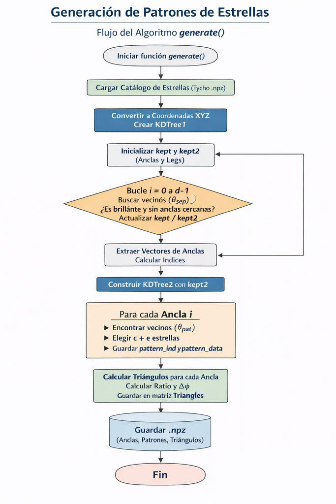

## Base de datos para PlateSolving

El proceso de *platesolving* requiere de una base de datos indexada con descriptores geométricos que sean **invariantes ante escala, rotación y traslación**.

A continuacvión se muestra el proceso de generación de las estructuras de datos
### Diagrama de bloques

