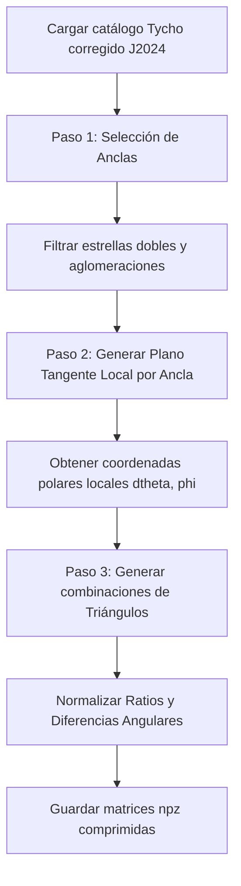

# Descripción Teórica y Matemática de `my_platesolve_new.py`

Este documento detalla el modelado físico-matemático y la estructura informática del módulo `my_platesolve_new.py`. El propósito principal de este script es generar la base de datos de patrones de estrellas de referencia en forma de tripletas (triángulos) a partir de un catálogo celeste corregido, permitiendo la resolución de imágenes astronómicas (*platesolving*).

---

## 1. Introducción y Arquitectura del Programa

El proceso de *platesolving* requiere de una base de datos indexada con descriptores geométricos que sean **invariantes ante escala, rotación y traslación**. El módulo `my_platesolve_new.py` realiza este procesamiento precalculando las relaciones geométricas para todo el cielo en tres etapas consecutivas:
1. **Selección y distribución de anclas:** Identifica estrellas brillantes distribuidas uniformemente en la esfera celeste y descarta estrellas dobles que puedan corromper las lecturas.
2. **Construcción de bases tangentes locales:** Para cada estrella ancla, se define un plano tangente y se determinan las coordenadas polares de sus vecinas más brillantes.
3. **Generación de tripletas (Triángulos):** Se combinan las estrellas de la vecindad de cada ancla para construir descriptores triangulares invariantes de escala y orientación, los cuales son finalmente almacenados en disco.



---

## 2. Modelado Matemático Detallado

### 2.1. Selección de Estrellas "Ancla" y Región de Exclusión
Para lograr una indexación eficiente del cielo sin redundancias locales excesivas, las estrellas se categorizan en estrellas "ancla" (vértices centrales del patrón) y "piernas" (estrellas secundarias que completan el patrón).
Dada una estrella candidato $i$ con vector cartesiano $\mathbf{v}_i$, se definen dos zonas angulares:
* **Zona de exclusión de densidad ($\theta_{\text{sep}} = 0.65^\circ$):** Ángulo mínimo para asegurar la dispersión homogénea de las anclas.
* **Zona de exclusión de estrella doble ($\theta_{\text{dob}} = 0.01^\circ$ o $36''$):** Evita errores de resolución causados por estrellas binarias o muy próximas en el sensor de imagen.

#### Reglas de Selección:
Para una estrella $i$ con vecinos más brillantes dentro del catálogo:
1. Si **ninguna estrella ya seleccionada como ancla** se encuentra a una distancia menor a $\theta_{\text{sep}}$:
   * Si la estrella pertenece al subconjunto de las más brillantes de primer nivel ($i < a+b$), se selecciona como ancla (`kept[i] = True`).
   * Se añade a la lista de piernas/vecinos válidos (`kept2[i] = True`).
2. Si existe un ancla dentro del radio $\theta_{\text{sep}}$ pero **ninguna dentro de** $\theta_{\text{dob}}$:
   * Si pertenece al subconjunto de estrellas hiper-brillantes ($i < a$), se selecciona igualmente como ancla (`kept[i] = True`) para mantener la cobertura.
   * Se añade a la lista de piernas (`kept2[i] = True`).

---

### 2.2. Base Ortonormal en el Plano Tangente Local
Para representar la posición relativa de una estrella vecina $\mathbf{v}_{\text{vec}}$ respecto a su estrella ancla $\mathbf{v}_{\text{anc}}$ sin distorsiones geométricas en la esfera celeste, se proyecta el vector diferencia $\mathbf{\delta} = \mathbf{v}_{\text{vec}} - \mathbf{v}_{\text{anc}}$ sobre la base ortonormal del plano tangente a la esfera en $\mathbf{v}_{\text{anc}}$.

La base ortonormal local se define usando el eje del polo celeste norte $\mathbf{z} = (0, 0, 1)^T$:
1. **Vector tangente de Ascensión Recta ($\hat{\phi}$):** Dirección este-oeste tangente al paralelo local:

$$
\mathbf{t}_{\phi} = \mathbf{z} \times \mathbf{v}_{\text{anc}}
$$

   $$\hat{\phi} = \frac{\mathbf{t}_{\phi}}{\|\mathbf{t}_{\phi}\|}$$
2. **Vector tangente de Declinación ($\hat{\theta}$):** Dirección norte-sur tangente al meridiano local:

$$
\mathbf{t}_{\theta} = \hat{\phi} \times \mathbf{v}_{\text{anc}}
$$

   $$\hat{\theta} = \frac{\mathbf{t}_{\theta}}{\|\mathbf{t}_{\theta}\|}$$

Proyectando el vector diferencia $\mathbf{\delta}$ en este plano tangente, obtenemos sus coordenadas 2D cartesianas locales $(x, y)$:

$$
x = \hat{\theta} \cdot \mathbf{\delta}
$$

$$y = \hat{\phi} \cdot \mathbf{\delta}$$

---

### 2.3. Coordenadas Polares del Patrón
A partir de las coordenadas del plano tangente local, se calculan las coordenadas polares del vecino $(\Delta\theta, \phi)$:

1. **Separación Angular Celeste ($\Delta\theta$):**
   Dado que los vectores son unitarios sobre la esfera celeste, la distancia angular real a través del círculo máximo se calcula de manera exacta a partir de la longitud del vector cuerda $\|\mathbf{\delta}\|$:

$$
\Delta\theta = 2 \arcsin\left(\frac{1}{2} \|\mathbf{\delta}\|\right)
$$


2. **Ángulo Polar Local ($\phi$):**

$$
\phi = \text{arctan2}(y, x)
$$

   Donde $\phi \in (-\pi, \pi]$.

---

### 2.4. Características Invariantes de los Triángulos
Para cada ancla $i$, se toman sus $N = c+e = 18$ vecinos más brillantes de su entorno local y se construyen descriptores triangulares. Cada triángulo está constituido por el ancla y dos vecinas $j$ y $k$ (con $j < k$ en orden de iteración).

Las propiedades del triángulo se definen a partir de las distancias angulares de los vecinos al ancla ($d_j = \Delta\theta_j$ y $d_k = \Delta\theta_k$) y de sus ángulos polares ($\phi_j$ y $\phi_k$):

1. **Razón de Radios Inicial:**

$$
r_{\text{ini}} = \frac{d_k}{d_j}
$$

2. **Diferencia Angular Inicial:**

$$
\Delta\phi_{\text{ini}} = \phi_k - \phi_j
$$


#### Normalización para Invariancia de Escala y Orientación:
Para que el descriptor sea idéntico independientemente del orden de los vértices secundarios y la rotación del sensor, se realiza la siguiente normalización:
* **Si $r_{\text{ini}} > 1$:**

$$
r = \frac{1}{r_{\text{ini}}}
$$

  $$\Delta\phi = -\Delta\phi_{\text{ini}}$$
* **Si $r_{\text{ini}} \le 1$:**

$$
r = r_{\text{ini}}
$$

  $$\Delta\phi = \Delta\phi_{\text{ini}}$$

Finalmente, se normaliza la diferencia angular al dominio $[0, 2\pi)$ para evitar saltos de fase:


$$
\Delta\phi = \Delta\phi \pmod{2\pi}
$$


Cada triángulo queda parametrizado de manera robusta por el par ordenado $(r, \Delta\phi)$.

---

## 3. Lógica y Estructura de Datos de Mapeo Interno

Una de las secciones algorítmicas más complejas del código es la remoción de la propia estrella ancla dentro del listado de vecinos devuelto por el KD-Tree de piernas (`kd_tree2`).

Dado que:
* `vectors` representa el catálogo original de tamaño $d$.
* `vectors2` de tamaño $M$ es el subconjunto donde `kept2 == True`.
* El ancla tiene un índice $i$ dentro de la lista de anclajes `vectors_kept`.
* El índice original del ancla en `vectors` es $\text{ind} = \text{kept\_vectors\_ind}[i]$.

Para eliminar al ancla de la lista de índices vecinos devueltos por `kd_tree2.query_ball_point` (los cuales están referenciados a los índices de `vectors2`), se calcula su índice equivalente en `vectors2` restando el número de elementos descartados en `kept2` hasta esa posición:


$$
\text{Índice en vectors2} = \text{ind} - \text{cumsum}[\text{ind}]
$$


Donde $\text{cumsum}$ es la suma acumulada de las estrellas no seleccionadas en `kept2`:

$$
\text{cumsum} = \sum_{k=0}^{\text{ind}} \neg \text{kept2}[k]
$$


---

## 4. Descripción Informática del Módulo (API)

El módulo exporta una única función principal encargada de construir y escribir la base de datos de triángulos.

### 4.1. Función: `generate`

```python
def generate()
```

#### **Descripción**
Carga el catálogo comprimido por defecto del proyecto, calcula la distribución del cielo para anclas y piernas, extrae las relaciones geométricas polares locales de vecinos y exporta los descriptores de triángulos resultantes en un archivo `.npz` comprimido.

#### **Parámetros de Entrada**
* Ninguno. (Carga internamente el archivo `resources/compressed_tycho2024epoch.npz` a través de `my_database_cache.open_catalogue`).

#### **Parámetros de Salida / Retorno**
* **`None`** (Genera y escribe el archivo en disco).

#### **Constantes de Operación del Generador**
| Constante | Tipo | Valor | Descripción |
| :--- | :--- | :--- | :--- |
| `a` | `int` | `80000` | Cantidad de estrellas brillantes para anclajes principales. |
| `b` | `int` | `120000` | Cantidad de estrellas adicionales para anclajes secundarios. |
| `theta_sep` | `float` | `0.01134` rad ($0.65^\circ$) | Radio mínimo de separación espacial de las anclas. |
| `theta_double_star`| `float` | `0.000174` rad ($0.01^\circ$) | Radio de tolerancia de estrellas dobles. |
| `c` | `int` | `0` | Número de vecinos cercanos por distancia. |
| `d` | `int` | `700000` | Número total de estrellas consideradas para piernas. |
| `e` | `int` | `18` | Número de vecinos seleccionados por brillo. |
| `theta_pat` | `float` | `0.02967` rad ($1.7^\circ$) | Radio angular para la búsqueda de estrellas del patrón. |

---

### 4.2. Estructura del Archivo NPZ Guardado
El archivo comprimido en `get_triangle_db_path()` contiene cuatro arreglos NumPy principales:

1. **`anchors` (numpy.ndarray):** Matriz de tamaño $N_{\text{anclas}} \times 3$ con los vectores directores cartesianos $(x,y,z)$ de las estrellas ancla seleccionadas.
2. **`pattern_ind` (numpy.ndarray):** Matriz de tamaño $N_{\text{anclas}} \times 18$ que almacena los índices correspondientes a las estrellas vecinas que forman el patrón de cada ancla.
3. **`pattern_data` (numpy.ndarray):** Matriz de dimensiones $N_{\text{anclas}} \times 18 \times 5$. Guarda la información polar e instrumental de los vecinos:
   * `[:, :, 0]`: Distancia angular $\Delta\theta$.
   * `[:, :, 1]`: Ángulo polar $\phi$.
   * `[:, :, 2:5]`: Vector unitario cartesiano $(x,y,z)$ de la estrella vecina.
4. **`triangles` (numpy.ndarray):** Matriz de dimensiones $N_{\text{anclas}} \times 153 \times 2$. Contiene los descriptores de las parejas de estrellas vecinas para cada ancla:
   * `[:, :, 0]`: Razón de radios normalizada ($r \le 1$).
   * `[:, :, 1]`: Diferencia angular normalizada ($\Delta\phi \in [0, 2\pi)$).

---

## 5. Observaciones sobre el Código (Robustez y Casos Límite)

> [!WARNING]
> **Manejo Incompleto de Casos de Borde (Excepciones):**
> En la sección de búsqueda de vecinos locales para cada ancla (líneas 98-100), si la cantidad de estrellas vecinas encontradas dentro de la vecindad de radio $\theta_{\text{pat}} = 1.7^\circ$ es inferior al mínimo requerido para el patrón ($c+e = 18$), el código detiene abruptamente la ejecución del generador lanzando una excepción:
> ```python
> if len(neighbours) < c+e:
>     print(f'note: insufficient neighbours found on index {i}')
>     raise Exception('edge case handling unimplemented!')
> ```
> Para asegurar el correcto funcionamiento del generador en regiones de baja densidad de estrellas del cielo (por ejemplo, en los polos galácticos con altas magnitudes de corte), se requeriría implementar un algoritmo que decremente dinámicamente el tamaño del patrón o expanda el radio de búsqueda $\theta_{\text{pat}}$.

---

## 6. Bibliografía de Soporte (Resolución de Placas y Reconocimiento de Patrones)

El algoritmo implementado en `my_platesolve_new.py` (basado en la generación de descriptores geométricos de triángulos a partir de estrellas brillantes y sus vecinos más cercanos proyectados en un plano tangente local para su búsqueda rápida con KD-Trees) se fundamenta en principios ampliamente descritos y validados en la literatura de astrometría computacional y navegación celeste:

1. **Valdes, F. G., Campusano, L. E., Velasquez, J. D., & Stetson, P. B. (1995).** *FOCAS Automatic Catalog Matching Algorithms.* Publications of the Astronomical Society of the Pacific, 107, 1119-1128.
   * **Relevancia:** Trabajo clásico sobre emparejamiento automatizado de catálogos mediante descriptores basados en triángulos. Introduce el uso de ordenamiento por magnitud para reducir el coste combinatorio en el emparejamiento geométrico de coordenadas de estrellas.

2. **Lang, D., Hogg, D. W., Mierle, K., Blanton, M., & Roweis, S. (2010).** *Astrometry.net: Blind Astrometric Calibration of Arbitrary Astronomical Images.* The Astronomical Journal, 139(5), 1782-1800.
   * **Relevancia:** Describe detalladamente la calibración astrométrica a ciegas (*blind solving*) mediante descriptores invariantes de escala y rotación (quads de estrellas) y su indexación ultrarrápida usando árboles K-dimensionales (KD-Trees).

3. **Liebe, C. C. (1997).** *Star trackers for attitude determination.* IEEE Aerospace and Electronic Systems Magazine, 12(6), 10-16.
   * **Relevancia:** Presenta la teoría operativa de los seguidores de estrellas (*star trackers*) mediante la catalogación de tripletas de estrellas, distancias angulares y magnitudes aparentes para la estimación de orientación de satélites en escenarios de pérdida de actitud (*lost-in-space*).

4. **Groth, E. J. (1986).** *A Pattern-Matching Algorithm for Two-Dimensional Coordinate Lists.* Astronomical Journal, 91, 1244-1248.
   * **Relevancia:** Uno de los primeros algoritmos matemáticos en proponer el emparejamiento de coordenadas mediante el uso de razones entre lados de triángulos y diferencias angulares (las bases del descriptor $(\text{ratio}, \Delta\phi)$ utilizado en el presente módulo) para garantizar invariancia ante transformaciones afines.

5. **Mortari, D. (1997).** *Search-Less Algorithm for Star Pattern Recognition.* Journal of the Astronautical Sciences, 45(2), 179-194.
   * **Relevancia:** Desarrolla algoritmos eficientes de indexación y búsqueda directa para bases de datos de patrones de estrellas sin requerir búsquedas iterativas complejas en el espacio de parámetros.
