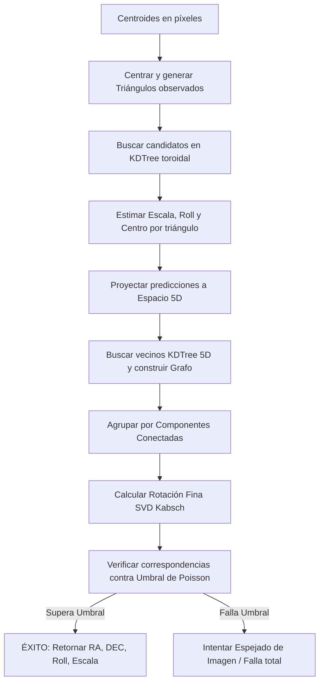

# Descripción Teórica y Matemática de `my_platesolve_triangle.py`

Este documento describe detalladamente los fundamentos teóricos, la formulación matemática y el diseño de software del módulo `my_platesolve_triangle.py`. Este módulo contiene el algoritmo principal de resolución de placas (*platesolving*) del proyecto, el cual realiza el reconocimiento ciego de imágenes estelares sin información previa de escala u orientación.

---

## 1. Introducción y Arquitectura del Solucionador

El módulo `my_platesolve_triangle.py` resuelve el problema conocido en astronavegación como **"Perdido en el Espacio" (Lost-in-Space)**. A partir de una lista de centroides de estrellas detectadas en una imagen en coordenadas de píxeles, el solucionador determina la escala de la placa (arcosegundos por píxel), las coordenadas de apuntamiento del centro de la imagen (Ascensión Recta $\alpha$, Declinación $\delta$) y el ángulo de rotación de la cámara (Roll).

El flujo lógico del algoritmo consta de cinco fases principales:
1. **Generación de tripletas observadas:** Centra los centroides y construye combinaciones de triángulos utilizando las estrellas más brillantes de la imagen.
2. **Búsqueda geométrica en base de datos:** Consulta las características de los triángulos observados $(\text{ratio}, \Delta\phi)$ en el KD-Tree toroidal del catálogo precalculado.
3. **Voto y Consenso en Espacio 5D:** Agrupa los triángulos que coinciden en sus predicciones de escala de placa, roll y centro geométrico mediante componentes conectadas de grafos dispersos.
4. **Alineación Fina por SVD:** Refina la matriz de rotación tridimensional entre los vectores de la imagen y el catálogo usando la descomposición en valores singulares (Algoritmo de Kabsch).
5. **Validación Estadística:** Compara el número de correspondencias reales contra un umbral de Poisson riguroso calculado mediante la función Lambert W.



---

## 2. Modelado Matemático Detallado

### 2.1. Estimación del Umbral de Aceptación Estocástico
Para evitar falsos positivos (coincidencias de patrones aleatorios en el cielo), el programa implementa un análisis estadístico riguroso basado en procesos de Poisson y la función de Lambert W.

#### Probabilidad de Coincidencia Aleatoria ($p$):
Asumiendo que las estrellas están distribuidas de forma homogénea (isotrópica) en la esfera celeste, la probabilidad de que una coordenada aleatoria en la imagen caiga dentro de un radio de tolerancia angular $r$ (en radianes) de una estrella del catálogo de tamaño $N_{\text{cat}}$ es la relación de áreas sobre la esfera:


$$
p = N_{\text{cat}} \cdot \frac{\pi r^2}{4\pi} = \frac{N_{\text{cat}} \cdot r^2}{4}
$$


Para un triángulo observado que coincide con uno del catálogo, las $n_{\text{obs}} - 3$ estrellas restantes de la imagen se modelan como ensayos de Bernouilli independientes, aproximándose por una distribución de Poisson con parámetro $\lambda$:


$$
\lambda = p \cdot (n_{\text{obs}} - 3)
$$


#### Número de Ensayos Combinatorios ($N$):
El número de formas en que se pueden combinar las estrellas observadas y las del catálogo para generar coincidencias geométricas se estima mediante:


$$
N = \binom{N_{\text{cat}}}{3} \cdot \binom{g}{3} \cdot \text{TOLERANCE}^2
$$


Donde $g$ es el número de vecinos considerados y $\text{TOLERANCE}^2$ es el factor de reducción del volumen de búsqueda geométrico.

#### Límite del Máximo de Variables de Poisson:
El umbral de aceptación se calcula determinando el valor esperado del máximo de $N$ variables de Poisson independientes con media $\lambda$. Se resuelve analíticamente empleando la **función de Lambert W** ($W$):


$$
x_0 = \frac{\ln(N)}{W\left(\frac{\ln(N)}{e \lambda}\right)}
$$


$$
x_1 = x_0 + \frac{\ln(\lambda) - \lambda - \frac{1}{2}\ln(2\pi) - \frac{3}{2}\ln(x_0)}{\ln(x_0) - \ln(\lambda)}
$$


El umbral de estrellas requeridas para validar la resolución es:


$$
\text{Umbral} = \text{round}(x_1) + 3 + \text{addon}
$$


Donde el $+3$ representa los vértices del triángulo de coincidencia inicial, y `addon` (por defecto 3) es un margen empírico de seguridad.

---

### 2.2. Estimación Analítica de Escala, Roll y Centro
Para cada triángulo observado que coincide con uno del catálogo, el programa estima analíticamente los parámetros de proyección de la cámara.

Sean los vectores cartesianos del triángulo en el catálogo $\mathbf{T} = [\mathbf{a}_1, \mathbf{a}_2, \mathbf{a}_3] \in \mathbb{R}^{3 \times 3}$ y las coordenadas correspondientes en la imagen escalada en radianes $\mathbf{S} = [\mathbf{s}_1, \mathbf{s}_2, \mathbf{s}_3] \in \mathbb{R}^{3 \times 3}$. La matriz de rotación $\mathbf{R}$ que mapea la cámara al cielo satisface:


$$
\mathbf{T} = \mathbf{R} \cdot \mathbf{S} \implies \mathbf{R} = \mathbf{T} \cdot \mathbf{S}^{-1}
$$


Para optimizar el rendimiento y evitar llamadas repetidas a solucionadores numéricos, la inversa $\mathbf{S}^{-1}$ se calcula analíticamente por cofactores en formato vectorizado sobre NumPy:


$$
\mathbf{S}^{-1} = \frac{1}{\det(\mathbf{S})} \text{Adj}(\mathbf{S})
$$


A partir de la matriz de rotación estimada $\mathbf{R}$:
1. **Centro Óptico Celeste ($\mathbf{v}_{\text{centro}}$):**
   El eje óptico de la cámara apunta en la dirección z del sensor, $\mathbf{z}_{\text{cam}} = (0, 0, 1)^T$. Al proyectarlo al cielo, obtenemos el vector director del centro de la placa:

$$
\mathbf{v}_{\text{centro}} = \mathbf{R} \cdot \begin{pmatrix} 0 \\ 0 \\ 1 \end{pmatrix} = \mathbf{R}_{:, 0}
$$

   A partir del vector unitario se extrae la Ascensión Recta ($\alpha$) y la Declinación ($\delta$):

$$
\alpha = \text{arctan2}(v_y, v_x), \quad \delta = \arcsin(v_z)
$$

2. **Ángulo de Roll ($\psi$):**
   Representa la orientación de la cámara alrededor de su eje óptico:

$$
\psi = \text{arctan2}(R_{1, 2}, R_{2, 2}) \pmod{2\pi}
$$


---

### 2.3. Agrupación y Consenso en Espacio 5D
Un triángulo individual puede emparejarse erróneamente debido al ruido. Sin embargo, los triángulos verdaderos coincidirán en la estimación global de escala de placa, roll y centro. El programa proyecta cada coincidencia a un espacio métrico de dimensión 5:


$$
\mathbf{u} = \begin{pmatrix} \frac{\ln(\text{escala})}{\text{log\_TOL\_SCALE}} \\ \frac{\text{roll}}{\text{TOL\_ROLL}} \\ \frac{\mathbf{v}_{\text{centro}}}{\text{TOL\_CENT}} \end{pmatrix} \in \mathbb{R}^5
$$


Se construye un `KDTree` con los vectores $\mathbf{u}$ de todas las coincidencias y se agrupan aquellas que se encuentran a una distancia máxima de 1 unidad. Este problema de agrupación se resuelve eficientemente mediante la búsqueda de componentes conectadas en un grafo disperso:
1. Las aristas del grafo se definen por pares de coincidencias consistentes espaciados a distancia $\le 1$ en $\mathbb{R}^5$.
2. Se extraen las componentes conexas utilizando el algoritmo de componentes conectadas en grafos no dirigidos.
3. Se selecciona la componente más grande que posea al menos 4 coincidencias no redundantes para realizar el ajuste fino.

---

### 2.4. Refinamiento de la Rotación mediante el Algoritmo de Kabsch (SVD)
Una vez agrupadas las estrellas que coinciden en el patrón, se calcula la matriz de rotación óptima de mínimos cuadrados que mapea el conjunto de vectores de la imagen $\mathbf{P} = [\mathbf{p}_1, \mathbf{p}_2, \dots, \mathbf{p}_k]$ a los vectores del catálogo $\mathbf{Q} = [\mathbf{q}_1, \mathbf{q}_2, \dots, \mathbf{q}_k]$ mediante descomposición en valores singulares:

1. **Matriz de Covarianza ($\mathbf{H}$):**

$$
\mathbf{H} = \mathbf{P}^T \cdot \mathbf{Q}
$$

2. **Descomposición SVD:**

$$
\mathbf{H} = \mathbf{U} \cdot \mathbf{\Sigma} \cdot \mathbf{V}^T
$$

3. **Matriz de Rotación Óptima ($\mathbf{R}$):**

$$
\mathbf{R} = \mathbf{U} \cdot \mathbf{V}^T
$$


---

## 3. Descripción Informática del Módulo (API)

### 3.1. Funciones del Módulo

#### **`estimate_acceptance_threshold`**
```python
def estimate_acceptance_threshold(n_obs, N_stars_catalog, threshold_match, g, addon=3):
```
* **Descripción:** Calcula el umbral estadístico mínimo de estrellas coincidentes necesarias para aceptar la resolución de placas.
* **Entradas:**
  * `n_obs` (int): Estrellas detectadas en la imagen.
  * `N_stars_catalog` (int): Estrellas en el catálogo de referencia.
  * `threshold_match` (float): Radio de coincidencia (tolerancia espacial) en radianes.
  * `g` (int): Vecinos estelares considerados en la vecindad del ancla.
  * `addon` (int, por defecto 3): Margen de seguridad estocástica.
* **Retorno:** `int` (Umbral de estrellas coincidentes necesarias).

#### **`match_centroids`**
```python
def match_centroids(centroids, platescale_fit, image_size, options):
```
* **Descripción:** Compara los centroides de la imagen con el catálogo dentro del campo visual proyectado, eliminando coincidencias ambiguas mediante correspondencias reflexivas de vecinos más cercanos.
* **Entradas:**
  * `centroids` (numpy.ndarray): Matriz $K \times 2$ de coordenadas de la imagen.
  * `platescale_fit` (numpy.ndarray): Escala y orientación de placa en radianes.
  * `image_size` (tuple): Dimensiones de la imagen `(alto, ancho)`.
  * `options` (dict): Parámetros de configuración del sistema.
* **Retorno:** Tupla `(stardata, plate2, max_error)` con los datos de estrellas catalogadas emparejadas, coordenadas de placa filtradas y el error máximo de distancia angular.

#### **`_find_rotation_matrix`**
```python
def _find_rotation_matrix(image_vectors, catalog_vectors):
```
* **Descripción:** Implementa el algoritmo de mínimos cuadrados de Kabsch para encontrar la rotación óptima entre dos listas emparejadas de vectores.
* **Entradas:**
  * `image_vectors` (numpy.ndarray): Matriz $K \times 3$ de vectores de la imagen.
  * `catalog_vectors` (numpy.ndarray): Matriz $K \times 3$ de vectores del catálogo.
* **Retorno:** `numpy.ndarray` (Matriz de rotación ortogonal $3 \times 3$).

#### **`compute_platescale`**
```python
def compute_platescale(triangles, pattern_data, anchors, match_cand, match_data, match_vect):
```
* **Descripción:** Estima analíticamente y de forma vectorizada la escala de placa, roll, matriz de rotación y centro del campo visual para todos los candidatos a coincidencia.
* **Entradas:** Estructuras de datos del catálogo y de las coincidencias de triángulos.
* **Retorno:** Tupla `(scale, roll, center_vect, rmatrix, target)`.

#### **`match_triangles_inner`**
```python
def match_triangles_inner(centroids, image_shape, options, kd_tree, anchors, pattern_ind, pattern_data, triangles):
```
* **Descripción:** Núcleo geométrico que centra las coordenadas de píxeles, calcula los descriptores de triángulos observados y realiza la consulta en el KD-Tree para retornar las estimaciones primarias de calibración.
* **Retorno:** Tupla `(scale, roll, center_vect, match_info, triangle_info, vectors, target)`.

#### **`platesolve`**
```python
def platesolve(centroids, image_shape, options, output_dir=None, try_mirror_also=True):
```
* **Descripción:** Función principal de resolución de placa accesible por el usuario. Administra los intentos normales, y si fallan, realiza una transformación especular (espejado) de la imagen para compensar la inversión óptica de telescopios.
* **Entradas:**
  * `centroids` (list o ndarray): Centroides detectados en píxeles.
  * `image_shape` (tuple): Tamaño de la imagen.
  * `options` (dict): Parámetros y banderas de depuración.
  * `try_mirror_also` (bool, por defecto `True`): Si es `True`, reintenta el cálculo invirtiendo los ejes ante fallos.
* **Retorno:** Diccionario con claves:
  * `"success"` (bool)
  * `"platescale"`, `"ra"`, `"dec"`, `"roll"` (float, en grados/arcosegundos)
  * `"matched_centroids"` (ndarray)
  * `"matched_stars"` (ndarray)

---

## 4. Bibliografía de Soporte (Calibración Astrométrica y Rotación Rígida)

1. **Kabsch, W. (1976).** *A discussion of the solution for the best rotation to relate two sets of vectors.* Acta Crystallographica Section A, 32(5), 922-923.
   * **Relevancia:** Desarrolla la formulación matemática cerrada basada en SVD para encontrar la rotación rígida óptima de mínimos cuadrados entre dos nubes de puntos (utilizada en `_find_rotation_matrix`).

2. **Keith Briggs, Linlin Song & Thomas Prellberg. (2009).** *A note on the distribution of the maximum of a set of Poisson random variables.* BT Research & Mathematics QMUL.
   * **Relevancia:** Proporciona la aproximación estadística y la resolución analítica para el máximo de variables aleatorias de Poisson independientes que se utiliza en la estimación del umbral de aceptación del módulo.

3. **Lang, D., Hogg, D. W., Mierle, K., Blanton, M., & Roweis, S. (2010).** *Astrometry.net: Blind Astrometric Calibration of Arbitrary Astronomical Images.* The Astronomical Journal, 139(5), 1782-1800.
   * **Relevancia:** Documenta el uso de KD-Trees para la indexación multidimensional de rasgos y la reducción de falsos positivos en resoluciones ciegas de campo.

4. **Groth, E. J. (1986).** *A Pattern-Matching Algorithm for Two-Dimensional Coordinate Lists.* Astronomical Journal, 91, 1244-1248.
   * **Relevancia:** Detalla el uso de razones entre distancias en agrupaciones estelares para lograr la invariancia de escala y orientación en algoritmos de emparejamiento.
