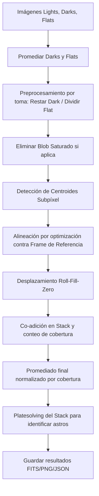

# Descripción Teórica y Matemática de `my_stacker_implementation.py`

Este documento describe detalladamente el modelado físico-matemático, los principios algorítmicos y el diseño de software implementados en el módulo `my_stacker_implementation.py`. Este script es el núcleo del procesamiento de imágenes astronómicas de la aplicación, encargado del guiado, alineación por centroides de estrellas, calibración (reducción de ruido mediante *darks* y *flats*) y apilado (*stacking*) de secuencias de imágenes.

---

## 1. Introducción y Propósito del Módulo

El apilado de imágenes astronómicas es una técnica fundamental utilizada para **incrementar la Relación Señal/Ruido (SNR)** de objetos celestes tenues. Dado que el ruido térmico y de lectura del sensor es de naturaleza estocástica e independiente entre tomas, al promediar $N$ imágenes, la señal coherente de las estrellas se acumula linealmente, mientras que la desviación estándar del ruido crece únicamente con la raíz cuadrada $\sqrt{N}$. Por tanto, la SNR global mejora en un factor de $\sqrt{N}$.

El pipeline de procesamiento de `my_stacker_implementation.py` consta de las siguientes fases:
1. **Ingestión e Inicialización:** Carga y conversión de imágenes multiformato (FITS, JPG, PNG) a matrices bidimensionales en escala de grises de punto flotante.
2. **Calibración de Campo:** Promediado de imágenes de calibración y aplicación de la corrección por corriente de oscuridad (*dark frame subtraction*) y corrección por iluminación del campo y viñeteo (*flat-field correction*).
3. **Eliminación de Saturación:** Detección de estrellas sobreexpuestas o planetas brillantes ("blobs") y su posterior enmascaramiento y supresión para evitar errores de guiado.
4. **Extracción de Centroides:** Identificación de estrellas y estimación ultraprecisa de sus coordenadas submétricas (subpíxel) mediante métodos de centro de masa filtrados.
5. **Alineación Inter-frame:** Optimización geométrica robusta en dos fases para encontrar el vector de desplazamiento relativo $(dy, dx)$ entre tomas.
6. **Apilado y Registro:** Desplazamiento y co-adición de las imágenes ajustadas por bordes, seguido de la calibración astrométrica final del stack resultante mediante *platesolving*.



---

## 2. Modelado Matemático y Algorítmico

### 2.1. Reducción Astronómica (Calibración de la Imagen)
Para eliminar los patrones sistemáticos de ruido instrumental del sensor, cada imagen científica $I_{\text{raw}}$ se calibra usando un cuadro maestro de oscuridad $D$ (promedio de tomas con obturador cerrado) y un cuadro maestro de plano plano $F$ (promedio de tomas de iluminación uniforme):


$$
I_{\text{calibrada}}(y, x) = \frac{I_{\text{raw}}(y, x) - D(y, x)}{F(y, x)}
$$


Donde:
* La sustracción del *dark* $D$ elimina la señal térmica acumulada de forma desigual en el sensor (píxeles calientes).
* La división por el *flat* $F$ (normalizado a la unidad) corrige las variaciones de sensibilidad pixel a pixel y el viñeteo óptico.

---

### 2.2. Detección y Enmascaramiento de Blobs Saturados
Las fuentes extremadamente brillantes en el campo visual pueden saturar los píxeles del sensor (llegando al límite digital, ej. 65535 en sensores de 16 bits), provocando desbordamientos de carga y halos que corrompen el cálculo de centroides.

El módulo detecta y elimina estas áreas mediante:
1. **Reducción Espacial:** Aplica un submuestreo espacial promediado local (`downscale_local_mean`) de factor $S$ (generalmente 8) para suavizar ruido de alta frecuencia y acelerar la identificación de estructuras contiguas de saturación.
2. **Segmentación y Convex Hull:** Se binarizan las zonas sobre el umbral de saturación $I_{\text{sat}}$ y se etiquetan las regiones conectadas. Para la región de mayor área, se calcula su Envolvente Convexa (*Convex Hull*) para rellenar vacíos.
3. **Expansión de Máscaras y Mezcla con Fondo:** Se expande la envolvente convexa mediante convoluciones morfológicas de radios $r_1$ y $r_2$. Para evitar discontinuidades abruptas en los bordes de la máscara de exclusión ($r_1$), los valores de píxel se reemplazan por el **percentil 5** de la intensidad de la propia imagen:

$$
I(y, x) \leftarrow P_5(I) \quad \forall (y,x) \in \text{Máscara}_1
$$

   Esto simula de manera natural el ruido y la luminosidad de fondo del cielo. La $\text{Máscara}_2$ ($r_2 > r_1$) se utiliza como zona de exclusión de seguridad para prohibir la detección de estrellas espurias en el halo circundante.

---

### 2.3. Extracción de Centroides Subpíxel (Centro de Masas)
Para estimar las coordenadas submétricas de las estrellas, el código implementa dos alternativas:

#### 2.3.1. Método de Centro de Masa Simplificado
1. Aplica un filtro de caja uniforme de $25 \times 25$ píxeles para estimar y restar el fondo local de baja frecuencia:

$$
I_{\text{sub}}(y, x) = I(y, x) - \text{UniformFilter}(I, 25)
$$

2. Estima el ruido RMS global $\sigma = \sqrt{\text{mean}(I_{\text{sub}}^2)}$ y binariza a un umbral de $2\sigma$.
3. Aplica una apertura binaria para eliminar ruido de un solo píxel y etiqueta regiones.
4. Calcula las coordenadas del centroide ponderado por intensidad (centro de masas):

$$
cy = \frac{\sum_i w_i y_i}{\sum_i w_i}, \quad cx = \frac{\sum_i w_i x_i}{\sum_i w_i}
$$

   Donde $w_i$ representa los pesos (intensidades del píxel) y $(y_i, x_i)$ son los centros del píxel con corrección de sesgo de $+0.5$.

#### 2.3.2. Método Avanzado de Normalización por Varianza Local
1. **Sustracción de Fondo por Doble Caja Blur:**
   Estima la variación del fondo usando la diferencia entre un desenfoque de caja grande de tamaño $k$ (ej. 17) y un desenfoque interno de tamaño pequeño $d_{\text{int}}$ (ej. 3) corregido por escalas de área:

$$
\text{Blur}(y, x) = \left(\text{BoxFilter}(I, k) - \text{BoxFilter}(I, d_{\text{int}}) \cdot \frac{d_{\text{int}}^2}{k^2}\right) \cdot \frac{k^2}{k^2 - d_{\text{int}}^2}
$$

   $$I_{\text{sub}}(y, x) = I(y, x) - \text{Blur}(y, x)$$
2. **Normalización por Varianza Local:**
   Calcula el cuadrado de la señal $I_{\text{sub}}^2$, recorta los extremos (percentil 95) para evitar que estrellas hiper-brillantes distorsionen la estadística local, y obtiene la varianza local con un filtro de caja de $50 \times 50$:

$$
\sigma^2_{\text{local}}(y, x) = \text{UniformFilter}\left(\text{Clip}(I_{\text{sub}}^2), 50\right)
$$

   Normaliza la señal por la desviación estándar local para mapear la significancia estadística (SNR local) de cada píxel:

$$
\text{SNR}_{\text{local}}(y, x) = \max\left(\frac{I_{\text{sub}}(y, x)}{\sqrt{\sigma^2_{\text{local}}(y, x)}} - \sigma_{\text{resta}}, 0\right)
$$

3. **Filtrado Morfológico y Sanity Check de Perfil Estelar:**
   Tras segmentar y etiquetar las regiones sobre un umbral SNR, el módulo verifica que el perfil de luminosidad decrezca de forma estrictamente monótona a medida que nos alejamos del centro del candidato:

$$
\bar{I}_{r=1} > \bar{I}_{r=2} > \bar{I}_{r=3} > \bar{I}_{r=4}
$$

   Donde $\bar{I}_r$ es la intensidad promedio en un contorno cuadrado de radio $r$. Esto elimina instantáneamente falsas detecciones por píxeles calientes o ruido impulsivo de alta frecuencia.

---

### 2.4. Alineación Geométrica Inter-frame (Optimización en Dos Pasos)
Para encontrar el vector de traslación relativo $\mathbf{b} = (dy, dx)^T$ entre el frame de referencia y una toma científica, se realiza un proceso de mínimos cuadrados no lineal robusto.

#### Paso 1: Búsqueda Global y Ajuste Robusto
Sean los centroides de referencia $\mathbf{C}_1 = [\mathbf{c}_{1,1}, \dots, \mathbf{c}_{1,m}]$ y los centroides del frame objetivo $\mathbf{C}_2 = [\mathbf{c}_{2,1}, \dots, \mathbf{c}_{2,m}]$. Se minimiza la función de pérdida:


$$
\min_{\mathbf{b}} L(\mathbf{b}) = \frac{1}{|\mathbf{C}_1|} \sum_{i} \min_{j} \left( \|\mathbf{c}_{1, i} - \mathbf{c}_{2, j} - \mathbf{b}\|^{1.5} \land \text{cutoff} \right)
$$


*Justificación:* El uso de la norma elevada a la potencia de $1.5$ pondera óptimamente las coincidencias cercanas. La operación de mínimo $\min_j$ resuelve automáticamente la asociación de identidad de las estrellas sin conocer la correspondencia de antemano. El umbral $\text{cutoff}$ actúa como estimador robusto (M-estimador), anulando la influencia de estrellas que no tienen contraparte en la otra imagen (outliers).

#### Paso 2: Ajuste Fino de Mínimos Cuadrados
Una vez estimada la traslación aproximada $\mathbf{b}_0$, se asocian las estrellas coincidentes dentro de un radio de tolerancia $\epsilon$. Con el subconjunto de parejas validadas $(\mathbf{c}_{1,k}, \mathbf{c}_{2,k})$, se refina la solución minimizando la distancia euclidiana cuadrática (L2 ordinaria):


$$
\min_{\mathbf{b}} L_2(\mathbf{b}) = \sum_k \|\mathbf{c}_{1, k} - \mathbf{c}_{2, k} - \mathbf{b}\|^2
$$


El error residual RMS final de la alineación se calcula como:

$$
\text{RMS} = \sqrt{\frac{L_2(\mathbf{b}_{\text{óptimo}})}{K}}
$$


---

### 2.5. Apilado por Desplazamiento y Adición (Shift-and-Add)
Al desplazar digitalmente las imágenes científicas para alinearlas con la de referencia, los bordes de la toma desplazada quedan vacíos. El módulo compensa esto implementando un operador de desplazamiento con relleno de ceros (`roll_fillzero`) y manteniendo una matriz de conteo de cobertura $C(y, x)$.

Para cada imagen $t$ con vector de alineación óptimo $\mathbf{b}_t = (dy_t, dx_t)^T$:
1. Se desplaza y acumula la imagen calibrada:

$$
S_{\text{acumulada}}(y, x) \leftarrow S_{\text{acumulada}}(y, x) + \text{RollFillZero}\left(I_{\text{calibrada}, t}, \mathbf{b}_t\right)
$$

2. Se desplaza y acumula la matriz de cobertura (máscara unitaria $\mathbf{1}$):

$$
C(y, x) \leftarrow C(y, x) + \text{RollFillZero}\left(\mathbf{1}, \mathbf{b}_t\right)
$$


La imagen apilada final normalizada por la cobertura real de píxeles es:


$$
\text{Stack}(y, x) = \frac{S_{\text{acumulada}}(y, x)}{C(y, x)}
$$


Esto asegura que las regiones periféricas de la imagen apilada no presenten artefactos de atenuación artificial debido a los desplazamientos.

---

## 3. Descripción Informática del Módulo (API)

### 3.1. Funciones del Módulo

#### **`open_image`**
```python
def open_image(file):
```
* **Descripción:** Carga archivos de imagen. Soporta lectura FITS científica y formatos estándar de imagen (a través de OpenCV). Convierte el resultado a un arreglo float32 bidimensional en escala de grises.
* **Entrada:** `file` (str o Path): Ruta de la imagen.
* **Retorno:** `numpy.ndarray` bidimensional.

#### **`roll_fillzero`**
```python
def roll_fillzero(src, shift):
```
* **Descripción:** Realiza un desplazamiento bidimensional de la matriz rellenando las fronteras vacías con ceros (a diferencia de `np.roll` que realiza un desplazamiento circular redundante).
* **Entradas:**
  * `src` (ndarray): Matriz bidimensional de origen.
  * `shift` (tuple): Tupla `(dy, dx)` indicando los desplazamientos de píxeles.
* **Retorno:** `numpy.ndarray` desplazado con bordes nulos.

#### **`expand_mask`**
```python
def expand_mask(src, radius, target_size=None):
```
* **Descripción:** Expande morfológicamente una máscara booleana evaluando vecindades espaciales en las 9 direcciones cartesianas según un radio dado.
* **Retorno:** `numpy.ndarray` booleano.

#### **`remove_saturated_blob`**
```python
def remove_saturated_blob(img, sat_val=65535, radius=100, radius2=150, min_size=20000, downscale=8, blob_saturation=1, perform=True):
```
* **Descripción:** Localiza y enmascara la región de saturación continua más grande de la imagen. Parchea el área afectada con el percentil 5 de la intensidad de fondo.
* **Retorno:** Tupla `(img_procesada, mask_1, mask_2)`.

#### **`attempt_align`**
```python
def attempt_align(c1, c2, options, guess=(0,0), framenum=-1):
```
* **Descripción:** Realiza la alineación estelar inter-frame en dos fases (robusta global seguida de mínimos cuadrados acoplados).
* **Entradas:**
  * `c1`, `c2` (ndarray): Matrices de centroides de referencia y de la toma científica.
  * `options` (dict): Diccionario de configuración con tolerancias y parámetros.
* **Retorno:** Tupla `(shift_primario, matches1, matches2, shift_refinado, rms)`.

#### **`simple_get_centroids`**
```python
def simple_get_centroids(image):
```
* **Descripción:** Método rápido de extracción de centroides basado en sustracción uniforme del fondo y filtrado por ruido RMS global.
* **Retorno:** `numpy.ndarray` con coordenadas `(y, x)` ordenadas por flujo.

#### **`get_centroids_blur`**
```python
def get_centroids_blur(img_mask2, ksize=17, r_max=10, options={}, gauss=False, debug_display=True):
```
* **Descripción:** Método avanzado de extracción de centroides. Utiliza sustracción adaptativa de fondo por doble caja, normalización por varianza local y verificación de monotonicidad estelar radial.
* **Retorno:** Lista de tuplas ordenadas descendentemente por brillo: `[(flujo, area, (y, x)_centroide)]`.

#### **`filter_edgy_centroids`**
```python
def filter_edgy_centroids(centroids_data, img, f=3, d=16, thresh=2, edge_threshold=20):
```
* **Descripción:** Evalúa los gradientes direccionales en los alrededores de cada centroide para identificar y descartar artefactos geométricos cerca de los bordes del sensor.
* **Retorno:** Lista filtrada de centroides.

#### **`do_stack`**
```python
def do_stack(files, darkfiles, flatfiles, options):
```
* **Descripción:** Coordina todo el pipeline de apilado. Lee calibraciones, procesa cuadros científicos, estima traslaciones de alineación, acumula imágenes con normalización por cobertura, ejecuta astrometría sobre el stack final e integra los resultados en un archivo ZIP de depuración y FITS científico.
* **Entradas:** Listas de rutas de archivos científicos (`files`), de oscuridad (`darkfiles`), planos planos (`flatfiles`) y diccionario de opciones.
* **Retorno:** `None`.

---

## 4. Bibliografía de Soporte (Procesamiento de Imágenes Astronómicas y Alineación)

El desarrollo del pipeline de calibración, detección de centroides, alineación robusta y apilado implementado en `my_stacker_implementation.py` se fundamenta en principios descritos y validados en los siguientes trabajos académicos y manuales técnicos:

1. **Howell, S. B. (2006).** *Handbook of CCD Astronomy.* Cambridge University Press.
   * **Relevancia:** Manual de referencia para la calibración básica de sensores CCD/CMOS en astronomía. Describe detalladamente la física y matemáticas detrás de la reducción de imágenes por corriente de oscuridad (*dark frames*) y de iluminación uniforme (*flat fields*).

2. **Berry, R., & Burnell, J. (2005).** *The Handbook of Astronomical Image Processing.* Willmann-Bell.
   * **Relevancia:** Obra canónica en el procesamiento de imágenes astronómicas. Detalla los algoritmos prácticos para el registro (alineación) de tomas, interpolación por bordes y apilado ponderado de secuencias de imágenes astronómicas.

3. **Stetson, P. B. (1987).** *DAOPHOT: A computer program for crowded-field stellar photometry.* Publications of the Astronomical Society of the Pacific, 99, 191-222.
   * **Relevancia:** Define los estándares astronómicos para la sustracción de fondo, estimación de varianza del ruido local y cálculo de centroides estelares ponderados por intensidad (centro de masas).

4. **Stone, R. C. (1989).** *A comparison of digital centering algorithms in astrometry.* Astronomical Journal, 97, 1227-1237.
   * **Relevancia:** Analiza la precisión submétrica (subpíxel) de los algoritmos de centrado digital en astrometría, incluyendo el método de primer momento de intensidad (centroides) empleado en este módulo.

5. **Huber, P. J. (1981).** *Robust Statistics.* John Wiley & Sons.
   * **Relevancia:** Proporciona las bases matemáticas para los estimadores de pérdida no cuadráticos y criterios de recorte (*cutoff*), sirviendo de fundamento para el optimizador de alineación de primer paso (L1.5 con umbral de recorte) diseñado para anular la influencia de estrellas espurias (*outliers*).

6. **Besl, P. J., & McKay, N. D. (1992).** *A method for registration of 3-D shapes.* IEEE Transactions on Pattern Analysis and Machine Intelligence, 14(2), 239-256.
   * **Relevancia:** Trabajo seminal sobre el registro de conjuntos de puntos con correspondencias desconocidas (algoritmo ICP y similares), que fundamenta la lógica de emparejamiento iterativo de centroides de estrellas entre imágenes desplazadas.

