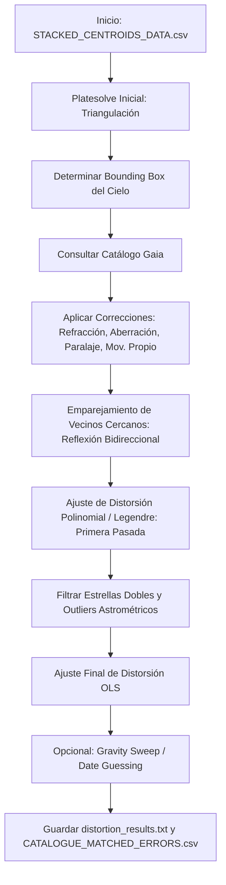

# Descripción Teórica y Matemática de `my_distortion_fitter.py` y `my_distortion_polynomial.py`

Este documento proporciona una descripción matemática y teórica detallada del funcionamiento de los módulos de calibración astrométrica y ajuste de distorsión óptica implementados en `my_distortion_fitter.py`, `my_distortion_polynomial.py` y `my_gravity_sweep.py`. Estos módulos están diseñados para refinar soluciones astrométricas (WCS), corregir aberraciones ópticas e instrumentales de campo amplio mediante ajustes polinomiales y de Legendre, y estimar parámetros físicos como la deflexión de la luz y la época de observación.

---

## Índice
1. [Introducción y Arquitectura del Sistema](#1-introducción-y-arquitectura-del-sistema)
2. [Fundamentos Físico-Matemáticos](#2-fundamentos-físico-matemáticos)
   - [2.1 Transformación de Coordenadas y WCS Inicial](#21-transformación-de-coordenadas-y-wcs-inicial)
   - [2.2 Bases de Distorsión Polinomial y Legendre](#22-bases-de-distorsión-polinomial-y-legendre)
   - [2.3 Regresión Lineal y Mínimos Cuadrados Ordinarios (OLS)](#23-regresión-lineal-y-mínimos-cuadrados-ordinarios-ols)
   - [2.4 Absorción de Términos de Primer Orden (WCS Absorption)](#24-absorción-de-términos-de-primer-orden-wcs-absorption)
   - [2.5 Correcciones Físico-Astrométricas en Coordenadas de Catálogo](#25-correcciones-físico-astrométricas-en-coordenadas-de-catálogo)
   - [2.6 Estimación Estocástica de la Fecha de Observación (Date Guessing)](#26-estimación-estocástica-de-la-fecha-de-observación-date-guessing)
   - [2.7 Barrido Gravitacional de Deflexión de la Luz (Gravity Sweep)](#27-barrido-gravitacional-de-deflexión-de-la-luz-gravity-sweep)
   - [2.8 Coherencia y Correlación Espacial de Residuos](#28-coherencia-y-correlación-espacial-de-residuos)
3. [Descripción Detallada de la API del Software](#3-descripción-detallada-de-la-api-del-software)
4. [Bibliografía y Referencias de Soporte](#4-bibliografía-y-referencias-de-soporte)

---

## 1. Introducción y Arquitectura del Sistema

El objetivo principal del resolvedor y ajustador de distorsión es mapear con precisión nanométrica (o en la escala de miliarcosegundos) las posiciones de los centroides de estrellas observadas en una imagen digital CCD/CMOS con sus contrapartes físicas reales reportadas en el catálogo de astrometría de alta precisión **Gaia (DR3)**.

La distorsión geométrica en imágenes astrofotográficas proviene de múltiples fuentes:
1. **Distorsiones Ópticas Instrumentales:** Aberraciones geométricas introducidas por el diseño óptico del telescopio (como distorsión en cojín o barril, coma y astigmatismo de campo).
2. **Efectos Atmosféricos:** Refracción cromática diferencial producida por la atmósfera terrestre, que comprime la escala vertical del campo visual.
3. **Efectos Relativistas:** Deflexión gravitacional de la luz debida a masas masivas interpuestas (por ejemplo, el Sol durante un eclipse solar).
4. **Errores Sistemáticos del Sensor:** Errores de alineación del plano focal o imperfecciones en la cuadrícula de píxeles del CCD.

### Flujo de Ejecución General

---

## 2. Fundamentos Físico-Matemáticos

### 2.1 Transformación de Coordenadas y WCS Inicial

La relación geométrica entre los píxeles medidos en el plano del detector $(x_{obs}, y_{obs})$ y las coordenadas celestes $(\alpha, \delta)$ (Ascensión Recta y Declinación) se modela inicialmente mediante parámetros de placa lineal simplificados: la escala de placa $s$ (en radianes por píxel), el centro de placa $(\alpha_0, \delta_0)$ y el ángulo de rotación $\theta$ (Roll). 

Definimos el vector de estado astrométrico como:

$$
\mathbf{q} = (s, \alpha_0, \delta_0, \theta)^T
$$

#### Paso 1: Centrado de píxeles
Las coordenadas de los centroides observados se desplazan con respecto al centro geométrico del sensor para eliminar traslaciones arbitrarias:

$$
\mathbf{x}_{obs, i} = \begin{pmatrix} y_{obs, i} - \frac{H}{2} \\ x_{obs, i} - \frac{W}{2} \end{pmatrix}
$$

donde $H$ y $W$ representan el alto y ancho de la imagen en píxeles.

#### Paso 2: Proyección al plano tangente (Detransformación)
Para comparar las posiciones del catálogo $\mathbf{v}_i \in \mathbb{R}^3$ (expresadas como vectores unitarios celestes de coordenadas tridimensionales en el sistema ICRS) con las posiciones del detector, aplicamos una rotación utilizando los ángulos de Euler dados por el vector $\mathbf{q}$:

$$
\mathbf{v}'_i = R_z(-\theta) R_y(\delta_0) R_x(-\alpha_0) \mathbf{v}_i
$$

A partir del vector rotado $\mathbf{v}'_i = (v'_{x, i}, v'_{y, i}, v'_{z, i})^T$, se proyecta la estrella sobre el plano tangente mediante coordenadas rectilíneas (o intermedias) $(\eta_i, \xi_i)$:

$$
\eta_i = \arcsin(v'_{z, i})
$$

$$\xi_i = \arcsin\left(\frac{v'_{y, i}}{\cos\eta_i}\right) \cos\eta_i$$
Estas coordenadas tangenciales en radianes se dividen por la escala de placa $s$ para obtener sus equivalentes en píxeles teóricos:

$$
\mathbf{x}_{detransformed, i} = \begin{pmatrix} \eta_i / s \\ \xi_i / s \end{pmatrix} = \begin{pmatrix} y_{cata, i} \\ x_{cata, i} \end{pmatrix}
$$

#### Paso 3: Transformación Directa (Linear Transform)
Inversamente, para proyectar coordenadas de píxel al cielo usando $\mathbf{q}$:

$$
\begin{pmatrix} \eta_i \\ \xi_i \end{pmatrix} = s \mathbf{x}_{obs, i}
$$

$$\mathbf{v}_{projected, i} = \text{icoord\_to\_vector}(\eta_i, \xi_i)$$
donde el paso de coordenadas planas a vector unitario es:

$$
v'_{z, i} = \sin\eta_i
$$

$$v'_{x, i} = \cos\eta_i \cos\left(\frac{\xi_i}{\cos\eta_i}\right)$$

$$
v'_{y, i} = \cos\eta_i \sin\left(\frac{\xi_i}{\cos\eta_i}\right)
$$

Luego se rota inversamente al sistema ICRS:

$$
\mathbf{v}_i = R_x(\alpha_0) R_y(-\delta_0) R_z(\theta) \mathbf{v}_{projected, i}
$$

---

### 2.2 Bases de Distorsión Polinomial y Legendre

La desviación entre las coordenadas proyectadas del catálogo y las posiciones observadas en los píxeles se define como el vector de error residual local $\mathbf{e}_i$:

$$
\mathbf{e}_i = \mathbf{x}_{detransformed, i} - \mathbf{x}_{obs, i} = \begin{pmatrix} y_{cata, i} - y_{obs, i} \\ x_{cata, i} - x_{obs, i} \end{pmatrix}
$$

Este vector residual se modela mediante una combinación lineal de funciones base espaciales. Para evitar inestabilidades numéricas al elevar a potencias coordenadas de píxeles muy grandes, el sistema implementa una normalización de escala $w$:

$$
w = \frac{\max(H, W)}{2}
$$

#### A) Base Polinomial Clásica (Binomial)
Para un orden de distorsión $d \in \{1, 2, 3, 4, 5, 6, 7\}$ (lineal, cuadrático, cúbico, quintico, etc.), la base binomial para un píxel con coordenadas normalizadas $(y/w, x/w)$ genera términos de la forma:

$$
\Phi_{i, j}(x, y) = \frac{y^j x^{i-j}}{w^i} \quad \text{donde } i \in [1, d], \ j \in [0, i]
$$

El vector de base para una estrella individual es:

$$
\mathbf{B}_{poly}(x, y) = \left[ \frac{x}{w}, \frac{y}{w}, \frac{x^2}{w^2}, \frac{xy}{w^2}, \frac{y^2}{w^2}, \dots, \frac{y^d}{w^d} \right]^T
$$

#### B) Base Polinomial de Legendre
Cuando se requiere ortogonalidad espacial para disminuir la covarianza entre coeficientes de ajuste, se utiliza la base de polinomios de Legendre $L_k(u)$ evaluados en el intervalo $[-1, 1]$:

$$
\Phi_{i, j}^{Legendre}(x, y) = L_j\left(\frac{y}{w}\right) L_{i-j}\left(\frac{x}{w}\right) \frac{1}{w^i}
$$

donde $L_k(u)$ se genera a través de la fórmula de recurrencia de Bonnet:

$$
L_0(u) = 1, \quad L_1(u) = u, \quad (k+1)L_{k+1}(u) = (2k+1)uL_k(u) - kL_{k-1}(u)
$$

---

### 2.3 Regresión Lineal y Mínimos Cuadrados Ordinarios (OLS)

Los errores residuales del plano del detector para cada eje se expresan en función de las bases de diseño y sus coeficientes de distorsión $\mathbf{c}_x$ y $\mathbf{c}_y$:

$$
e_{x, i} = c_{x, 0} + \sum_{k=1}^{M} c_{x, k} B_k(x_{obs, i}, y_{obs, i}) + \epsilon_{x, i}
$$

$$e_{y, i} = c_{y, 0} + \sum_{k=1}^{M} c_{y, k} B_k(x_{obs, i}, y_{obs, i}) + \epsilon_{y, i}$$
donde $M = \frac{(d+2)(d+1)}{2} - 1$ es el número de términos de la base y $\epsilon$ es el residuo estocástico.

Si denotamos la matriz de diseño de dimensiones $N \times (M+1)$ como $\mathbf{X}$ (la cual incluye una columna de unos para el término constante $c_0$), el sistema resuelve de forma independiente el sistema lineal utilizando mínimos cuadrados ordinarios:

$$
\mathbf{c}_x = (\mathbf{X}^T \mathbf{X})^{-1} \mathbf{X}^T \mathbf{e}_x
$$

$$\mathbf{c}_y = (\mathbf{X}^T \mathbf{X})^{-1} \mathbf{X}^T \mathbf{e}_y$$

Para mitigar el efecto de errores heterocedásticos, el programa estima la incertidumbre estándar relativa de la escala de placa utilizando el estimador robusto de White o matriz de covarianza consistente con heterocedasticidad (HC0):

$$
\Sigma_{HC0} = (\mathbf{X}^T \mathbf{X})^{-1} \mathbf{X}^T \mathbf{\Omega} \mathbf{X} (\mathbf{X}^T \mathbf{X})^{-1}
$$

donde $\mathbf{\Omega} = \text{diag}(\hat{\epsilon}_i^2)$. La incertidumbre relativa final del factor de escala se deriva como:

$$
\sigma_{scale} = \frac{\sqrt{\sigma_{a_x}^2 + \sigma_{b_y}^2}}{w}
$$

donde $\sigma_{a_x}^2$ y $\sigma_{b_y}^2$ corresponden a las varianzas asociadas a los coeficientes de las pendientes lineales en la dirección respectiva.

---

### 2.4 Absorción de Términos de Primer Orden (WCS Absorption)

Un aspecto clave del código es que las correcciones lineales puras (traslación, escala y rotación diferencial) calculadas por la regresión **no** deben permanecer en los coeficientes de distorsión óptica. En cambio, son absorbidas directamente para corregir el vector astrométrico original $\mathbf{q}$.

A partir de los resultados de la regresión OLS, se obtienen los coeficientes lineales e interceptos:
- Para el eje $X$: Intercepto constante $a_0 = c_{x, 0}$, coeficiente lineal de $x/w$ es $a_x = c_{x, 1}$, coeficiente de $y/w$ es $a_y = c_{x, 2}$.
- Para el eje $Y$: Intercepto constante $b_0 = c_{y, 0}$, coeficiente lineal de $x/w$ es $b_x = c_{y, 1}$, coeficiente de $y/w$ es $b_y = c_{y, 2}$.

La rutina `_get_corrected_q` ajusta recursivamente el vector $\mathbf{q}$ mediante las siguientes relaciones geométricas:

#### 1. Factor de Escala de Placa
El multiplicador de la escala de placa se determina como la media geométrica del estiramiento detectado en los dos ejes ortogonales:

$$
m = \sqrt{\left(1 + \frac{a_x}{w}\right)\left(1 + \frac{b_y}{w}\right)}
$$

$$s_{new} = s_{old} \cdot m$$

#### 2. Desplazamiento del Centro de Placa (RA y Dec)
Los interceptos constantes $(a_0, b_0)$ representan desalineaciones del centro de placa en unidades de píxeles. Se proyectan al sistema de coordenadas celestes rotando por el ángulo de Roll actual $\theta$ y escalando con respecto a la declinación $\delta_0$ para compensar la convergencia de meridianos:

$$
\begin{pmatrix} \Delta \alpha \\ \Delta \delta \end{pmatrix} = s_{old} \begin{pmatrix} \frac{1}{\cos\delta_0} & 0 \\ 0 & 1 \end{pmatrix} \begin{pmatrix} \cos\theta & -\sin\theta \\ \sin\theta & \cos\theta \end{pmatrix} \begin{pmatrix} a_0 \\ b_0 \end{pmatrix}
$$

$$\alpha_{0, new} = \alpha_{0, old} + \Delta \alpha$$

$$
\delta_{0, new} = \delta_{0, old} + \Delta \delta
$$

#### 3. Ángulo de Rotación (Roll)
La rotación de campo diferencial introduce un residuo cruzado en el eje $X$ dependiente de la coordenada $Y$, de la forma $\Delta x \approx -y \Delta\theta$. De la base normalizada, esto implica que la pendiente de $y/w$ es $a_y \approx -w \Delta\theta$. Aplicando la aproximación para ángulos pequeños:

$$
\Delta\theta = \frac{a_y}{w}
$$

$$\theta_{new} = \theta_{old} - \Delta\theta$$

Este procedimiento se repite iterativamente (tres pasadas en total) para asegurar la convergencia completa, reduciendo los términos lineales de distorsión a cero y refinando los parámetros globales de WCS.

---

### 2.5 Correcciones Físico-Astrométricas en Coordenadas de Catálogo

El software utiliza la biblioteca de astrofísica `astropy.coordinates` junto con las rutinas oficiales de la IAU (SOFA implementado a través de `erfa`) para corregir la posición de las estrellas del catálogo Gaia antes del ajuste:

1. **Movimiento Propio (Proper Motion):** Desplaza las estrellas desde la época de referencia del catálogo $t_{ref}$ hasta la época de observación estimada $t$:

$$
\alpha(t) = \alpha(t_{ref}) + \mu_\alpha (t - t_{ref})
$$

   $$\delta(t) = \delta(t_{ref}) + \mu_\delta (t - t_{ref})$$
2. **Paralaje (Parallax):** Modifica la posición angular aparente en función de la posición orbital de la Tierra en el instante de la observación (usando la distancia implícita $d = 1/\pi$).
3. **Aberración Estelar Anual:** Corrección relativista de la dirección de llegada de los fotones debida a la velocidad de traslación de la Tierra alrededor del Sol.
4. **Refracción Atmosférica:** Implementa el modelo de atmósfera local en el marco de Alt-Az (Altitud-Azimut). La altitud aparente (refractada) $a_a$ se calcula a partir de la altitud geométrica $a_g$ mediante la presión local $P$, la temperatura $T$, la humedad relativa $H_r$ y la longitud de onda de observación $\lambda$:

$$
a_a = a_g + R(a_g, P, T, H_r, \lambda)
$$

5. **Deflexión Gravitacional (Einstein Deflection):** Desplazamiento radial de la estrella debido al campo gravitacional del Sol. En el límite elástico de la relatividad general, el ángulo de deflexión para una estrella con separación angular $\Phi$ respecto al centro del Sol está gobernado por la masa solar $M_\odot$:

$$
\Delta\Phi_{def} = \frac{4 G M_\odot}{c^2 d_{impacto}} = \frac{4 G M_\odot}{c^2 R_\odot} \frac{1}{\sin\Phi}
$$

---

### 2.6 Estimación Estocástica de la Fecha de Observación (Date Guessing)

Cuando la fecha exacta de la toma de datos no está disponible, el sistema la estima resolviendo un problema de optimización inversa en una dimensión. Dado que el movimiento propio estelar altera las posiciones relativas con el tiempo, la calibración astrométrica óptima (mínimo residuo astrométrico) se alcanza cuando la fecha supuesta coincide con el instante de captura.

El software minimiza la función de costo:

$$
F(t) = \text{RMS}\left( \mathbf{e}_{final}(t) \right)
$$

Donde $\mathbf{e}_{final}(t)$ son los residuos de la regresión OLS aplicando la corrección de posición por movimiento propio al tiempo $t$. 
El problema se plantea utilizando el algoritmo de optimización acotado de Brent en un intervalo de búsqueda de $\pm 50$ años alrededor de una fecha base $t_0$:

$$
t_{estimado} = \arg\min_{t \in [t_0-50, t_0+50]} F(t)
$$

---

### 2.7 Barrido Gravitacional de Deflexión de la Luz (Gravity Sweep)

Para aplicaciones científicas de alta precisión (como la validación de la Relatividad General de Einstein en eclipses solares), el módulo `my_gravity_sweep.py` realiza una optimización numérica para estimar el parámetro experimental de deflexión lumínica $g$.

El sistema modifica el cálculo astrométrico de la refracción y deflexión modificando dinámicamente la función interna de ERFA `erfa.ld` (Light Deflection) para escalar la masa solar equivalente:

$$
M_{eff} = M_\odot \cdot \left(\frac{g}{1.751}\right)
$$

donde $1.751''$ representa la deflexión teórica de Einstein en el limbo solar.

El software realiza una minimización del error cuadrático medio residual mediante el algoritmo de Nelder-Mead:

$$
g_{opt} = \arg\min_g \text{RMS}\left(\mathbf{e}(g)\right)
$$

y reporta la discrepancia porcentual respecto a la Relatividad General:

$$
\text{Error Relativo (\%)} = 100 \times \frac{g_{opt} - 1.751}{1.751}
$$

---

### 2.8 Coherencia y Correlación Espacial de Residuos

Para evaluar si los residuos del ajuste se comportan como ruido blanco espacial (deseable para un ajuste completo) o si muestran patrones coherentes debido a distorsiones residuales no modeladas o turbulencias atmosféricas locales (seeing), se calcula el coeficiente de correlación espacial de los residuos con sus vecinos más cercanos.

Para cada estrella $i$ en la posición del detector $\mathbf{p}_i = (y_{obs, i}, x_{obs, i})$, se identifica su vecino más cercano $j = \text{NN}(i)$ tal que:

$$
j = \arg\min_{k \neq i} \|\mathbf{p}_i - \mathbf{p}_k\|_2
$$

A continuación, se define el coeficiente de correlación direccional del residuo $\rho_{NN}$ mediante el producto escalar de los vectores de error normalizados:

$$
\rho_i = \frac{\mathbf{e}_i \cdot \mathbf{e}_{\text{NN}(i)}}{\|\mathbf{e}_i\|_2 \|\mathbf{e}_{\text{NN}(i)}\|_2}
$$

La métrica global reportada en los resultados es el valor esperado (promedio):

$$
C_{NN} = \langle \rho \rangle = \frac{1}{N}\sum_{i=1}^N \frac{\mathbf{e}_i \cdot \mathbf{e}_{\text{NN}(i)}}{\|\mathbf{e}_i\|_2 \|\mathbf{e}_{\text{NN}(i)}\|_2}
$$

- Si $C_{NN} \approx 0$, los residuos no están correlacionados espacialmente (buen ajuste astrométrico).
- Si $C_{NN} \to 1$, los residuos muestran una fuerte coherencia espacial (indica subajuste o la presencia de aberraciones de alto orden no capturadas por el grado del polinomio).

---

## 3. Descripción Detallada de la API del Software

A continuación se detallan las principales firmas de las funciones que componen la biblioteca de cálculo astrométrico de distorsiones:

### `my_distortion_fitter.py`

#### 1. `match_and_fit_distortion(path_data, options, debug_folder=None)`
* **Descripción:** Función principal de control. Carga el archivo comprimido `.zip` de centroides medidos, ejecuta la triangulación astrométrica inicial, asocia observaciones con Gaia, filtra outliers y estrellas dobles, calcula los coeficientes óptimos y exporta los resultados en formato JSON y CSV.
* **Entradas:**
  - `path_data` (str): Ruta absoluta al archivo `.zip` que contiene `STACKED_CENTROIDS_DATA.csv` y `results.txt`.
  - `options` (dict): Diccionario de configuración con los parámetros y tolerancia del ajuste.
  - `debug_folder` (str, opcional): Ruta física para almacenar depuraciones.
* **Salidas:** Escribe los archivos `distortion_results.txt`, `CATALOGUE_MATCHED_ERRORS.csv` y genera gráficos de error en el subdirectorio de salida correspondiente.

#### 2. `match_centroids(other_stars_df, rough_platesolve_x, dbs, corners, image_size, lookupdate, options)`
* **Descripción:** Proyecta los centroides observados usando una solución de placas inicial y realiza un emparejamiento reflexivo bidireccional uno a uno con el catálogo estelar.
* **Entradas:**
  - `other_stars_df` (DataFrame): Centroides medidos.
  - `rough_platesolve_x` (tuple): Parámetros WCS iniciales $(s, \alpha_0, \delta_0, \theta)$.
  - `dbs` (Database): Objeto de consulta a la base de datos de Gaia.
  - `corners` (np.ndarray): Coordenadas celestes proyectadas de las esquinas del sensor.
  - `image_size` (tuple): Dimensiones de la imagen `(H, W)`.
  - `lookupdate` (str): Fecha para realizar la corrección del movimiento propio de las estrellas.
  - `options` (dict): Parámetros de configuración.
* **Salidas:** Retorna `(stardata0, stardata, plate2, alt, az, mask_select)`.

#### 3. `get_nn_correlation_error(positions, errors, options)`
* **Descripción:** Calcula el coeficiente de correlación espacial de los residuos astrométricos con respecto al vecino más cercano en coordenadas de píxeles.
* **Retorna:** `(nn_corr, nn_r)` representando el promedio de correlación y la distancia física promedio entre vecinos.

---

### `my_distortion_polynomial.py`

#### 1. `get_basis(y, x, w, m, options, use_special=False)`
* **Descripción:** Genera la matriz de diseño de distorsiones evaluando los puntos en la base binomial o de Legendre normalizada.
* **Entradas:**
  - `y`, `x` (np.ndarray): Coordenadas de los píxeles respecto al centro óptico.
  - `w` (float): Factor de escala de normalización ($w = \max(H, W)/2$).
  - `m` (float): Factor de escala secundario (por defecto 1).
  - `options` (dict): Diccionario que contiene las llaves `distortionOrder` ('cubic', 'quintic', etc.) y `basis_type` ('polynomial', 'legendre').
* **Salidas:** Matriz de diseño de dimensiones $N \times M$.

#### 2. `do_cubic_fit(plate, stardata, initial_guess, img_shape, options, weights=1)`
* **Descripción:** Realiza el ajuste de distorsiones cúbicas o de grado superior mediante mínimos cuadrados ordinarios e implementa el bucle iterativo para absorber los términos de primer orden en el WCS.
* **Retorna:** `(q_corrected, plate_corrected, coeff_x, coeff_y, platescale_stdrelerror)`.

#### 3. `_get_corrected_q(q, reg_x, reg_y, w)`
* **Descripción:** Aplica el álgebra de absorción lineal descrita en la sección 2.4. Corrige los parámetros WCS globales utilizando los coeficientes del primer orden del ajuste de residuos.

#### 4. `_date_guess(date_guess, q, plate, stardata, img_shape, options)`
* **Descripción:** Ejecuta la optimización unidimensional para encontrar la época en la que los residuos astrométricos son mínimos.

---

### `my_gravity_sweep.py`

#### 1. `gravity_sweep(stardata0, plate2, initial_guess, image_size, mask_select, mask_select2, starttime, basename, options)`
* **Descripción:** Realiza el barrido de coeficientes de deflexión gravitacional para caracterizar experimentalmente el ángulo de flexión de Einstein.
* **Retorna:** El factor de deflexión optimizado experimentalmente y la tupla de coeficientes del ajuste astrométrico refinado.

---

## 4. Bibliografía y Referencias de Soporte

1. **Calabretta, M. R., & Greisen, E. W. (2002).** *Representations of celestial coordinates in FITS*. Astronomy & Astrophysics, 395(3), 1077-1122.
   - [DOI: 10.1051/0004-6361:20021327](https://doi.org/10.1051/0004-6361:20021327)
   - *Detalla el estándar internacional para la conversión matemática entre coordenadas del plano de imagen de FITS (plano tangente) y coordenadas celestes esféricas (WCS).*

2. **Shupe, D. L., Laher, R. R., Storrie-Lombardi, M. C., Koposov, S., Cole, D. M., & Grillmair, C. J. (2005).** *The SIP Convention for Representing Distortion in FITS Image Headers*. ASP Conference Series, Vol. 347.
   - [Enlace ADS](https://ui.adsabs.harvard.edu/abs/2005ASPC..347..491S/abstract)
   - *Describe la convención polinómica de distorsiones en píxeles (Simple Imaging Polynomial), base conceptual de la formulación polinómica implementada en este software.*

3. **Gaia Collaboration, et al. (Brown, A. G. A., et al.) (2021).** *Gaia Early Data Release 3 - Summary of the astrometric, photometric, and survey properties*. Astronomy & Astrophysics, 649, A1.
   - [DOI: 10.1051/0004-6361/202039657](https://doi.org/10.1051/0004-6361/202039657)
   - *Documentación técnica sobre las incertidumbres de medición, errores sistemáticos y parámetros de movimiento propio de Gaia en los que se fundamenta la biblioteca de búsqueda del catálogo.*

4. **Einstein, A. (1916).** *Die Grundlage der allgemeinen Relativitätstheorie*. Annalen der Physik, 354(7), 769-822.
   - [Enlace del Artículo](https://onlinelibrary.wiley.com/doi/10.1002/andp.19163540702)
   - *Establece las bases teóricas de la deflexión de la luz en campos gravitacionales masivos de gran precisión (el cual es barrido mediante Nelder-Mead en `my_gravity_sweep.py`).*

5. **Hohenkerk, C. Y., & Sinclair, A. T. (1985).** *The Computation of Angular Atmospheric Refraction*. Royal Greenwich Observatory, RGO Astronomy and Astrophysics Note, No. 2.
   - *Describe las ecuaciones físicas de refracción atmosférica integradas en las correcciones locales de AltAz empleadas por ERFA y astropy.*

6. **Montgomery, D. C., Peck, E. A., & Vining, G. G. (2021).** *Introduction to Linear Regression Analysis*. John Wiley & Sons.
   - *Soporte teórico sobre regresión de mínimos cuadrados ordinarios, cálculo de matrices de diseño y estimación de errores robustos (HC0) para evitar sesgos por heterocedasticidad.*
