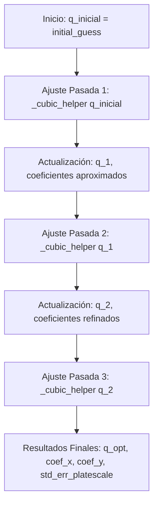

# Descripción Teórica y Matemática de la Rutina `do_cubic_fit`

Este documento proporciona una descripción teórica y matemática detallada del funcionamiento de la rutina `do_cubic_fit` implementada en el módulo [my_distortion_polynomial.py](file:///c:/Users/captw/workspaces/MEE2027/MEE2024.v6/Source/mee2024/_working3/my_distortion_polynomial.py).

---

## Índice
- [Descripción Teórica y Matemática de la Rutina `do_cubic_fit`](#descripción-teórica-y-matemática-de-la-rutina-do_cubic_fit)
  - [Índice](#índice)
  - [1. Introducción y Propósito](#1-introducción-y-propósito)
        - 1. `result` *(Tupla de 4 elementos)
        - 2. `plate2_corrected`
  - [2. Estructura y Acoplamiento del Ajuste Astrométrico](#2-estructura-y-acoplamiento-del-ajuste-astrométrico)
  - [3. El Proceso de Optimización Iterativo (WCS Absorption Loop)](#3-el-proceso-de-optimización-iterativo-wcs-absorption-loop)
    - [Formulación Matemática de las Iteraciones](#formulación-matemática-de-las-iteraciones)
  - [4. Análisis del Caso Especial de Orden Libre Cero (Fixed Calibration Mode)](#4-análisis-del-caso-especial-de-orden-libre-cero-fixed-calibration-mode)
  - [5. Visualización y Topología de Superficie Residuos 3D](#5-visualización-y-topología-de-superficie-residuos-3d)
  - [6. Bibliografía y Referencias de Soporte](#6-bibliografía-y-referencias-de-soporte)

---

## 1. Introducción y Propósito

La rutina `do_cubic_fit` es el orquestador matemático principal en el proceso de calibración de distorsiones geométricas. Acepta posiciones de píxeles observadas, vectores de catálogo celestes ICRS de referencia y una estimación astrométrica inicial (WCS). Su objetivo es estimar conjuntamente la distorsión del plano del detector y los parámetros intrínsecos de la orientación del telescopio.

Las variables `result` y `plate2_corrected` capturan los dos primeros valores devueltos por el método [do_cubic_fit](file:///c:/Users/captw/workspaces/MEE2027/MEE2024.v6/Source/mee2024/_working3/my_distortion_polynomial.py#L284-L326) de `my_distortion_polynomial.py` (el cual es importado y ejecutado en `my_distortion_fitter.py`).

A continuación se detalla la información técnica y el formato de cada variable:

##### 1. `result` *(Tupla de 4 elementos)*
Representa el **vector de estado astrométrico WCS refinado** tras realizar el proceso iterativo de mínimos cuadrados ordinarios y la absorción lineal de los residuos de distorsión. 
*   **Formato:** Contiene cuatro flotantes expresados en **radianes**:

$$
\mathbf{q} = (s, \alpha_0, \delta_0, \theta)
$$

    *   $s$: Escala de placa corregida (en radianes por píxel). Refinada tras absorber la dilatación lineal detectada en el sensor.
    *   $\alpha_0$: Coordenada de Ascensión Recta (RA) del centro de placa corregido (en radianes). Refinada tras proyectar y absorber los desplazamientos constantes de píxeles.
    *   $\delta_0$: Coordenada de Declinación (Dec) del centro de placa corregido (en radianes).
    *   $\theta$: Ángulo de rotación de campo (Roll) refinado (en radianes). Refinado tras absorber el componente rotacional puro de los residuos de distorsión.

---

##### 2. `plate2_corrected` *(np.ndarray de tamaño $N_{matched} \times 2$)*
Contiene las coordenadas de los centroides estelares observados en la imagen **después de aplicar las correcciones de distorsión geométrica e instrumental de alto orden** (cúbicas o quinticas).
*   **Formato:** Es un arreglo bidimensional con las posiciones en píxeles $(y, x)$ referenciadas respecto al centro geométrico del sensor:

$$
x_{corrected} = x_{obs} + \Delta x_{distortion}
$$

    $$y_{corrected} = y_{obs} + \Delta y_{distortion}$$
    donde $\Delta x_{distortion}$ y $\Delta y_{distortion}$ son las desviaciones geométricas (en píxeles) calculadas a través de la regresión lineal sobre la base polinómica o de Legendre (sumando tanto el ajuste de coeficientes libres como el aporte de los coeficientes precalibrados fijos).
*   **Significado Físico:** Representa la posición idealizada en píxeles donde habrían caído las estrellas de la imagen en un plano focal perfecto y sin aberraciones ópticas, lo cual permite que coincidan directamente con la proyección geométrica WCS lineal pura del catálogo.

---

## 2. Estructura y Acoplamiento del Ajuste Astrométrico

El problema de calibración geométrica presenta un acoplamiento físico y matemático entre dos conjuntos de variables:
1. **Parámetros Astrométricos Globales (WCS):** Representados por el vector de placa $\mathbf{q} = (s, \alpha_0, \delta_0, \theta)^T$, el cual define la proyección lineal del cielo al plano del detector.
2. **Coeficientes de Distorsión Óptica:** Representados por los vectores de coeficientes polinomiales $\mathbf{c}_x, \mathbf{c}_y$, los cuales modelan desviaciones geométricas de alto orden causadas por aberraciones ópticas del sistema de lentes/espejos del telescopio.

Dado que los residuos en píxeles $\mathbf{e}_i = \mathbf{x}_{detransformed, i}(\mathbf{q}) - \mathbf{x}_{obs, i}$ dependen no linealmente del vector WCS $\mathbf{q}$, el ajuste directo de los coeficientes de distorsión y los parámetros de placa en un único paso de regresión lineal no es posible. 

---

## 3. El Proceso de Optimización Iterativo (WCS Absorption Loop)

Para resolver el acoplamiento y converger al óptimo global, `do_cubic_fit` implementa un algoritmo de optimización iterativo de tipo optimización por bloques coordenados (block-coordinate descent).

El algoritmo ejecuta una secuencia de tres llamadas a la función de ajuste lineal `_cubic_helper` para asegurar la convergencia completa:

### Formulación Matemática de las Iteraciones

Sea $k \in \{1, 2, 3\}$ el índice de la iteración. Para cada paso:
1. **Detransformación de vectores celestes:** Se proyectan las coordenadas celestes al plano de la placa utilizando el vector de estado astrométrico de la iteración anterior $\mathbf{q}^{(k-1)}$:

$$
\mathbf{x}_{detransformed, i}^{(k)} = \text{detransform\_vectors}(\mathbf{q}^{(k-1)}, \mathbf{v}_{cata, i})
$$

2. **Cálculo de residuos intermedios:**

$$
\mathbf{e}_i^{(k)} = \mathbf{x}_{detransformed, i}^{(k)} - \mathbf{x}_{obs, i}
$$

3. **Regresión Lineal por OLS:** Se calculan los parámetros de regresión $\mathbf{c}_x^{(k)}, \mathbf{c}_y^{(k)}$ sobre la matriz de diseño de distorsiones $\mathbf{X}$:

$$
\mathbf{c}_x^{(k)} = (\mathbf{X}^T \mathbf{X})^{-1} \mathbf{X}^T \mathbf{e}_{x}^{(k)}
$$

   $$\mathbf{c}_y^{(k)} = (\mathbf{X}^T \mathbf{X})^{-1} \mathbf{X}^T \mathbf{e}_{y}^{(k)}$$
4. **Absorción Algebraica:** Se extraen las correcciones de traslación, escala y rotación de los coeficientes lineales e interceptos de la regresión:
   - Desplazamiento del centro óptico: $(\Delta\alpha, \Delta\delta) = f(c_{x,0}^{(k)}, c_{y,0}^{(k)}, \theta^{(k-1)})$
   - Multiplicador de escala de placa: $m = \sqrt{(1 + c_{x,1}^{(k)}/w)(1 + c_{y,2}^{(k)}/w)}$
   - Variación angular del Roll: $\Delta\theta = c_{x,2}^{(k)} / w$
5. **Actualización del Vector Astrométrico:**

$$
\mathbf{q}^{(k)} = \mathbf{q}^{(k-1)} + \Delta\mathbf{q}^{(k)}
$$

Al repetir este procedimiento tres veces ($k=3$), los coeficientes lineales $c_{x,1}, c_{x,2}, c_{y,1}, c_{y,2}$ e interceptos constantes $c_{x,0}, c_{y,0}$ remanentes en la regresión final se reducen a valores numéricamente despreciables ($\approx 0$), indicando que todos los efectos lineales han sido transferidos (absorbidos) al modelo físico de la WCS global representado por $\mathbf{q}^{(3)}$.

---

## 4. Análisis del Caso Especial de Orden Libre Cero (Fixed Calibration Mode)

Cuando el grado polinomial libre es cero (`order_free == 0`), se asume que las distorsiones del sensor óptico ya están perfectamente caracterizadas por calibraciones de referencia históricas cargadas desde archivos. En este escenario, la rutina no debe modificar los coeficientes de distorsión, sino únicamente determinar el desplazamiento del centro de placa de la cámara en el cielo.

La rutina ejecuta el siguiente flujo matemático estructurado:
1. **Absorción Lineal Preliminar:** Ejecuta dos pasadas secuenciales forzando el orden libre a lineal (`distortion_fixed_coefficients: 'linear'`) sobre la aproximación inicial. Esto absorbe los desplazamientos y la rotación aproximada de campo:

$$
\mathbf{q}^* = (s^*, \alpha_0^*, \delta_0^*, \theta^*)^T
$$

2. **Congelación de Escala:** Reemplaza la escala estimada $s^*$ por la escala de referencia precalibrada fija $\bar{s}_{fixed}$ (en segundos de arco por píxel), convertida a radianes por píxel:

$$
s_{fixed} = \bar{s}_{fixed} \times \frac{\pi}{180 \times 3600}
$$

   El vector astrométrico final se define como:

$$
\mathbf{q}_{final} = (s_{fixed}, \alpha_0^*, \delta_0^*, \theta^*)^T
$$

3. **Aplicación de Correcciones Fijas:** Corrige las posiciones de los píxeles utilizando la biblioteca de distorsiones de referencia promedio cargada desde el disco ($\mathbf{c}_{x, fixed}, \mathbf{c}_{y, fixed}$):

$$
\mathbf{x}_{corrected, i} = \mathbf{x}_{obs, i} + \sum_{p=1}^M \mathbf{c}_{corrected, p} B_p(x_{obs, i}, y_{obs, i})
$$

4. **Cálculo de Errores de Traslación residuales:**

$$
\mathbf{e}_{residual, i} = \text{detransform\_vectors}(\mathbf{q}_{final}, \mathbf{v}_{cata, i}) - \mathbf{x}_{corrected, i}
$$

   El desplazamiento constante medio se evalúa como $\langle \mathbf{e}_{residual} \rangle$.

---

## 5. Visualización y Topología de Superficie Residuos 3D

Para analizar la calidad del ajuste geométrico, la rutina grafica los residuos en píxeles y sus superficies polinomiales estimadas proyectando una cuadrícula regular de puntos en una malla bidimensional regular sobre el detector de rango $[-W/2, W/2] \times [-H/2, H/2]$.

Si definimos la matriz de diseño evaluada en cada nodo de la malla como $\mathbf{X}_{mesh}$, las superficies teóricas modeladas de distorsión $\mathbf{Z}_x, \mathbf{Z}_y$ se obtienen evaluando la regresión:

$$
\mathbf{Z}_x(x, y) = \mathbf{X}_{mesh} \mathbf{c}_{x, free}
$$

$$\mathbf{Z}_y(x, y) = \mathbf{X}_{mesh} \mathbf{c}_{y, free}$$

La superficie global de la magnitud del error residual se define como la norma euclidiana del mapa vectorial de distorsión:

$$
\mathbf{Z}_{norm}(x, y) = \sqrt{\mathbf{Z}_x^2(x, y) + \mathbf{Z}_y^2(x, y)}
$$

Estas tres superficies se grafican en proyección 3D frente a los vectores de error discretos medidos de las estrellas individuales para su validación visual.

---

## 6. Bibliografía y Referencias de Soporte

1. **Calabretta, M. R., & Greisen, E. W. (2002).** *Representations of celestial coordinates in FITS*. Astronomy & Astrophysics, 395(3), 1077-1122.
   - *Explica la base matemática de las representaciones y transformaciones locales de plano tangente.*

2. **Shupe, D. L., et al. (2005).** *The SIP Convention for Representing Distortion in FITS Image Headers*. ASP Conference Series, Vol. 347.
   - *Detalla los polinomios de distorsión geométrica y el mapeo inverso de píxeles.*

3. **Bertsekas, D. P. (1999).** *Nonlinear Programming*. Athena Scientific.
   - *Soporte teórico sobre algoritmos de optimización por bloques coordenados (Coordinate Descent / Block Minimization) y demostración de su convergencia en optimizaciones acopladas.*
